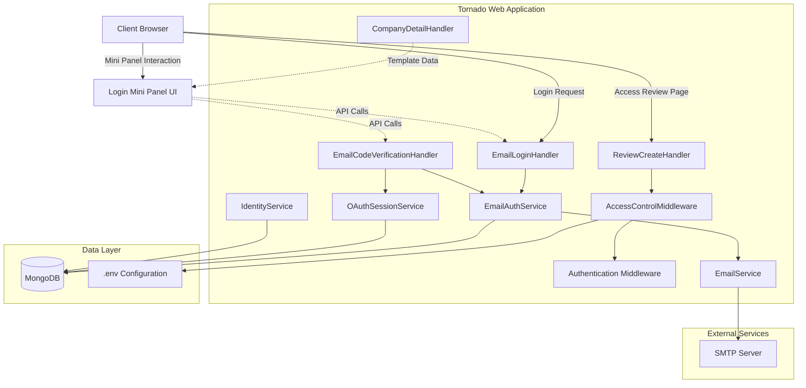
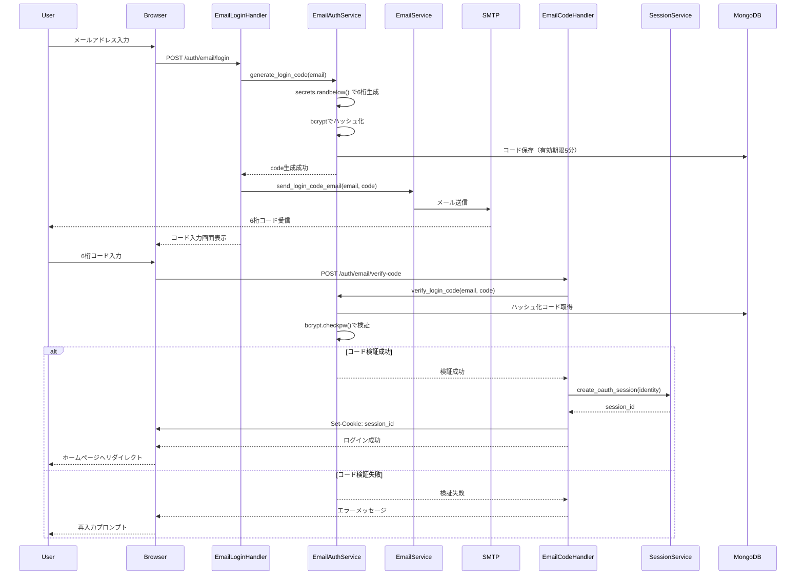
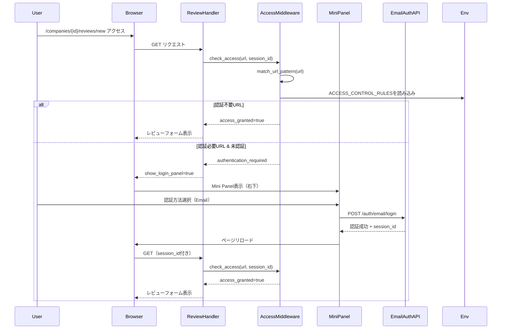
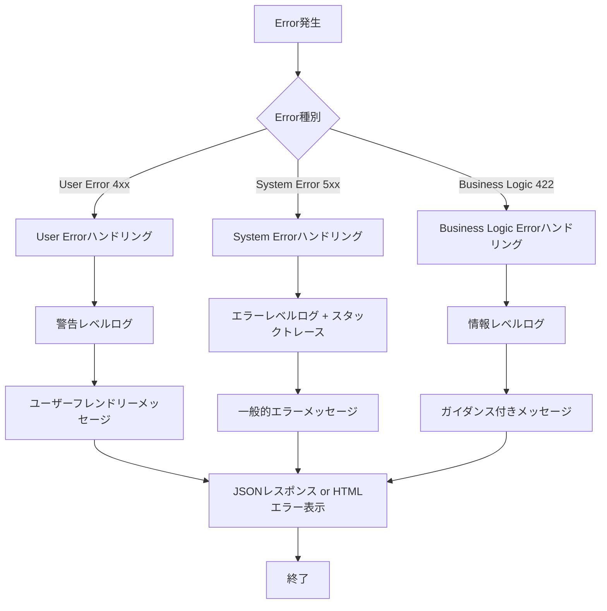

# Technical Design Document

## Overview

認証アクセス制御機能強化は、既存のOAuth認証システムを拡張し、メール認証の6桁コードログイン、.envベースの柔軟なアクセス制御、ユーザーフレンドリーなログインUI、そしてレビュー投稿の利便性を向上させます。この機能は既存のTornadoアーキテクチャとMongoDBデータモデルに統合され、セキュアで使いやすい認証体験を提供します。

**ユーザー**: 既存ユーザーと新規ユーザーは、メールアドレスのみで安全にログインでき、レビュー投稿時にスムーズな認証体験を得られます。システム管理者は、コード変更なしで.envファイルからアクセス制御ルールを管理できます。

**影響**: 既存のメール認証フロー、アクセス制御ミドルウェア、レビュー投稿ハンドラーを拡張します。新しいログインUI（Mini Panel）を追加し、会社詳細ページのテンプレートを更新します。

### Goals

- メール認証の6桁コードログイン機能を実装し、パスワード不要の安全なログインを実現
- .envベースのアクセス制御ルール管理により、柔軟でメンテナンス性の高いURL保護を提供
- 右下配置のMini Panelで、未認証ユーザーにシームレスな認証体験を提供
- 会社詳細ページにレビュー投稿リンクを追加し、複数レビュー投稿を容易に
- SMTP設定のテストと検証機能で、メール送信の信頼性を確保

### Non-Goals

- Google/Facebook認証フローの変更（既存実装を維持）
- セッション管理ロジックの変更（既存OAuthSessionServiceを使用）
- レビュー投稿フォーム自体の変更（認証チェックのみ強化）
- 管理者向けアクセス制御UIダッシュボード（将来検討）

## Architecture

### Existing Architecture Analysis

既存のDXEEWorldは以下のアーキテクチャパターンを採用しています：

- **MVC Pattern**: Tornado handlers（Controller）、Services（Business Logic）、Models（Data）の明確な分離
- **Middleware Pattern**: 既存の `AccessControlMiddleware` と `auth_middleware.py` による認証・認可
- **Service Layer Pattern**: `EmailAuthService`, `OAuthSessionService`, `IdentityService` による再利用可能なビジネスロジック
- **Async/Await**: Motor（MongoDB非同期ドライバー）とTornadoによる非同期処理

既存の主要コンポーネント：
- `src/middleware/access_control_middleware.py` - URL パターンマッチングと権限チェック
- `src/handlers/email_auth_handler.py` - メール認証登録・ログイン・検証
- `src/services/email_auth_service.py` - トークン・コード生成と検証
- `src/handlers/review_handler.py` - レビュー投稿ハンドラー（認証チェック付き）

### High-Level Architecture



### Technology Alignment

この機能は既存の技術スタックに完全に適合し、新しい依存関係を最小限に抑えます：

**既存技術の活用**:
- **Tornado 6.5.2**: 既存のハンドラーパターンを継承
- **Motor**: 非同期MongoDB操作（既存のdb_serviceを使用）
- **itsdangerous**: トークン生成（既存のEmailAuthServiceを拡張）
- **secrets**: 暗号学的に安全な乱数生成（既存のベストプラクティスに従う）

**新規依存関係**: なし（すべて既存ライブラリで実装可能）

**既存パターンの遵守**:
- BaseHandlerからの継承とエラーハンドリング
- Result型による統一的なエラー処理
- Service層でのビジネスロジック集約
- Jinja2テンプレートとbase.html継承

## Key Design Decisions

### 決定1: 6桁コードのハッシュ化保存

**Context**: メール認証ログインで6桁コードをデータベースに保存する際のセキュリティ

**Alternatives**:
1. 平文保存 - 実装は簡単だが、DBが侵害された場合にコードが漏洩
2. ハッシュ化保存 - bcryptでハッシュ化、検証時に比較
3. 暗号化保存 - 可逆的暗号化、鍵管理が必要

**Selected Approach**: bcryptによるハッシュ化保存

**Rationale**:
- 既存のEmailAuthServiceがbcryptを使用しており、パターン一貫性を保つ
- 6桁コードは短時間（5分）のみ有効なため、ハッシュ化で十分
- 鍵管理のオーバーヘッドを避けつつ、DBレベルの侵害に対する保護を提供

**Trade-offs**:
- **Gain**: DB侵害時のコード漏洩リスク軽減、OWASP推奨のセキュリティ実践
- **Sacrifice**: わずかな計算コスト（bcrypt演算）、ただし5分間の有効期限により影響は最小

### 決定2: Mini Panel UIのクライアントサイド実装

**Context**: 認証が必要なページで表示するログイン/登録UIの実装方法

**Alternatives**:
1. サーバーサイドレンダリング - Jinja2テンプレートで各ページに埋め込み
2. クライアントサイドJavaScript - 動的にMini Panelを生成・表示
3. ハイブリッド - base.htmlに静的HTMLを含め、JavaScriptで表示制御

**Selected Approach**: ハイブリッドアプローチ（base.htmlに静的HTML + JavaScript制御）

**Rationale**:
- 既存のbase.html拡張パターンに適合し、すべてのページで一貫した動作を保証
- JavaScriptによる動的表示制御で、認証状態に応じた表示/非表示を実現
- サーバーサイドでテンプレート変数（is_authenticated, show_login_panel）を渡すことで、初期状態を制御

**Trade-offs**:
- **Gain**: 実装のシンプルさ、既存テンプレート構造との整合性、全ページでの再利用性
- **Sacrifice**: JavaScriptが無効な環境では動作しない（ただし、現代のWebアプリでは許容範囲）

### 決定3: アクセス制御ルールの.env設定形式

**Context**: URLパターンと必要権限を.envファイルで管理する際の設定形式

**Alternatives**:
1. JSON形式 - `ACCESS_CONTROL_RULES='[{"pattern":"/reviews/new","perms":["user"]}]'`
2. カンマ区切り形式 - `ACCESS_CONTROL_RULES='/reviews/new,user;/reviews/edit,user,admin'`
3. 専用設定ファイル - `.access_control.yaml` などの別ファイル

**Selected Approach**: カンマ区切り形式（既存実装を維持）

**Rationale**:
- 既存の `AccessControlMiddleware` が既にこの形式をサポート
- .envファイル内で簡潔に記述でき、環境変数の制約（改行不可）に適合
- パース処理がシンプルで、エラーハンドリングが容易

**Trade-offs**:
- **Gain**: 既存コードの再利用、シンプルなパース処理、.env標準形式に適合
- **Sacrifice**: 複雑なルール（正規表現、複数条件）の表現力は限定的（ただし、現在の要件には十分）

## System Flows

### メール認証6桁コードログインフロー



### アクセス制御とMini Panel表示フロー



## Requirements Traceability

| 要件 | 要件概要 | コンポーネント | インターフェース | フロー |
|------|---------|--------------|----------------|--------|
| 1.1-1.6 | メール認証6桁コードログイン | EmailAuthService, EmailLoginHandler, EmailCodeVerificationHandler | generate_login_code(), verify_login_code(), send_login_code_email() | メール認証6桁コードログインフロー |
| 2.1-2.5 | SMTP設定テスト | EmailService, SMTPTestHandler | test_smtp_connection(), send_test_email() | - |
| 3.1-3.13 | 設定ベースアクセス制御 | AccessControlMiddleware | load_access_control_rules(), match_url_pattern(), check_access() | アクセス制御とMini Panel表示フロー |
| 4.1-4.8 | ログイン/登録Mini Panel UI | base.html, login-panel.js | showLoginPanel(), hideLoginPanel(), handleAuth() | アクセス制御とMini Panel表示フロー |
| 5.1-5.5 | レビュー投稿フォーム表示制御 | ReviewCreateHandler, reviews/create.html | require_authentication_with_redirect() | アクセス制御とMini Panel表示フロー |
| 6.1-6.7 | 会社詳細ページレビュー投稿リンク | CompanyDetailHandler, companies/detail.html | - | - |
| 7.1-7.7 | セキュリティとエラーハンドリング | すべてのコンポーネント | すべてのインターフェース | すべてのフロー |

## Components and Interfaces

### 認証・セッション管理層

#### EmailAuthService（拡張）

**Responsibility & Boundaries**
- **Primary Responsibility**: メール認証用の6桁コード生成・検証、トークン管理
- **Domain Boundary**: 認証ドメイン（Auth Domain）に属し、メール認証に特化
- **Data Ownership**: `email_verifications` コレクション（トークン、コード、有効期限）
- **Transaction Boundary**: 単一コード/トークン操作ごとに独立したトランザクション

**Dependencies**
- **Inbound**: EmailLoginHandler, EmailCodeVerificationHandler, EmailRegistrationHandler
- **Outbound**: MongoDB（email_verificationsコレクション）、EmailEncryptionService
- **External**: itsdangerous（トークン生成）、secrets（暗号学的乱数）、bcrypt（ハッシュ化）

**Contract Definition**

```typescript
interface EmailAuthService {
  // 6桁コード生成（新規）
  generate_login_code(email: string): Result<{
    code: string;
    expires_at: datetime;
    code_id: string;
  }, EmailAuthError>;

  // 6桁コード検証（新規）
  verify_login_code(email: string, code: string): Result<{
    verified: boolean;
    identity_id: string;
    email: string;
  }, EmailAuthError>;

  // 既存メソッド（変更なし）
  generate_verification_token(email: string, type: string): Result<TokenData, EmailAuthError>;
  verify_verification_token(token: string): Result<VerificationData, EmailAuthError>;
}
```

**Preconditions**:
- `generate_login_code`: emailは有効な形式、Identityコレクションに存在
- `verify_login_code`: emailとcodeが非空文字列

**Postconditions**:
- `generate_login_code`: MongoDBにハッシュ化されたコードが保存され、5分後に期限切れ
- `verify_login_code`: 検証成功時、コードは使用済みとしてマーク

**Invariants**:
- コードは必ず6桁の数字（000000-999999）
- コードはbcryptでハッシュ化されて保存
- 有効期限切れコードは検証時に拒否

**Implementation Notes**:
- `secrets.randbelow(1000000)` で0-999999の乱数生成、6桁にゼロパディング
- bcrypt.hashpw()でハッシュ化、bcrypt.checkpw()で検証
- MongoDBの`expires_at`フィールドでTTL管理（自動削除）
- 最大試行回数（3回）を超えた場合、コードを無効化

#### EmailService（拡張）

**Responsibility & Boundaries**
- **Primary Responsibility**: SMTP経由でのメール送信、テンプレート管理
- **Domain Boundary**: 通知ドメイン（Notification Domain）
- **Data Ownership**: メールテンプレート（コード内定義）

**Dependencies**
- **Inbound**: EmailAuthService, EmailLoginHandler, SMTPTestHandler
- **Outbound**: なし
- **External**: SMTP Server（.envで設定）、smtplib（Python標準ライブラリ）

**Contract Definition**

```typescript
interface EmailService {
  // 6桁コードメール送信（新規）
  send_login_code_email(email: string, code: string): Result<{
    message_id: string;
    sent_at: datetime;
  }, EmailError>;

  // SMTP接続テスト（新規）
  test_smtp_connection(): Result<{
    connected: boolean;
    server: string;
    response: string;
  }, EmailError>;

  // 既存メソッド
  send_verification_email(email: string, verification_url: string): Result<MessageData, EmailError>;
}
```

**Preconditions**:
- SMTP設定（SMTP_HOST, SMTP_PORT, SMTP_USERNAME, SMTP_PASSWORD）が.envに存在
- emailは有効な形式

**Postconditions**:
- メール送信成功時、SMTPサーバーからmessage_idを受信
- 失敗時、詳細なエラーメッセージをログに記録

**External Dependency Investigation**:
- Python標準ライブラリ `smtplib` を使用（追加依存なし）
- Gmail SMTP使用時の注意: アプリパスワード必須（2段階認証有効時）
- SendGrid/Mailgun等のSMTPサーバーも同様に対応可能
- タイムアウト設定: 10秒（既存実装に従う）
- TLS/SSL対応: SMTP_PORT=587でSTARTTLS、SMTP_PORT=465でSSL

#### AccessControlMiddleware（拡張）

**Responsibility & Boundaries**
- **Primary Responsibility**: URLパターンマッチングと権限チェック、.env設定読み込み
- **Domain Boundary**: 認可ドメイン（Authorization Domain）
- **Data Ownership**: アクセス制御ルール（.envから読み込み、メモリ保持）

**Dependencies**
- **Inbound**: すべてのハンドラー（Tornado middleware経由）
- **Outbound**: OAuthSessionService（セッション検証）
- **External**: .envファイル（ACCESS_CONTROL_RULES環境変数）

**Contract Definition**

```typescript
interface AccessControlMiddleware {
  // アクセス制御ルール読み込み（既存、変更なし）
  load_access_control_rules(): Promise<void>;

  // URLパターンマッチング（既存、変更なし）
  match_url_pattern(url: string): Rule | null;

  // アクセスチェック（既存、変更なし）
  check_access(url: string, session_id: string | null, ip_address?: string): Result<{
    access_granted: boolean;
    authentication_required: boolean;
    matched_rule: Rule | null;
    user_context: UserContext | null;
  }, AccessControlError>;

  // 設定検証（既存、変更なし）
  validate_configuration(rules_config: string): Result<boolean, AccessControlError>;
}
```

**Preconditions**:
- .envファイルが存在し、ACCESS_CONTROL_RULES が正しい形式
- 形式: `pattern,perm1,perm2;pattern2,perm1`

**Postconditions**:
- ルール読み込み成功時、`access_rules`配列に格納
- 検証失敗時、デフォルトルール（すべてのURLで認証要求）を適用

**Invariants**:
- ルールは設定順序でマッチング（最初にマッチしたルールを適用）
- 未マッチURLは認証不要で許可

**State Management**:
- **State Model**: Loaded（ルール読み込み済み） ↔ Reloading（再読み込み中）
- **Persistence**: メモリ内保持、再起動時に.envから再読み込み
- **Concurrency**: 再読み込み中も既存ルールで動作継続（非ブロッキング）

**Integration Strategy**:
- **Modification Approach**: 既存コード拡張（新規メソッド追加なし）
- **Backward Compatibility**: 既存のアクセス制御ルール形式を完全維持
- **Migration Path**: .envファイルに新しいルールを追加するだけで有効化

### ハンドラー層

#### EmailLoginHandler（新規）

**Responsibility & Boundaries**
- **Primary Responsibility**: メールアドレス入力 → 6桁コード送信のHTTPエンドポイント
- **Domain Boundary**: Web層（Presentation Layer）

**Dependencies**
- **Inbound**: クライアントブラウザ、Mini Panel JavaScript
- **Outbound**: EmailAuthService, EmailService, IdentityService

**API Contract**:

| Method | Endpoint | Request | Response | Errors |
|--------|----------|---------|----------|--------|
| GET | /auth/email/login | - | HTML（メールアドレス入力フォーム） | - |
| POST | /auth/email/login | { email: string } | { message: string, email_masked: string, next_step: "verify_code", redirect_url: string } | 400（無効なemail）、500（SMTP失敗） |

**Request Schema**:
```typescript
interface LoginRequest {
  email: string; // 必須、有効なメールアドレス形式
}
```

**Response Schema**:
```typescript
interface LoginResponse {
  message: string; // "認証コードを送信しました。メールを確認してください。"
  email_masked: string; // "ab***@example.com"
  next_step: "verify_code";
  redirect_url: string; // "/auth/email/login?step=code&email={email}"
}
```

#### EmailCodeVerificationHandler（新規）

**Responsibility & Boundaries**
- **Primary Responsibility**: 6桁コード検証 → セッション作成のHTTPエンドポイント

**API Contract**:

| Method | Endpoint | Request | Response | Errors |
|--------|----------|---------|----------|--------|
| POST | /auth/email/verify-code | { email: string, code: string } | { message: string, user: UserData, redirect_url: string } | 400（無効なコード）、404（ユーザー不存在）、500（セッション失敗） |

**Request Schema**:
```typescript
interface CodeVerificationRequest {
  email: string; // 必須
  code: string; // 必須、6桁数字
}
```

**Response Schema**:
```typescript
interface CodeVerificationResponse {
  message: "ログインが完了しました";
  user: {
    id: string;
    email_masked: string;
    user_type: "user" | "ally" | "admin";
    auth_method: "email";
  };
  redirect_url: "/";
}
```

#### SMTPTestHandler（新規）

**Responsibility & Boundaries**
- **Primary Responsibility**: SMTP設定の手動テスト用エンドポイント（開発・デバッグ用）

**API Contract**:

| Method | Endpoint | Request | Response | Errors |
|--------|----------|---------|----------|--------|
| POST | /admin/smtp-test | { test_email?: string } | { success: boolean, message: string, details: object } | 500（SMTP接続失敗） |

**Response Schema**:
```typescript
interface SMTPTestResponse {
  success: boolean;
  message: string; // "SMTP接続テスト成功" or "SMTP接続失敗: {error}"
  details: {
    smtp_host: string;
    smtp_port: number;
    connected: boolean;
    test_email_sent: boolean;
  };
}
```

#### ReviewCreateHandler（変更）

**Responsibility & Boundaries**
- **Primary Responsibility**: レビュー投稿フォーム表示とレビュー作成（既存機能）
- **変更点**: 未認証時にMini Panel表示フラグをテンプレートに渡す

**Integration Strategy**:
- **Modification Approach**: 既存メソッド `get()` の先頭に認証チェックを追加
- **Backward Compatibility**: 認証済みユーザーの動作は変更なし
- **Template Changes**: `reviews/create.html` に `show_login_panel` 変数を渡す

**Modified Interface**:
```python
async def get(self, company_id):
    """レビュー投稿フォーム表示"""
    # 認証チェック
    session_id = self.get_secure_cookie('session_id')
    access_result = await access_middleware.check_access(
        self.request.path, session_id
    )

    if not access_result.is_success or not access_result.data['access_granted']:
        # 未認証の場合、show_login_panel=True でテンプレートレンダリング
        self.render('reviews/create.html',
                   company=company,
                   show_login_panel=True,
                   review_form_visible=False)
        return

    # 認証済みの場合、通常のフォーム表示
    self.render('reviews/create.html',
               company=company,
               show_login_panel=False,
               review_form_visible=True)
```

#### CompanyDetailHandler（変更）

**Responsibility & Boundaries**
- **Primary Responsibility**: 会社詳細ページ表示（既存機能）
- **変更点**: レビュー投稿リンクをテンプレートデータに追加

**Integration Strategy**:
- **Modification Approach**: テンプレートデータに `show_review_link` と `review_count` を追加
- **Backward Compatibility**: 既存の会社詳細表示ロジックは変更なし

**Modified Template Data**:
```python
async def get(self, company_id):
    """会社詳細ページ表示"""
    company = await self.get_company(company_id)
    reviews = await self.get_reviews(company_id)

    self.render('companies/detail.html',
               company=company,
               reviews=reviews,
               review_count=len(reviews),
               show_review_link=len(reviews) > 0)  # 1件以上でリンク表示
```

### UI層

#### Login Mini Panel（新規）

**Responsibility & Boundaries**
- **Primary Responsibility**: 右下に表示される認証UI、Google/Facebook/Email認証オプション提供
- **Domain Boundary**: プレゼンテーション層（クライアントサイド）

**Component Structure**:
```html
<!-- base.html に追加 -->
<div id="login-mini-panel" class="mini-panel" style="display: none;">
  <div class="panel-header">
    <h3>Sign in to DXEEWorld</h3>
    <button class="close-btn">&times;</button>
  </div>
  <div class="panel-body">
    <button class="google-btn" onclick="loginWithGoogle()">
      
      Google でログイン
    </button>
    <button class="facebook-btn" onclick="loginWithFacebook()">
      
      Facebook でログイン
    </button>
    <div class="divider">または</div>
    <input type="email" id="email-input" placeholder="Email">
    <button class="email-btn" onclick="loginWithEmail()">
      Sign in with Email
    </button>
    <div class="register-link">
      Don't have an account? <a href="/auth/email/register">Register</a>
    </div>
  </div>
</div>

<script src="/static/js/login-panel.js"></script>
```

**JavaScript Interface**:
```javascript
// static/js/login-panel.js
class LoginPanel {
  show() {
    // Mini Panel表示
    document.getElementById('login-mini-panel').style.display = 'block';
  }

  hide() {
    // Mini Panel非表示
    document.getElementById('login-mini-panel').style.display = 'none';
  }

  async loginWithEmail() {
    const email = document.getElementById('email-input').value;
    const response = await fetch('/auth/email/login', {
      method: 'POST',
      headers: { 'Content-Type': 'application/json' },
      body: JSON.stringify({ email })
    });

    if (response.ok) {
      const data = await response.json();
      window.location.href = data.redirect_url;
    }
  }
}

// グローバル初期化
window.loginPanel = new LoginPanel();

// テンプレート変数に基づいて自動表示
if (window.showLoginPanel) {
  window.loginPanel.show();
}
```

**CSS Design**:
```css
/* static/css/login-panel.css */
.mini-panel {
  position: fixed;
  bottom: 20px;
  right: 20px;
  width: 360px;
  background: #1a1a1a; /* ダークモード */
  border-radius: 12px;
  box-shadow: 0 4px 20px rgba(0,0,0,0.3);
  padding: 24px;
  z-index: 1000;
}

@media (max-width: 768px) {
  .mini-panel {
    bottom: 0;
    right: 0;
    left: 0;
    width: 100%;
    border-radius: 12px 12px 0 0;
  }
}

.google-btn {
  background: white;
  color: #333;
  border: 1px solid #ddd;
}

.facebook-btn {
  background: #1877f2;
  color: white;
}

.email-btn {
  background: #007bff;
  color: white;
}
```

**State Management**:
- **State Model**: Hidden（非表示） → Visible（表示） → Authenticating（認証中） → Hidden（認証成功後）
- **Persistence**: セッションストレージなし（ページリロード時に再評価）

## Data Models

### Physical Data Model（MongoDB）

#### email_verifications コレクション（拡張）

既存のコレクションに新しいフィールドを追加：

```typescript
interface EmailVerification {
  _id: ObjectId;
  email_hash: string; // 既存: bcryptハッシュ
  verification_type: "registration" | "login"; // 既存: 検証タイプ

  // 既存フィールド（トークン用）
  token?: string; // 登録用トークン
  expires_at: Date; // 有効期限

  // 新規フィールド（6桁コード用）
  login_code_hash?: string; // bcryptハッシュ化された6桁コード
  code_expires_at?: Date; // コード有効期限（5分）
  attempts: number; // 試行回数（最大3回）

  // 共通フィールド
  verified_at?: Date; // 検証完了時刻
  created_at: Date;
}
```

**Indexes**:
```javascript
// 既存インデックス
{ email_hash: 1 }
{ token: 1 }
{ expires_at: 1 } // TTL index

// 新規インデックス
{ login_code_hash: 1 } // コード検証の高速化
{ code_expires_at: 1 } // TTL index（コード自動削除）
```

**Data Retention**:
- トークン: 1時間後に自動削除（TTL index）
- 6桁コード: 5分後に自動削除（TTL index）

## Error Handling

### Error Strategy

すべてのエラーは統一的な `Result` 型で処理し、ユーザーフレンドリーなメッセージとログ記録を提供します。

### Error Categories and Responses

**User Errors (4xx)**:
- **Invalid Email Format (400)**: "有効なメールアドレス形式ではありません" - フィールドレベルバリデーション
- **Invalid Login Code (400)**: "認証コードが正しくありません。もう一度お試しください。" - 再入力プロンプト
- **Code Expired (400)**: "認証コードの有効期限が切れました。再送信してください。" - 再送信ボタン表示
- **Unauthorized (401)**: Mini Panel表示、ログインガイダンス

**System Errors (5xx)**:
- **SMTP Connection Failure (500)**: ユーザーには "メール送信に失敗しました。しばらくしてから再度お試しください。"、ログには詳細なSMTPエラー
- **Database Error (500)**: ユーザーには "一時的なエラーが発生しました。"、ログには詳細なMongoDBエラー
- **Session Creation Failure (500)**: ユーザーには "ログイン処理に失敗しました。"、ログには詳細なセッションエラー

**Business Logic Errors (422)**:
- **Too Many Attempts (422)**: "認証試行回数が上限に達しました。新しい認証コードを再送信してください。" - 再送信ガイダンス
- **Email Already Registered (409)**: "このメールアドレスは既に登録されています。" - ログインページへのリンク

### Error Flow Visualization



### Monitoring

**Error Tracking**:
- すべてのエラーは `logging` モジュールで記録（既存パターン）
- エラーレベル: DEBUG（詳細情報）、INFO（ビジネスロジック）、WARNING（ユーザーエラー）、ERROR（システムエラー）
- ログフォーマット: `logger.exception("Error message: %s", error)` （既存パターンに従う）

**Health Monitoring**:
- SMTP接続テストエンドポイント: `/admin/smtp-test`（手動実行）
- アクセス制御ルール読み込み成功/失敗のログ
- 6桁コード生成・検証の成功率（MongoDBクエリで計測可能）

## Testing Strategy

### Unit Tests

1. **EmailAuthService.generate_login_code()**: 6桁コード生成（000000-999999の範囲）、bcryptハッシュ化、MongoDB保存
2. **EmailAuthService.verify_login_code()**: コード検証（正しいコード/間違ったコード/期限切れ）、試行回数チェック
3. **EmailService.send_login_code_email()**: SMTPモックでメール送信成功/失敗
4. **AccessControlMiddleware.load_access_control_rules()**: .env設定パース（正常形式/異常形式/空設定）
5. **AccessControlMiddleware.match_url_pattern()**: URLマッチング（完全一致/部分一致/未マッチ）

### Integration Tests

1. **メール認証ログインフロー**: EmailLoginHandler → EmailAuthService → EmailService → EmailCodeVerificationHandler → SessionService
2. **アクセス制御フロー**: ReviewCreateHandler → AccessControlMiddleware → OAuthSessionService → レスポンス（Mini Panel表示 or フォーム表示）
3. **SMTP設定テスト**: SMTPTestHandler → EmailService → 実際のSMTPサーバー（テスト環境）
4. **レビュー投稿リンク表示**: CompanyDetailHandler → テンプレートレンダリング → HTML検証（リンク存在確認）

### E2E Tests

1. **未認証ユーザーのレビュー投稿フロー**: /companies/{id}/reviews/new アクセス → Mini Panel表示 → Email認証 → レビューフォーム表示
2. **6桁コードログイン完全フロー**: メールアドレス入力 → コードメール受信（モック） → コード入力 → ログイン成功 → ホームページリダイレクト
3. **会社詳細ページからのレビュー投稿**: 会社詳細ページ表示 → "Reviewを投稿する"リンククリック → レビュー投稿ページ遷移
4. **Mini Panelの表示/非表示**: 認証必要ページアクセス（未認証） → Mini Panel表示 → ログイン後 → Mini Panel非表示
5. **コード有効期限切れハンドリング**: コード送信 → 5分待機 → コード入力 → エラーメッセージ表示 → 再送信

### Performance Tests

1. **並行6桁コード生成**: 100並行リクエストでコード生成、すべて一意性保証
2. **アクセス制御ルールマッチング**: 100URLパターン設定で1000リクエスト/秒のスループット
3. **SMTP送信パフォーマンス**: 10秒タイムアウト内でメール送信完了（Gmail/SendGrid）

## Security Considerations

### Threat Modeling

**Threat 1: 6桁コードブルートフォース攻撃**
- **Attack Vector**: 攻撃者が1,000,000通りのコードを総当たり
- **Mitigation**: 最大試行回数3回制限、5分の短い有効期限、レート制限（Tornado rate limiter）
- **Residual Risk**: 低（3回試行で成功確率 3/1,000,000 = 0.0003%）

**Threat 2: メールインターセプト（中間者攻撃）**
- **Attack Vector**: 攻撃者がメールを傍受して6桁コードを取得
- **Mitigation**: SMTP over TLS（STARTTLS）必須、5分の短い有効期限
- **Residual Risk**: 中（TLS使用時は低、ただしメールクライアント側のセキュリティに依存）

**Threat 3: アクセス制御ルール設定ミス**
- **Attack Vector**: 管理者が誤った.env設定で保護されるべきURLを公開
- **Mitigation**: 設定検証（validate_configuration）、デフォルトで全URL認証要求にフォールバック
- **Residual Risk**: 低（デフォルトが安全側に倒れる設計）

**Threat 4: セッションハイジャック**
- **Attack Vector**: 攻撃者がセッションIDを盗んで不正アクセス
- **Mitigation**: Secure Cookie（HTTPS必須）、HttpOnly Cookie、IPアドレス検証（既存OAuthSessionService）
- **Residual Risk**: 低（既存セキュリティ機構を維持）

### Authentication and Authorization

**Authentication Patterns**:
- **Multi-Factor認証**: メールアドレス（知っているもの） + メール受信（持っているもの）
- **Passwordless認証**: 6桁コードによるワンタイムパスワード方式
- **既存OAuth認証**: Google/Facebook認証は変更なし

**Authorization Patterns**:
- **Role-Based Access Control (RBAC)**: user/ally/admin の3種類（既存）
- **.env設定による柔軟な権限マッピング**: URLパターン → 必要権限リスト
- **セッションベース認可**: OAuthSessionServiceによるセッション検証

### Data Protection

**Sensitive Data Handling**:
- **6桁コード**: bcryptハッシュ化、平文保存禁止
- **メールアドレス**: ハッシュ化（既存EmailEncryptionService）
- **セッションID**: Secure Cookie、HttpOnly、SameSite=Lax
- **ログ記録**: メールアドレス・セッションIDをマスキング（例: `ab***@example.com`）

**Compliance**:
- **OWASP Top 10準拠**: A02（Cryptographic Failures）、A07（Identification and Authentication Failures）に対応
- **GDPR考慮**: メールアドレスハッシュ化、ユーザーデータ削除機能（既存実装に準拠）

## Performance & Scalability

### Target Metrics

- **6桁コード生成**: < 100ms（bcryptハッシュ化含む）
- **コード検証**: < 150ms（bcrypt検証 + MongoDB検索）
- **メール送信**: < 10秒（SMTPタイムアウト）
- **アクセス制御チェック**: < 50ms（URLマッチング + セッション検証）
- **Mini Panel表示**: < 200ms（初回ロード、JavaScript実行含む）

### Scaling Approaches

**水平スケーリング**:
- Tornadoプロセスの複数起動（既存アーキテクチャ）
- MongoDB ReplicaSetによる読み取りスケーリング（既存）
- セッションデータはMongoDBで共有（ステートレスハンドラー）

**キャッシング**:
- アクセス制御ルール: メモリ内キャッシュ（30秒間隔で再読み込み可能）
- セッション検証: OAuthSessionServiceの既存キャッシュ機構を活用

**Performance Optimization**:
- MongoDBインデックス: `email_hash`, `login_code_hash`, `expires_at`（既存+新規）
- 非同期I/O: すべてのDB操作とSMTP送信を非同期化（既存パターン維持）
