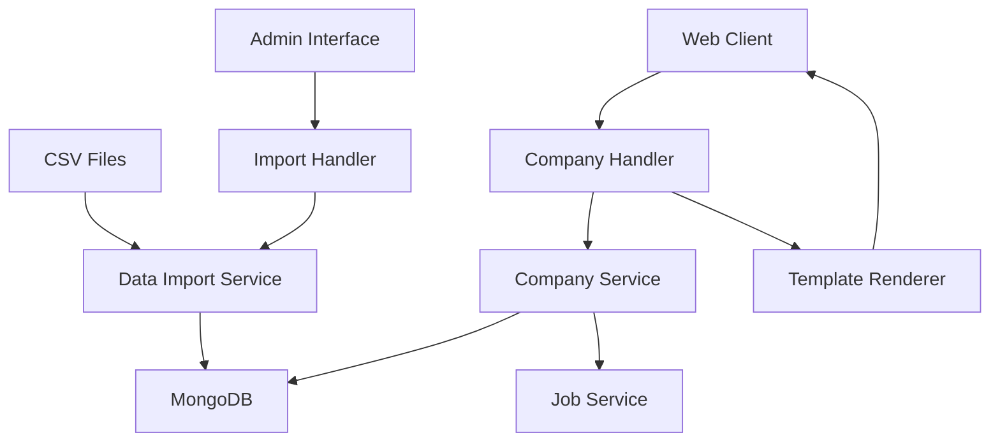
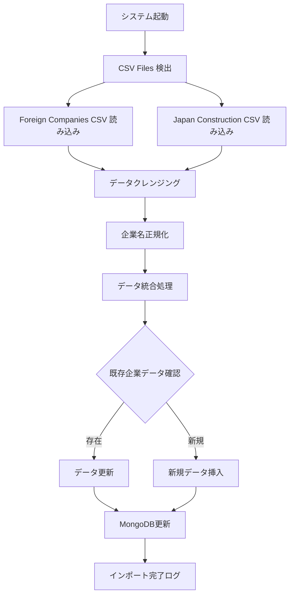
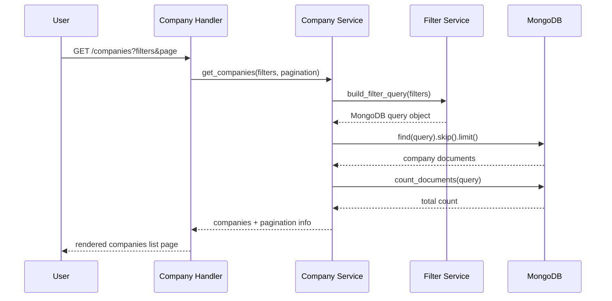
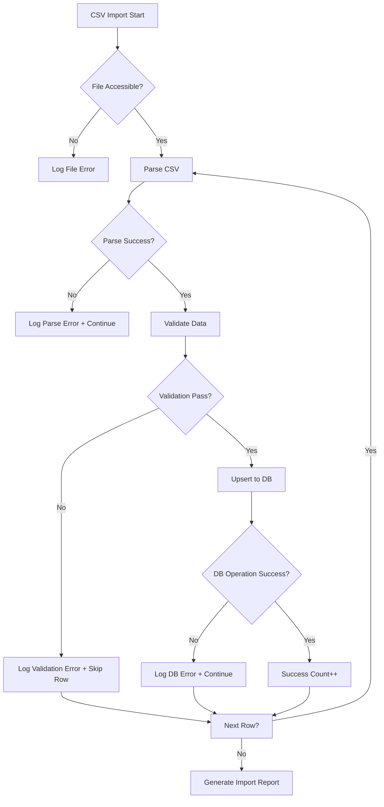

# 企業一覧システム技術設計書

## 概要

この機能は企業研究を行うユーザーに包括的な企業データベースアクセスを提供します。システムは2つのCSVファイルから企業データを取得し、MongoDBに統合格納し、フィルター機能とページネーション機能を備えたWebインターフェースを通じて効率的な企業検索と詳細情報閲覧を可能にします。

**目的**: このシステムは企業研究を行うユーザーに対し、日本と海外の幅広い企業データへの統一されたアクセスポイントを提供します。

**ユーザー**: 就職活動中の学生、転職希望者、市場調査を行うビジネスパーソンが、企業情報の検索、比較、詳細分析のためにこのシステムを活用します。

**インパクト**: 現在の分散した企業情報環境を、一元化されたデータベースと直感的な検索インターフェースによって統合し、ユーザーの企業研究効率を大幅に向上させます。

### ゴール

- 複数のCSVデータソースからの企業データ統合と一元管理
- 柔軟なフィルター機能による効率的な企業検索体験
- 大量データに対応するページネーション機能の提供
- 企業詳細情報と関連求人情報への包括的アクセス

### 非ゴール

- リアルタイム企業データ更新機能（定期更新のみ）
- 複雑な企業分析やレポート生成機能
- ユーザー間の企業情報共有機能

## アーキテクチャ

### 既存アーキテクチャ分析

現在のシステムは以下のパターンに基づいて構築されています：

- **MVC アーキテクチャ**: Tornadoベースのハンドラー、サービス、モデル分離
- **非同期処理**: async/awaitパターンによるデータベースアクセス
- **サービス指向設計**: ビジネスロジックのサービスレイヤー分離
- **データバリデーション**: 型安全性とビジネスルール検証の分離

既存のコンポーネントとの統合において、現在の`CompanyService`および`Company`モデルを拡張し、新しいCSVインポート機能とフィルター機能を追加します。

### 高レベルアーキテクチャ



**アーキテクチャ統合**:
- 既存パターン保持: Tornado Handler -> Service -> Database の3層構造
- 新コンポーネント根拠: CSV Import Service（データ統合）、Company List Handler（一覧表示）、Filter Service（検索機能）
- 技術適合性: 既存のasync/await、Motor MongoDB driver、Tornadoフレームワーク継続使用
- ステアリング準拠: 文書管理重視、段階的開発、既存パターン活用の原則

### 技術整合性

**既存技術スタックとの整合**:
- **Webフレームワーク**: 既存のTornado継続使用、ハンドラーパターンの拡張
- **データベース**: 既存のMongoDB + Motor driver活用、コレクション構造の拡張
- **言語**: Python 3.8+継続、既存のtype hintingパターン踏襲
- **アーキテクチャ**: 既存のService-Repository-ModelパターンにCSVインポート機能を追加

**新規依存関係**:
- **pandas**: CSVファイル処理と データクレンジング（新規追加）
- **numpy**: 数値データの処理と統計計算（新規追加）

**主要設計決定**:

**決定**: CSV データ統合戦略としてUpsert（Insert or Update）パターンを採用
**コンテキスト**: 2つのCSVファイル間での重複企業データと欠損データの適切な処理が必要
**代替案**: 1) Full Replace（完全置換）、2) Append Only（追加のみ）、3) Manual Merge（手動統合）
**選択アプローチ**: 企業名をユニークキーとし、既存データが存在する場合は新しいデータで更新、存在しない場合は新規作成
**根拠**: データの整合性を保ちながら、両CSVファイルからの情報を最大限活用でき、システム運用時の柔軟性を確保
**トレードオフ**: データの一意性確保を得る代わりに、初期インポート処理が複雑化し、企業名の正規化ロジックが必要

**決定**: ページネーション実装にCursor-basedパターンではなくOffset-basedパターンを採用
**コンテキスト**: ユーザビリティ重視の企業一覧表示で、フィルター条件と組み合わせた柔軟なナビゲーションが必要
**代替案**: 1) Cursor-based Pagination、2) Load More Pattern、3) Virtual Scrolling
**選択アプローチ**: MongoDBのskip()とlimit()を使用したOffset-based pagination
**根拠**: ユーザーが任意のページに直接ジャンプでき、フィルター結果に対する総件数表示が容易で、UIの直感性が高い
**トレードオフ**: 大量データでのパフォーマンス劣化リスクを受け入れ、ユーザビリティと実装の簡潔性を優先

## システムフロー

### CSVデータインポートフロー



### 企業検索フロー



## 要件トレーサビリティ

| 要件 | 要件概要 | 担当コンポーネント | インターフェース | フロー |
|------|----------|-------------------|------------------|-------|
| 1.1-1.5 | CSVデータインポート | ImportService, CompanyService | import_csv_data(), upsert_company() | CSVインポートフロー |
| 2.1-2.5 | 企業一覧とフィルター | CompanyHandler, FilterService | get_companies(), build_filter_query() | 企業検索フロー |
| 3.1-3.5 | ページネーション | PaginationService, CompanyHandler | paginate(), render_pagination() | 企業検索フロー |
| 4.1-4.5 | 企業詳細ページ | CompanyDetailHandler, CompanyService | get_company_by_id(), render_detail() | 企業詳細フロー |
| 5.1-5.5 | 求人情報表示 | JobService, CompanyDetailHandler | get_jobs_by_company(), render_jobs() | 企業詳細フロー |

## コンポーネントとインターフェース

### データ処理レイヤー

#### CSVインポートサービス

**責任と境界**
- **主要責任**: 複数のCSVファイルから企業データを読み込み、クレンジング、正規化を行い、データベースに統合格納
- **ドメイン境界**: データインポートおよび初期データ処理ドメイン
- **データ所有権**: CSVファイルの読み込み処理とデータ変換ロジック
- **トランザクション境界**: 1つのCSVファイル単位でのトランザクション管理

**依存関係**
- **アウトバウンド**: CompanyService（データ永続化）、FileSystem（CSVファイルアクセス）
- **外部**: pandas（CSVパース）、numpy（データ処理）

**契約定義**

**サービスインターフェース**:
```python
from typing import List, Dict, Optional
from enum import Enum

class ImportStatus(Enum):
    SUCCESS = "success"
    PARTIAL = "partial"
    FAILED = "failed"

class ImportResult:
    status: ImportStatus
    processed_count: int
    error_count: int
    errors: List[str]

interface CSVImportService:
    async def import_foreign_companies_csv(file_path: str) -> Result[ImportResult, ImportError]
    async def import_japan_construction_csv(file_path: str) -> Result[ImportResult, ImportError]
    async def merge_company_data(foreign_data: List[Dict], japan_data: List[Dict]) -> Result[List[Dict], MergeError]
```

- **事前条件**: CSVファイルが存在し、読み取り可能であること
- **事後条件**: データがクレンジングされ、正規化された形式でデータベースに格納
- **不変条件**: 企業名の一意性が保たれること

#### フィルターサービス

**責任と境界**
- **主要責任**: ユーザーのフィルター条件をMongoDBクエリに変換し、検索性能を最適化
- **ドメイン境界**: 企業検索およびデータ取得ドメイン
- **データ所有権**: フィルター条件の検証と正規化ロジック

**契約定義**

**サービスインターフェース**:
```python
from typing import Dict, Any, Optional

class FilterCriteria:
    industry: Optional[str]
    size: Optional[str]
    location: Optional[str]
    founded_year_min: Optional[int]
    founded_year_max: Optional[int]
    employee_count_min: Optional[int]
    employee_count_max: Optional[int]

interface FilterService:
    def build_filter_query(criteria: FilterCriteria) -> Dict[str, Any]
    def validate_filter_criteria(criteria: Dict[str, Any]) -> Result[FilterCriteria, ValidationError]
```

### アプリケーションレイヤー

#### 企業一覧ハンドラー

**責任と境界**
- **主要責任**: 企業一覧ページのHTTPリクエスト処理、フィルター適用、ページネーション制御
- **ドメイン境界**: Webプレゼンテーション層
- **データ所有権**: HTTPリクエスト/レスポンスの処理

**依存関係**
- **インバウンド**: WebClientからのHTTPリクエスト
- **アウトバウンド**: CompanyService、FilterService、PaginationService

**APIコントラクト**:

| Method | Endpoint | Request | Response | Errors |
|--------|----------|---------|----------|--------|
| GET | /companies | query params: industry, size, location, page | HTML page with companies list | 400, 500 |
| GET | /companies/api | query params: filters, page, limit | JSON companies data | 400, 404, 500 |

#### 企業詳細ハンドラー

**責任と境界**
- **主要責任**: 個別企業の詳細情報表示、関連求人情報の取得と表示
- **ドメイン境界**: Webプレゼンテーション層
- **データ所有権**: 企業詳細ページのレイアウトとコンテンツ組織

**依存関係**
- **アウトバウンド**: CompanyService、JobService

**APIコントラクト**:

| Method | Endpoint | Request | Response | Errors |
|--------|----------|---------|----------|--------|
| GET | /companies/{company_id} | Path param: company_id | HTML company detail page | 404, 500 |
| GET | /companies/{company_id}/jobs | Path param: company_id, query: limit | JSON jobs data | 404, 500 |

### ビジネスロジックレイヤー

#### 拡張CompanyService

**責任と境界**
- **主要責任**: 企業データのCRUD操作、検索クエリ実行、データ整合性管理
- **ドメイン境界**: 企業管理ドメイン
- **データ所有権**: 企業エンティティの永続化と検索

**既存実装との統合戦略**:
- **拡張アプローチ**: 既存のCompanyServiceクラスにメソッドを追加
- **後方互換性**: 既存のメソッドシグネチャを変更せず、新機能を追加メソッドとして実装
- **移行パス**: 段階的に新しいフィルター機能を既存の検索機能と統合

**契約定義**

**サービスインターフェース**（拡張部分）:
```python
interface CompanyService:
    # 既存メソッド継続
    async def create_company(company_data: dict) -> Result[Company, ValidationError]
    async def get_company_by_id(company_id: str) -> Result[Company, NotFoundError]
    
    # 新規追加メソッド
    async def search_companies(
        filters: FilterCriteria, 
        pagination: PaginationParams
    ) -> Result[PaginatedResponse[Company], SearchError]
    
    async def upsert_company_from_csv(csv_data: dict) -> Result[Company, UpsertError]
    async def get_companies_count(filters: FilterCriteria) -> Result[int, CountError]
```

#### ページネーションサービス

**責任と境界**
- **主要責任**: ページネーション計算、ページ境界の管理、メタデータ生成
- **ドメイン境界**: UI支援サービス
- **データ所有権**: ページネーション状態の計算ロジック

**契約定義**

```python
class PaginationParams:
    page: int = 1
    limit: int = 30
    
class PaginationMeta:
    current_page: int
    total_pages: int
    total_items: int
    has_previous: bool
    has_next: bool
    previous_page: Optional[int]
    next_page: Optional[int]

interface PaginationService:
    def calculate_pagination(
        total_items: int, 
        params: PaginationParams
    ) -> PaginationMeta
    
    def get_skip_limit(params: PaginationParams) -> tuple[int, int]
```

## データモデル

### 物理データモデル

**MongoDB コレクション設計**:

**companies コレクション**:
```python
{
    "_id": ObjectId,
    "name": str,                    # 企業名（正規化済み）
    "name_original": str,           # 元の企業名
    "industry": str,                # 業界（enum値）
    "size": str,                    # 企業規模（enum値）
    "description": str,             # 企業説明
    "website": str,                 # ウェブサイトURL
    "location": str,                # 所在地
    "founded_year": int,            # 設立年
    "employee_count": int,          # 従業員数
    "source_files": [str],          # データソースファイル名
    "created_at": datetime,
    "updated_at": datetime,
    "is_active": bool,
    
    # CSV統合用追加フィールド
    "foreign_company_data": {       # 外資系CSV由来データ
        "region": str,
        "country": str,
        "market_cap": float
    },
    "construction_data": {          # 建設業CSV由来データ
        "license_type": str,
        "project_types": [str],
        "annual_revenue": float
    }
}
```

**インデックス定義**:
```javascript
// 企業名による一意性確保
db.companies.createIndex({"name": 1}, {unique: true})

// フィルター検索最適化
db.companies.createIndex({"industry": 1, "size": 1, "location": 1})
db.companies.createIndex({"founded_year": 1})
db.companies.createIndex({"employee_count": 1})

// ページネーション最適化
db.companies.createIndex({"created_at": -1})
db.companies.createIndex({"name": 1, "created_at": -1})
```

### データ統合戦略

**CSV統合ルール**:
- **企業名正規化**: 空白、記号の正規化による重複検出
- **データマージ**: 既存企業データに新しいフィールドを追加
- **欠損データ処理**: null値として格納、UI側で適切なデフォルト表示
- **データソース追跡**: source_filesフィールドでデータ由来を記録

## エラーハンドリング

### エラー戦略

具体的なエラーハンドリングパターンと各エラータイプに対する復旧メカニズムを実装します。

### エラーカテゴリーと対応

**ユーザーエラー (4xx)**:
- **不正フィルター条件** (400) → フィールドレベルバリデーション、適用可能な条件の提示
- **存在しない企業ID** (404) → 企業一覧ページへの誘導、関連企業の提案
- **権限なしアクセス** (401) → ログインページへのリダイレクト

**システムエラー (5xx)**:
- **データベース接続失敗** (500) → フォールバック表示、自動リトライ機構
- **CSVインポートエラー** (500) → 部分インポート継続、エラーログ詳細出力
- **メモリ不足** (503) → ページサイズ制限、レート制限の適用

**ビジネスロジックエラー (422)**:
- **データ整合性違反** → トランザクションロールバック、データ修復提案
- **CSVフォーマット不正** → 詳細なフォーマットエラー説明、サンプルファイル提供

### CSVインポートエラーフロー



### モニタリング

エラー追跡、ログ記録、ヘルスモニタリングの実装：

- **構造化ログ**: JSON形式でのエラーログ、検索・集計対応
- **メトリクス収集**: インポート成功率、検索レスポンス時間、エラー率
- **アラート設定**: データベース接続失敗、インポートエラー率閾値超過
- **ヘルスチェック**: `/health/companies` エンドポイントでの死活監視

## テスト戦略

### 単体テスト
- **CSVImportService**: ファイル読み込み、データ正規化、エラーハンドリング
- **FilterService**: クエリ構築、バリデーション、エッジケース処理
- **CompanyService**: CRUD操作、検索機能、データ整合性
- **PaginationService**: ページ計算、境界値処理

### 統合テスト
- **CSV インポートフロー**: エンドツーエンドでのデータインポートとデータベース格納
- **検索フィルターフロー**: フィルター適用からページネーション結果まで
- **企業詳細表示フロー**: 企業データ取得から関連求人表示まで
- **エラー処理フロー**: 各種エラーシナリオでの適切な処理とユーザー通知

### E2E/UIテスト
- **企業一覧ページ**: フィルター操作、ページネーション、レスポンシブ表示
- **企業詳細ページ**: データ表示、求人情報リンク、戻りナビゲーション
- **検索フォーム**: 複数条件組み合わせ、リアルタイムフィルタリング

### パフォーマンステスト
- **大量データ検索**: 10,000件以上の企業データでの検索レスポンス時間
- **CSVインポート負荷**: 大容量CSVファイルでのメモリ使用量と処理時間
- **同時アクセス**: 複数ユーザーによる同時検索処理
- **データベース最適化**: インデックス効果の測定と最適化

## セキュリティ考慮事項

### データ保護と脆弱性対策

**入力検証とサニタイゼーション**:
- **CSVインジェクション**: CSVファイル内の悪意のある数式や関数の無効化
- **SQLインジェクション対策**: MongoDBクエリビルダーの使用、パラメータ化クエリ
- **XSS対策**: テンプレートエンジンの自動エスケープ、コンテンツセキュリティポリシー

**認証と認可**:
- **CSVインポート**: 管理者権限ユーザーのみアクセス可能
- **企業データアクセス**: 認証済みユーザーのみ詳細情報アクセス
- **APIエンドポイント**: レート制限とトークンベース認証

**データ暗号化**:
- **転送時暗号化**: HTTPS強制、TLS 1.2以上の使用
- **保存時暗号化**: MongoDB at-rest暗号化の設定
- **機密データ保護**: 個人情報相当データの暗号化フィールド

### コンプライアンス要件

**データプライバシー**:
- **データ匿名化**: 企業の機密情報レベルに応じた表示制限
- **ログ管理**: 個人識別情報のログ記録回避
- **データ保持期間**: CSVデータの更新サイクルに応じた古いデータの削除

## パフォーマンスとスケーラビリティ

### ターゲットメトリクス

**応答時間目標**:
- **企業一覧表示**: 500ms以内（30件表示）
- **フィルター検索**: 800ms以内（複数条件適用時）
- **企業詳細ページ**: 300ms以内（関連求人3件含む）
- **CSVインポート**: 10,000件あたり5分以内

**スケーリングアプローチ**:
- **読み取り最適化**: MongoDBレプリカセットでの読み取り分散
- **インデックス戦略**: 複合インデックスによるクエリ最適化
- **キャッシュ戦略**: 人気企業データのメモリキャッシュ
- **ページネーション最適化**: カーソルベースページネーションへの移行準備

### 最適化技術

**データベース最適化**:
- **アグリゲーションパイプライン**: 複雑なフィルター条件の効率的な実行
- **インデックス設計**: フィルター項目に対する複合インデックス
- **コネクションプール**: 適切なコネクション数の設定とプール管理

**アプリケーション最適化**:
- **非同期処理**: async/awaitパターンでのI/O最適化
- **バッチ処理**: CSVインポート時のバッチサイズ最適化
- **メモリ管理**: 大量データ処理時のメモリ使用量制御