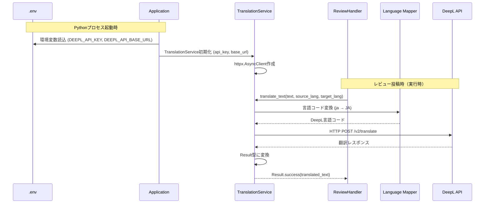
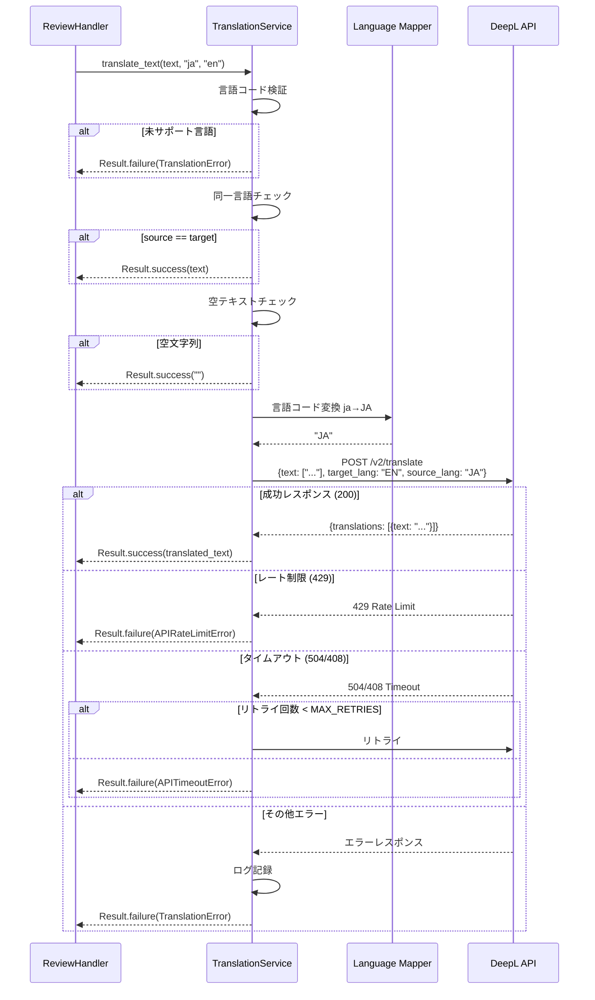
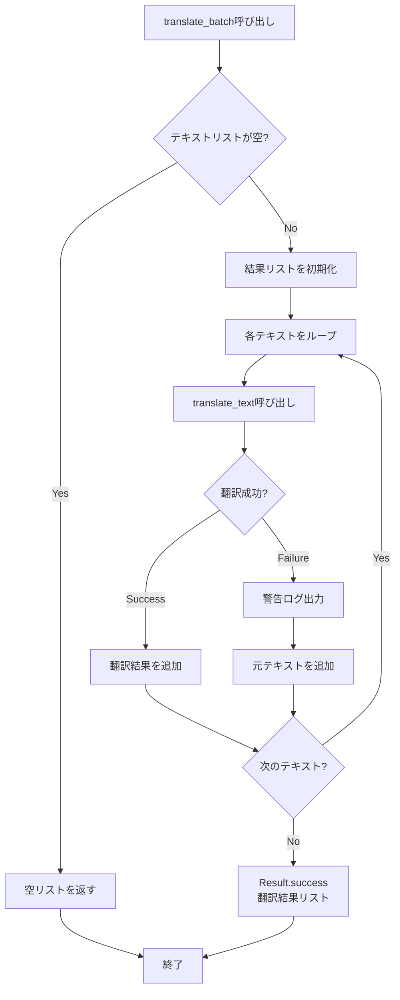
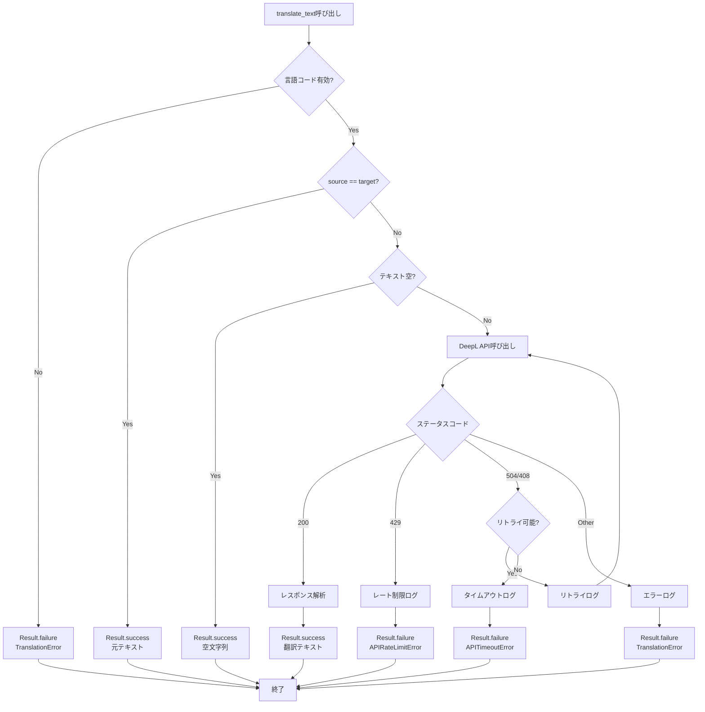
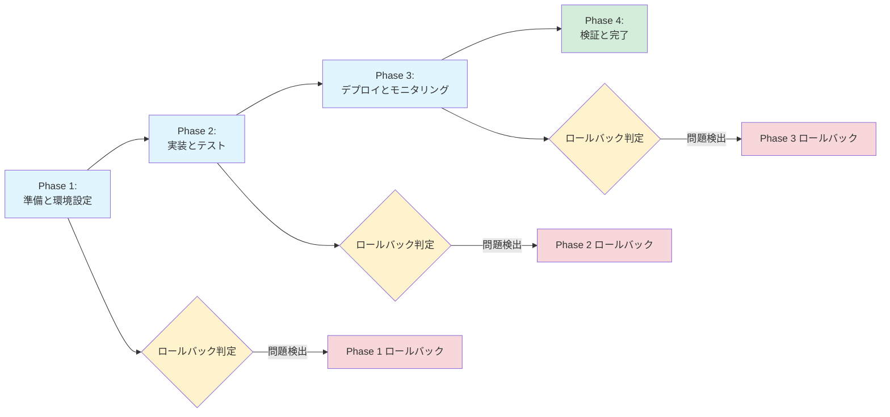

# Technical Design Document

## Overview

本機能は、既存のレビューフォーム翻訳機能をDeepSeek LLMからDeepL Translation APIに移行します。DeepL APIは業界標準の高品質翻訳サービスであり、より自然で正確な翻訳、レスポンス時間の改善、コスト効率の向上を提供します。

**Purpose**: TranslationServiceの内部実装をDeepL APIに置き換え、翻訳品質とパフォーマンスを向上させる。

**Users**: 企業レビューを投稿・閲覧するすべてのユーザー（日本語、英語、中国語の多言語環境）が、高品質な自動翻訳を通じて多言語レビューを体験できます。

**Impact**: 既存のTranslationServiceインターフェースは完全に維持されるため、review_handler.pyや他の依存コンポーネントの変更は不要です。内部実装のみをDeepL APIに置き換えます。

### Goals

- TranslationServiceの内部実装をDeepSeek LLMからDeepL APIに完全移行
- 既存のパブリックインターフェース（translate_text、translate_batch、Result型）を維持し、後方互換性を保証
- 日本語、英語、中国語の3言語サポートを継続
- エラーハンドリングとリトライメカニズムを強化し、信頼性を向上
- 環境変数による柔軟な設定管理（無料/有料プランの切り替え対応）

### Non-Goals

- 新しい言語の追加（韓国語など）は本スコープ外
- 翻訳APIの抽象化レイヤーの導入（将来的に複数の翻訳プロバイダをサポートする場合）
- リアルタイム翻訳やストリーミング翻訳機能
- 翻訳キャッシュ機構の導入（将来の最適化として検討）
- review_handler.pyや他の依存コンポーネントの修正

## Architecture

### Existing Architecture Analysis

現在のアーキテクチャでは、TranslationServiceがDeepSeek LLM APIを使用してテキスト翻訳を提供しています：

**現在の実装パターン**:
- 非同期HTTPクライアント（httpx）を使用したAPI通信
- Result型による関数型エラーハンドリング
- 非同期コンテキストマネージャーによるリソース管理
- Service Layer Pattern: Handler層から分離されたビジネスロジック

**既存の統合ポイント**:
- `review_handler.py`: レビュー投稿時の多言語翻訳処理
- テストスイート: `test_translation_service.py`による単体テスト
- マニュアルテスト: `test_translation_manual.py`による実際のAPI検証

**維持すべき技術的制約**:
- Tornado非同期フレームワークとの互換性
- httpxライブラリによる非同期HTTP通信
- Result[T, Error]型によるエラーハンドリングパターン
- python-dotenvによる環境変数管理

### High-Level Architecture



**Architecture Integration**:

- **既存パターン保持**: Service Layer Pattern、非同期コンテキストマネージャー、Result型エラーハンドリングを完全に維持
- **新コンポーネント追加理由**: DeepL API固有の言語コード変換ロジック（ja→JA）、認証ヘッダー形式（DeepL-Auth-Key）、レスポンス構造解析を追加
- **技術スタック整合性**: httpx非同期クライアント、python-dotenv、Tornado非同期フレームワークとの統合を維持
- **ステアリング準拠**:
  - structure.md: Service Layer Patternに準拠した`src/services/translation_service.py`配置
  - tech.md: httpx、asyncio、環境変数管理のベストプラクティスに従う
  - product.md: 多言語サポート（EN/ZH/JA）要件を満たす

### Technology Alignment

本機能は既存システムの拡張であり、確立された技術スタックに完全に整合します：

**既存技術スタックの継続使用**:
- **HTTP通信**: httpx 非同期クライアント（既存と同じライブラリ）
- **エラーハンドリング**: Result[T, Error]型パターン（src/utils/result.py）
- **環境変数管理**: python-dotenv（既存の.env管理と統一）
- **非同期実行**: Tornado asyncioイベントループ

**新規依存関係**:
- なし（既存の依存関係のみを使用）

**既存パターンからの変更点**:
- **APIエンドポイント**: DeepSeek `/v1/chat/completions` → DeepL `/v2/translate`
- **認証方式**: `Bearer token` → `DeepL-Auth-Key`ヘッダー
- **リクエスト形式**: LLMプロンプト形式 → 構造化翻訳リクエスト（text配列、target_lang）
- **レスポンス解析**: LLM completion → DeepL translations配列

### Key Design Decisions

#### Decision 1: 既存TranslationServiceインターフェースの完全維持

**Context**: review_handler.pyを含む複数のコンポーネントがTranslationServiceに依存しており、インターフェース変更は広範な修正を必要とする。

**Alternatives**:
1. インターフェースを変更し、すべての依存コンポーネントを更新
2. 新しいDeepLTranslationServiceクラスを作成し、段階的に移行
3. 既存インターフェースを維持し、内部実装のみを置き換え

**Selected Approach**: 既存インターフェースを維持し、内部実装のみを置き換え
- パブリックメソッド: `translate_text()`, `translate_batch()`, `is_language_supported()`, `get_supported_languages()`
- 戻り値型: `Result[str, TranslationError]`, `Result[List[str], TranslationError]`
- 非同期コンテキストマネージャー: `__aenter__`, `__aexit__`, `close()`

**Rationale**:
- 既存コードへの影響をゼロに抑え、リスクを最小化
- 単一ファイル（translation_service.py）の修正で完了
- テストコードの大部分を再利用可能

**Trade-offs**:
- **獲得**: 安全な移行、既存機能の無中断運用、低リスク
- **犠牲**: DeepL API固有の高度な機能（glossary、formality）の活用は将来拡張として検討

#### Decision 2: プログラムコード内での言語コード変換と検証

**Context**: アプリケーション層では小文字の言語コード（ja、en、zh）を使用しているが、DeepL APIは大文字の言語コード（JA、EN、ZH）を要求する。

**Alternatives**:
1. API呼び出し前に毎回変換ロジックを実行
2. プログラムコード内に明示的なマッピング辞書を定義し、初期化時に検証
3. DeepL APIのレスポンスに依存して動的にサポート言語を判定

**Selected Approach**: プログラムコード内に明示的なマッピング辞書を定義
```python
LANGUAGE_CODE_MAPPING = {
    "ja": "JA",  # 日本語
    "en": "EN",  # 英語
    "zh": "ZH",  # 中国語
}
```

**Rationale**:
- API呼び出し前にサポート外言語を早期検出し、不要なAPI呼び出しを防止
- 言語サポート範囲をプログラムコードで明示的に管理
- テスト可能性の向上（言語コード変換ロジックを独立してテスト）

**Trade-offs**:
- **獲得**: 予測可能な動作、早期エラー検出、テスト容易性
- **犠牲**: 新言語追加時にコード修正が必要（ただし、現状3言語のみサポートで変更予定なし）

#### Decision 3: 個別リクエストによるバッチ翻訳とGraceful Degradation

**Context**: レビューフォームでは複数カテゴリのコメント（例: 給与、福利厚生、キャリア成長）を同時に翻訳する必要がある。

**Alternatives**:
1. DeepL APIのバッチ機能を使用（text配列に複数テキストを含める）
2. 各テキストを個別にtranslate_text()で翻訳し、失敗時は元テキストを返す
3. Promise.all的な並列実行で全テキストを同時翻訳

**Selected Approach**: 各テキストを個別にtranslate_text()で翻訳し、失敗時は元テキストを返す（Graceful Degradation）

**Rationale**:
- 一部の翻訳が失敗しても、他の翻訳結果は正常に返却される
- エラーハンドリングとリトライロジックをtranslate_text()に集約し、コードの重複を回避
- 個別テキストごとの詳細なログとエラー追跡が可能

**Trade-offs**:
- **獲得**: 高い可用性、部分的成功のサポート、シンプルなエラーハンドリング
- **犠牲**: バッチリクエストによるネットワーク効率の向上機会（ただし、レビュー投稿は低頻度操作のためパフォーマンス影響は限定的）

## System Flows

### 翻訳処理フロー



### バッチ翻訳フロー



## Requirements Traceability

| 要件 | 要件概要 | コンポーネント | インターフェース | フロー |
|------|---------|--------------|----------------|--------|
| 1.1-1.5 | DeepL API統合とクライアント実装 | TranslationService.__init__ | 環境変数読込、httpxクライアント初期化 | - |
| 2.1-2.6 | テキスト翻訳機能 | TranslationService.translate_text | async def translate_text() -> Result | 翻訳処理フロー |
| 3.1-3.6 | 言語サポートと検証 | Language Mapper | _convert_to_deepl_lang_code(), is_language_supported() | 言語コード変換 |
| 4.1-4.5 | バッチ翻訳機能 | TranslationService.translate_batch | async def translate_batch() -> Result | バッチ翻訳フロー |
| 5.1-5.7 | エラーハンドリングとリトライ | Error Handler, Retry Logic | _call_deepl_api() with retry | 翻訳処理フロー（エラー分岐） |
| 6.1-6.6 | 既存インターフェース互換性 | TranslationService | パブリックメソッド、Result型、コンテキストマネージャー | 全フロー |
| 7.1-7.5 | 環境設定とデプロイメント | Configuration | DEEPL_API_KEY, DEEPL_API_BASE_URL | - |
| 8.1-8.5 | テストとドキュメント | Test Suite | test_translation_service.py更新 | - |

## Components and Interfaces

### Service Layer

#### TranslationService

**Responsibility & Boundaries**
- **Primary Responsibility**: DeepL APIを使用してテキストの多言語翻訳を提供する
- **Domain Boundary**: 翻訳ドメイン（Translation Domain）に所属し、レビューシステムの多言語化を支援
- **Data Ownership**: 翻訳リクエスト/レスポンスの一時的な管理（永続化なし）
- **Transaction Boundary**: 各翻訳リクエストは独立したトランザクション（ステートレス）

**Dependencies**
- **Inbound**: ReviewHandler（レビュー投稿時の翻訳）
- **Outbound**: DeepL API（外部翻訳サービス）、Result型（src/utils/result.py）
- **External**: httpx（非同期HTTPクライアント）、python-dotenv（環境変数管理）

**External Dependencies Investigation**

**DeepL API Documentation Analysis**:
- 公式ドキュメント: https://developers.deepl.com/api-reference/translate
- **認証方式**: `Authorization: DeepL-Auth-Key [yourAuthKey]`ヘッダー
- **エンドポイント**:
  - 無料プラン: `https://api-free.deepl.com/v2/translate`
  - 有料プラン: `https://api.deepl.com/v2/translate`
- **リクエスト形式**: POST、JSON Content-Type、必須パラメータ（text配列、target_lang）、オプションパラメータ（source_lang、context）
- **レスポンス形式**:
  ```json
  {
    "translations": [
      {
        "detected_source_language": "JA",
        "text": "translated text here"
      }
    ]
  }
  ```
- **言語コード**: 大文字2文字（JA、EN、ZH）、一部バリアント（EN-US、PT-BRなど）
- **レート制限**: ドキュメントに明示なし（実装時に429エラーで検知）
- **エラーコード**: 標準HTTPステータスコード（400、401、403、429、456、503など）

**重要な変更（2025年2月）**:
- GET リクエストの廃止（POST のみサポート）
- クエリパラメータ認証の廃止（認証ヘッダー必須）

**httpx Async Client Best Practices**:
- AsyncClientインスタンスの再利用（アプリケーション起動時に初期化、シャットダウン時にクローズ）
- 非同期コンテキストマネージャーによるリソース管理
- タイムアウト設定の明示的な指定
- リトライロジックの実装（一時的な障害に対応）

**Contract Definition**

**Service Interface**:
```python
class TranslationService:
    """DeepL APIを使用した翻訳サービス"""

    async def translate_text(
        self,
        text: str,
        source_lang: str,
        target_lang: str,
        context: Optional[str] = None
    ) -> Result[str, TranslationError]:
        """
        テキストを翻訳

        Preconditions:
        - text: 有効なUTF-8文字列
        - source_lang, target_lang: サポート言語コード（ja、en、zh）

        Postconditions:
        - 成功時: 翻訳されたテキストを含むResult.success
        - 失敗時: エラー詳細を含むResult.failure

        Invariants:
        - source_lang == target_langの場合、API呼び出しなしで元テキストを返す
        - 空文字列入力の場合、API呼び出しなしで空文字列を返す
        """
        pass

    async def translate_batch(
        self,
        texts: List[str],
        source_lang: str,
        target_lang: str,
        context: Optional[str] = None
    ) -> Result[List[str], TranslationError]:
        """
        複数テキストのバッチ翻訳

        Preconditions:
        - texts: 文字列のリスト
        - 各テキストは有効なUTF-8文字列

        Postconditions:
        - 成功時: 翻訳結果リストを含むResult.success
        - 部分失敗時: 失敗したテキストは元テキストを返す（Graceful Degradation）

        Invariants:
        - 空リスト入力の場合、空リストを返す
        - 結果リストの長さは入力リストと同じ
        """
        pass

    @classmethod
    def is_language_supported(cls, lang_code: str) -> bool:
        """
        言語コードがサポートされているか確認

        Preconditions:
        - lang_code: 文字列（小文字想定）

        Postconditions:
        - サポート言語の場合True、それ以外False
        """
        pass

    @classmethod
    def get_supported_languages(cls) -> Dict[str, str]:
        """
        サポート言語のマッピング辞書を取得

        Postconditions:
        - 言語コード→言語名のマッピング辞書を返す
        """
        pass

    async def close(self) -> None:
        """HTTPクライアントのクリーンアップ"""
        pass

    async def __aenter__(self) -> "TranslationService":
        """非同期コンテキストマネージャー入口"""
        pass

    async def __aexit__(self, exc_type, exc_val, exc_tb) -> None:
        """非同期コンテキストマネージャー出口"""
        pass
```

**Error Types**:
```python
class TranslationError(Exception):
    """翻訳エラーの基底クラス"""
    pass

class APIRateLimitError(TranslationError):
    """APIレート制限エラー（429）"""
    pass

class APITimeoutError(TranslationError):
    """APIタイムアウトエラー（504、408）"""
    pass
```

**Integration Strategy**:
- **Modification Approach**: 既存のtranslation_service.pyファイルを完全に置き換え（既存コードは使用しない）
- **Backward Compatibility**: パブリックインターフェース（メソッドシグネチャ、Result型）を完全に維持
- **Migration Path**:
  1. 環境変数を`.env`に追加（DEEPL_API_KEY、DEEPL_API_BASE_URL）
  2. translation_service.pyを新実装で置き換え
  3. 既存のテストを実行し、互換性を確認
  4. マニュアルテストで実際のDeepL API動作を検証

### Utility Layer

#### Language Mapper

**Responsibility & Boundaries**
- **Primary Responsibility**: アプリケーション層の言語コード（小文字）とDeepL API言語コード（大文字）の変換
- **Domain Boundary**: 翻訳ドメイン内の補助機能
- **Data Ownership**: 言語コードマッピング辞書（静的データ）

**Contract Definition**:
```python
# TranslationServiceクラス内のプライベートメソッドとして実装
LANGUAGE_CODE_MAPPING = {
    "ja": "JA",  # 日本語
    "en": "EN",  # 英語
    "zh": "ZH",  # 中国語
}

def _convert_to_deepl_lang_code(self, app_lang_code: str) -> str:
    """
    アプリケーション言語コードをDeepL API形式に変換

    Preconditions:
    - app_lang_code: サポート言語コード（ja、en、zh）

    Postconditions:
    - DeepL API形式の言語コード（JA、EN、ZH）を返す

    Raises:
    - KeyError: サポートされていない言語コードの場合
    """
    return LANGUAGE_CODE_MAPPING[app_lang_code]
```

#### Error Handler

**Responsibility & Boundaries**
- **Primary Responsibility**: DeepL APIレスポンスのステータスコードに基づいたエラー分類と適切な例外への変換
- **Domain Boundary**: 翻訳ドメイン内のエラーハンドリング

**Contract Definition**:
```python
# TranslationService._call_deepl_api() メソッド内で実装
def _handle_api_error(self, status_code: int, response_text: str) -> TranslationError:
    """
    APIエラーレスポンスを適切な例外に変換

    Preconditions:
    - status_code: HTTPステータスコード
    - response_text: レスポンスボディ

    Postconditions:
    - 適切なTranslationErrorサブクラスを返す
    """
    if status_code == 429:
        return APIRateLimitError("API rate limit exceeded")
    elif status_code in (504, 408):
        return APITimeoutError("API timeout")
    else:
        return TranslationError(f"API error: {status_code} - {response_text}")
```

#### Retry Logic

**Responsibility & Boundaries**
- **Primary Responsibility**: タイムアウトエラー時の自動リトライ処理
- **Domain Boundary**: 翻訳ドメイン内の回復性機能

**Contract Definition**:
```python
# TranslationService._call_deepl_api() メソッド内で実装
MAX_RETRIES = 2

async def _call_deepl_api(
    self,
    request_body: Dict[str, Any],
    retry_count: int = 0
) -> Result[Dict[str, Any], TranslationError]:
    """
    DeepL APIを呼び出し、必要に応じてリトライ

    Preconditions:
    - request_body: 有効なDeepL APIリクエストボディ
    - retry_count: 現在のリトライ回数（0から開始）

    Postconditions:
    - 成功時: APIレスポンスを含むResult.success
    - 失敗時: エラーを含むResult.failure

    Retry Policy:
    - タイムアウト（504、408、httpx.TimeoutException）時のみリトライ
    - 最大リトライ回数: MAX_RETRIES（2回）
    - その他のエラーは即座に失敗を返す
    """
    pass
```

## Data Models

### API Data Transfer

**DeepL API Request Schema**:
```python
{
    "text": List[str],          # 必須: 翻訳するテキストの配列
    "target_lang": str,         # 必須: ターゲット言語コード（大文字）
    "source_lang": str,         # オプション: ソース言語コード（大文字）
    "context": Optional[str]    # オプション: 翻訳コンテキスト（未使用）
}
```

**DeepL API Response Schema**:
```python
{
    "translations": [
        {
            "detected_source_language": str,  # 検出された元言語
            "text": str                       # 翻訳されたテキスト
        }
    ]
}
```

**Validation Rules**:
- リクエスト:
  - text配列は空でない
  - target_langはサポート言語コード（JA、EN、ZH）
  - source_langが指定される場合、サポート言語コード
- レスポンス:
  - translations配列が存在し、少なくとも1要素を含む
  - 各translation要素にtextフィールドが存在

**Serialization Format**: JSON（application/json）

### Error Data Structures

```python
class TranslationError(Exception):
    """
    翻訳エラーの基底クラス

    Attributes:
        message: エラーメッセージ
    """
    def __init__(self, message: str):
        self.message = message
        super().__init__(message)

class APIRateLimitError(TranslationError):
    """
    APIレート制限エラー

    発生条件: DeepL APIが429ステータスコードを返す
    """
    pass

class APITimeoutError(TranslationError):
    """
    APIタイムアウトエラー

    発生条件:
    - DeepL APIが504または408ステータスコードを返す
    - httpx.TimeoutExceptionが発生
    - MAX_RETRIESを超えてもタイムアウトが継続
    """
    pass
```

## Error Handling

### Error Strategy

TranslationServiceはResult型パターンを使用し、すべてのエラーを例外ではなくResult.failureとして返します。これにより、呼び出し側は明示的にエラーハンドリングを行うことができます。

**Error Handling Principles**:
1. **例外の内部化**: TranslationServiceの内部で例外をキャッチし、Result.failureに変換
2. **詳細なログ記録**: すべてのエラーを適切なログレベル（warning、error、exception）で記録
3. **Graceful Degradation**: バッチ翻訳では、部分的失敗時に元テキストを返す
4. **自動リトライ**: タイムアウトエラーのみリトライ、その他のエラーは即座に失敗

### Error Categories and Responses

#### User Errors (4xx相当)

**無効な言語コード**:
- **検出ポイント**: translate_text()の入力検証
- **処理**: API呼び出し前に`Result.failure(TranslationError("Unsupported language: XX"))`を返す
- **ログレベル**: warning
- **ユーザーへの影響**: 翻訳が実行されず、エラーメッセージが表示される

**空テキスト入力**:
- **検出ポイント**: translate_text()の入力検証
- **処理**: API呼び出しをスキップし、`Result.success("")`を返す
- **ログレベル**: なし（正常な動作）
- **ユーザーへの影響**: なし

#### System Errors (5xx)

**APIレート制限 (429)**:
- **検出ポイント**: DeepL APIレスポンス
- **処理**: `Result.failure(APIRateLimitError("API rate limit exceeded"))`を返す
- **リトライ**: なし（レート制限は一時的なリトライでは解決しない）
- **ログレベル**: warning
- **ユーザーへの影響**: 翻訳失敗、バッチ翻訳では元テキストを表示

**APIタイムアウト (504, 408, httpx.TimeoutException)**:
- **検出ポイント**: DeepL APIレスポンスまたはhttpx例外
- **処理**:
  - リトライ回数 < MAX_RETRIES: 自動リトライ
  - リトライ上限到達: `Result.failure(APITimeoutError("API timeout after retries"))`を返す
- **リトライ**: 最大2回
- **ログレベル**: warning（リトライ時）、error（リトライ上限時）
- **ユーザーへの影響**: リトライ成功時は透過的、失敗時は翻訳失敗

**予期しないAPIエラー (その他5xx)**:
- **検出ポイント**: DeepL APIレスポンス
- **処理**: `Result.failure(TranslationError(f"API error: {status_code}"))`を返す
- **ログレベル**: exception（スタックトレース付き）
- **ユーザーへの影響**: 翻訳失敗

#### Configuration Errors

**APIキー未設定**:
- **検出ポイント**: TranslationService.__init__()
- **処理**: `ValueError("DEEPL_API_KEY is required")`例外を発生（アプリケーション起動時に検出）
- **ログレベル**: critical
- **ユーザーへの影響**: アプリケーション起動失敗

### Error Flow Visualization



### Monitoring

**Error Tracking**:
- すべてのTranslationErrorを`logger.exception()`で記録（スタックトレース付き）
- APIレスポンスのステータスコードとレスポンスボディをログに含める
- リトライ時は`logger.info()`でリトライ回数を記録

**Logging Strategy**:
```python
import logging
logger = logging.getLogger(__name__)

# 成功時
logger.info("Translation successful: %s -> %s (length: %d -> %d)",
            source_lang, target_lang, len(text), len(translated_text))

# リトライ時
logger.info("Retrying API call (%d/%d)", retry_count + 1, MAX_RETRIES)

# レート制限
logger.warning("DeepL API rate limit exceeded")

# タイムアウト
logger.warning("DeepL API timeout")

# 予期しないエラー
logger.exception("Translation failed: %s", e)
```

**Health Monitoring**:
- アプリケーション既存のヘルスチェックエンドポイント（/health）で監視
- TranslationServiceの初期化失敗はアプリケーション起動失敗として検出
- 実行時エラーはログ集約システムで監視（既存のログ基盤を使用）

## Testing Strategy

### Unit Tests

**TranslationService Core Functions**:
1. **正常系翻訳**: モックDeepL APIレスポンスを使用し、translate_text()が正しく翻訳テキストを返すことを検証
2. **言語コード変換**: _convert_to_deepl_lang_code()が小文字→大文字変換を正しく実行することを検証
3. **エラーハンドリング**: 429、504、408ステータスコードに対して適切なエラー型を返すことを検証
4. **リトライロジック**: タイムアウト時に最大2回リトライし、上限後にエラーを返すことを検証
5. **バッチ翻訳のGraceful Degradation**: 一部のテキスト翻訳が失敗しても、他のテキストは正常に翻訳されることを検証

**Test Implementation Approach**:
```python
import pytest
from unittest.mock import AsyncMock, patch
from src.services.translation_service import TranslationService, APIRateLimitError

@pytest.mark.asyncio
async def test_translate_text_success():
    """正常系: DeepL APIが正常なレスポンスを返す"""
    with patch('httpx.AsyncClient.post') as mock_post:
        mock_post.return_value = AsyncMock(
            status_code=200,
            json=lambda: {
                "translations": [
                    {"detected_source_language": "JA", "text": "Hello, world!"}
                ]
            }
        )

        service = TranslationService()
        result = await service.translate_text("こんにちは、世界！", "ja", "en")

        assert result.is_success
        assert result.data == "Hello, world!"

@pytest.mark.asyncio
async def test_translate_text_rate_limit():
    """異常系: DeepL APIがレート制限エラーを返す"""
    with patch('httpx.AsyncClient.post') as mock_post:
        mock_post.return_value = AsyncMock(status_code=429)

        service = TranslationService()
        result = await service.translate_text("テスト", "ja", "en")

        assert not result.is_success
        assert isinstance(result.error, APIRateLimitError)
```

### Integration Tests

**Cross-Component Flows**:
1. **ReviewHandler統合**: review_handler.pyがTranslationServiceを呼び出し、翻訳結果を正しく処理することを検証
2. **環境変数読込**: .envファイルからDEEPL_API_KEYを正しく読み込み、TranslationServiceが初期化されることを検証
3. **非同期コンテキストマネージャー**: async withブロックでTranslationServiceを使用し、リソースが正しくクリーンアップされることを検証
4. **Result型統合**: 既存のResult型との互換性を検証し、is_success、data、errorプロパティが正しく機能することを確認
5. **バッチ翻訳エンドツーエンド**: review_handler.pyが複数カテゴリのコメントをバッチ翻訳し、すべての結果が正しく返されることを検証

### Manual Testing

**Critical User Paths**:
1. **日本語→英語翻訳**: 実際のDeepL APIを使用し、日本語のレビューコメントが自然な英語に翻訳されることを確認
2. **日本語→中国語翻訳**: 実際のDeepL APIを使用し、日本語のレビューコメントが正しい中国語に翻訳されることを確認
3. **英語→日本語翻訳**: 実際のDeepL APIを使用し、英語のレビューコメントが自然な日本語に翻訳されることを確認
4. **レビューフォーム多言語投稿**: レビュー投稿フォームで言語を選択し、複数カテゴリのコメントが正しく翻訳されることをブラウザで確認
5. **エラーハンドリング**: 無効なAPIキーを設定し、アプリケーション起動時にエラーが検出されることを確認

**Manual Test Script** (`test_translation_manual.py`更新):
```python
import asyncio
from src.services.translation_service import TranslationService

async def manual_test():
    async with TranslationService() as service:
        # Test 1: 日本語→英語
        result = await service.translate_text(
            "この会社は福利厚生が充実しており、ワークライフバランスが良いです。",
            "ja", "en"
        )
        print(f"JA->EN: {result.data if result.is_success else result.error}")

        # Test 2: 日本語→中国語
        result = await service.translate_text(
            "給与水準は業界平均より高く、キャリア成長の機会が豊富です。",
            "ja", "zh"
        )
        print(f"JA->ZH: {result.data if result.is_success else result.error}")

        # Test 3: 英語→日本語
        result = await service.translate_text(
            "The company culture is innovative and collaborative.",
            "en", "ja"
        )
        print(f"EN->JA: {result.data if result.is_success else result.error}")

if __name__ == "__main__":
    asyncio.run(manual_test())
```

### Performance Testing

**Latency Benchmarks**:
1. **単一翻訳レイテンシ**: translate_text()の平均応答時間を測定（目標: 2秒以内）
2. **バッチ翻訳レイテンシ**: 7カテゴリのコメント翻訳（典型的なレビュー投稿）の合計時間を測定（目標: 15秒以内）
3. **タイムアウトとリトライ**: タイムアウト時のリトライ動作を検証し、最大リトライ時間を測定
4. **並行リクエスト**: 複数のレビュー投稿が同時に発生した場合の性能を測定

**Performance Test Implementation**:
```python
import time
import asyncio
from src.services.translation_service import TranslationService

async def performance_test():
    async with TranslationService() as service:
        texts = [
            "給与水準について",
            "福利厚生について",
            "キャリア成長について",
            "ワークライフバランスについて",
            "企業文化について",
            "マネジメントについて",
            "総合評価"
        ]

        start = time.time()
        result = await service.translate_batch(texts, "ja", "en")
        elapsed = time.time() - start

        print(f"Batch translation time: {elapsed:.2f}s")
        print(f"Success: {result.is_success}")
        if result.is_success:
            print(f"Translated {len(result.data)} texts")

if __name__ == "__main__":
    asyncio.run(performance_test())
```

## Security Considerations

### API Key Management

**Threat**: APIキーの漏洩により、不正な翻訳リクエストが実行される可能性がある。

**Security Controls**:
- 環境変数（.env）でのAPIキー管理、ソースコードへのハードコーディング禁止
- .envファイルを.gitignoreに追加し、バージョン管理システムから除外
- .env.exampleファイルでキーのフォーマットを提供（実際の値は含めない）
- 本番環境ではシークレット管理システム（AWS Secrets Manager、HashiCorp Vaultなど）の使用を推奨

**Implementation**:
```python
import os
from dotenv import load_dotenv

load_dotenv()

class TranslationService:
    def __init__(self, api_key: Optional[str] = None):
        self.api_key = api_key or os.getenv("DEEPL_API_KEY")
        if not self.api_key:
            raise ValueError("DEEPL_API_KEY is required")
```

### Data Privacy

**Threat**: 翻訳対象のレビューテキストがDeepL APIに送信されるため、機密情報や個人情報が外部サービスに渡される可能性がある。

**Security Controls**:
- DeepL APIのプライバシーポリシーを確認し、データ保持期間とセキュリティ対策を理解
- レビュー投稿時に、個人を特定できる情報（氏名、メールアドレス、電話番号など）を含めないようユーザーに注意喚起
- 翻訳リクエストログには翻訳元テキストを含めない（テキスト長のみ記録）
- HTTPSによる暗号化通信（DeepL APIはHTTPSをサポート）

### Input Validation

**Threat**: 不正なテキスト入力によるインジェクション攻撃やDoS攻撃の可能性。

**Security Controls**:
- テキスト長の上限チェック（DeepL APIのリクエストサイズ上限: 128KiB）
- 特殊文字やHTMLタグのサニタイゼーション（review_handler.pyで実施）
- 言語コードの厳格な検証（ホワイトリスト方式: ja、en、zhのみ許可）

**Implementation**:
```python
SUPPORTED_LANGUAGES = {"ja", "en", "zh"}

async def translate_text(self, text: str, source_lang: str, target_lang: str):
    # 言語コードの検証
    if source_lang not in SUPPORTED_LANGUAGES:
        return Result.failure(TranslationError(f"Unsupported language: {source_lang}"))

    if target_lang not in SUPPORTED_LANGUAGES:
        return Result.failure(TranslationError(f"Unsupported language: {target_lang}"))

    # テキスト長の検証（128KiB = 131072バイト）
    if len(text.encode('utf-8')) > 131072:
        return Result.failure(TranslationError("Text size exceeds API limit"))
```

### Rate Limiting and DoS Protection

**Threat**: 大量の翻訳リクエストによるAPIレート制限到達やコスト増加。

**Security Controls**:
- DeepL APIのレート制限（429エラー）を適切にハンドリング
- アプリケーション層でのレート制限実装（将来の拡張として検討）
- レビュー投稿頻度の制限（既存のアクセス制御機能を活用）
- APIキーの使用量モニタリング（DeepL APIダッシュボードで確認）

## Migration Strategy

既存のTranslationService実装をDeepL APIベースの実装に置き換えるための段階的移行戦略を定義します。

### Migration Phases



### Phase 1: 準備と環境設定

**目的**: DeepL API統合に必要な環境設定とドキュメント準備を完了する。

**作業項目**:
1. DeepL APIアカウントの作成（無料プランで開始）
2. APIキーの取得
3. `.env`ファイルに環境変数を追加:
   ```bash
   # DeepL Translation API
   DEEPL_API_KEY=your-deepl-api-key-here
   DEEPL_API_BASE_URL=https://api-free.deepl.com/v2
   ```
4. `.env.example`ファイルの更新:
   ```bash
   # DeepL Translation API Configuration
   DEEPL_API_KEY=your-deepl-api-key
   DEEPL_API_BASE_URL=https://api-free.deepl.com/v2  # または https://api.deepl.com/v2 (有料プラン)
   ```

**検証チェックポイント**:
- [ ] DeepL APIキーが正常に動作することを確認（curlまたはPostmanでテストリクエスト）
- [ ] 環境変数が正しく読み込まれることを確認

**ロールバックトリガー**:
- DeepL APIアカウントの作成に失敗
- APIキーが正常に動作しない

**ロールバック手順**:
- 環境変数の追加を取り消し
- 既存のDeepSeek LLM実装を継続使用

### Phase 2: 実装とテスト

**目的**: TranslationServiceの実装を完了し、すべてのテストをパスすることを確認する。

**作業項目**:
1. `src/services/translation_service.py`を新実装で置き換え
2. 単体テストの更新:
   - DeepL APIレスポンスモックの作成
   - 言語コード変換テストの追加
   - エラーハンドリングテストの更新
3. 統合テストの実行:
   - review_handler.pyとの統合確認
   - Result型互換性確認
4. マニュアルテストの実行:
   - `test_translation_manual.py`で実際のDeepL API動作確認
   - 日本語→英語、日本語→中国語、英語→日本語の翻訳品質確認

**検証チェックポイント**:
- [ ] すべての単体テストがパス
- [ ] すべての統合テストがパス
- [ ] マニュアルテストで翻訳品質が許容範囲内
- [ ] 既存のreview_handler.pyが正常に動作

**ロールバックトリガー**:
- 単体テストまたは統合テストが失敗
- 翻訳品質が著しく低下
- review_handler.pyとの統合で問題発生

**ロールバック手順**:
1. Gitで前回のコミットに戻す: `git revert <commit-hash>`
2. 既存のDeepSeek LLM実装を復元
3. テストを再実行し、既存機能が正常に動作することを確認

### Phase 3: デプロイとモニタリング

**目的**: 本番環境（または開発環境）にデプロイし、実際の動作を監視する。

**作業項目**:
1. 本番環境の`.env`ファイルにDeepL API設定を追加
2. アプリケーションを再起動
3. ログ監視:
   - 翻訳成功ログを確認
   - エラーログを確認（特にレート制限、タイムアウト）
4. パフォーマンス監視:
   - レスポンス時間の測定
   - バッチ翻訳の性能確認

**検証チェックポイント**:
- [ ] アプリケーションが正常に起動
- [ ] 翻訳リクエストが成功
- [ ] エラーレートが許容範囲内（< 5%）
- [ ] レスポンス時間が目標範囲内（単一翻訳: < 2秒、バッチ翻訳: < 15秒）

**ロールバックトリガー**:
- アプリケーション起動失敗
- 翻訳エラーレートが高い（> 10%）
- レスポンス時間が著しく遅い（> 5秒）
- ユーザーからのクレームが多数

**ロールバック手順**:
1. 本番環境の`.env`ファイルからDeepL API設定を削除
2. Gitで前回のリリースに戻す
3. アプリケーションを再起動
4. 既存のDeepSeek LLM実装が正常に動作することを確認
5. ユーザーに障害復旧を通知

### Phase 4: 検証と完了

**目的**: 移行が成功したことを確認し、古いDeepSeek LLM実装関連のコードとドキュメントをクリーンアップする。

**作業項目**:
1. 24時間のモニタリング期間を設定
2. ユーザーフィードバックの収集
3. 翻訳品質の定性的評価
4. DeepSeek API関連の環境変数を削除（`DEEPSEEK_API_KEY`）
5. ドキュメントの更新:
   - `TESTING_TRANSLATION_SERVICE.md`をDeepL API用に更新
   - `README.md`の更新

**検証チェックポイント**:
- [ ] 24時間のエラーレートが < 5%
- [ ] ユーザーからの肯定的なフィードバック
- [ ] パフォーマンスメトリクスが安定
- [ ] すべてのドキュメントが更新済み

**完了条件**:
- 移行から1週間経過し、問題が報告されていない
- DeepSeek LLM関連のコードとドキュメントがクリーンアップ済み
- チームメンバー全員がDeepL API実装を理解

---

## 設計レビューポイント

本設計文書をレビューする際は、以下の点を確認してください：

1. **既存インターフェース互換性**: TranslationServiceのパブリックメソッドシグネチャが維持されているか
2. **言語サポート**: 日本語、英語、中国語の3言語が正しくサポートされているか
3. **エラーハンドリング**: すべてのエラーケース（レート制限、タイムアウト、無効な入力）が適切に処理されているか
4. **リトライロジック**: タイムアウト時のリトライが適切に実装されているか
5. **テスト戦略**: 単体テスト、統合テスト、マニュアルテストが包括的にカバーされているか
6. **セキュリティ**: APIキー管理、データプライバシー、入力検証が適切に考慮されているか
7. **移行戦略**: 段階的な移行とロールバック計画が明確に定義されているか

設計に問題がなければ、次のコマンドでタスク分解フェーズに進んでください：
```
/kiro:spec-tasks deepl-translation-api -y
```
