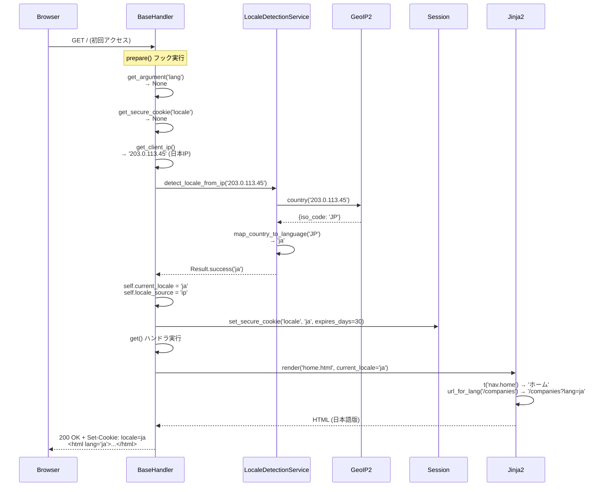
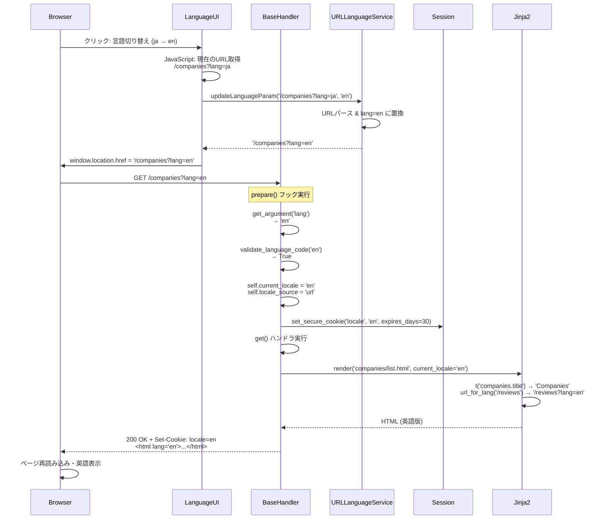
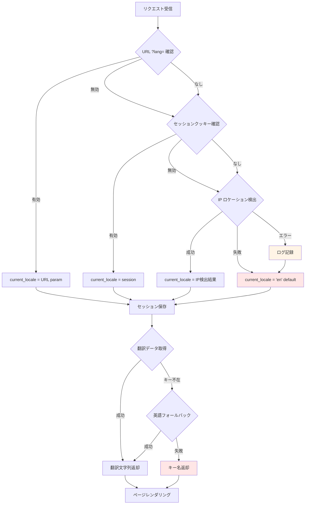
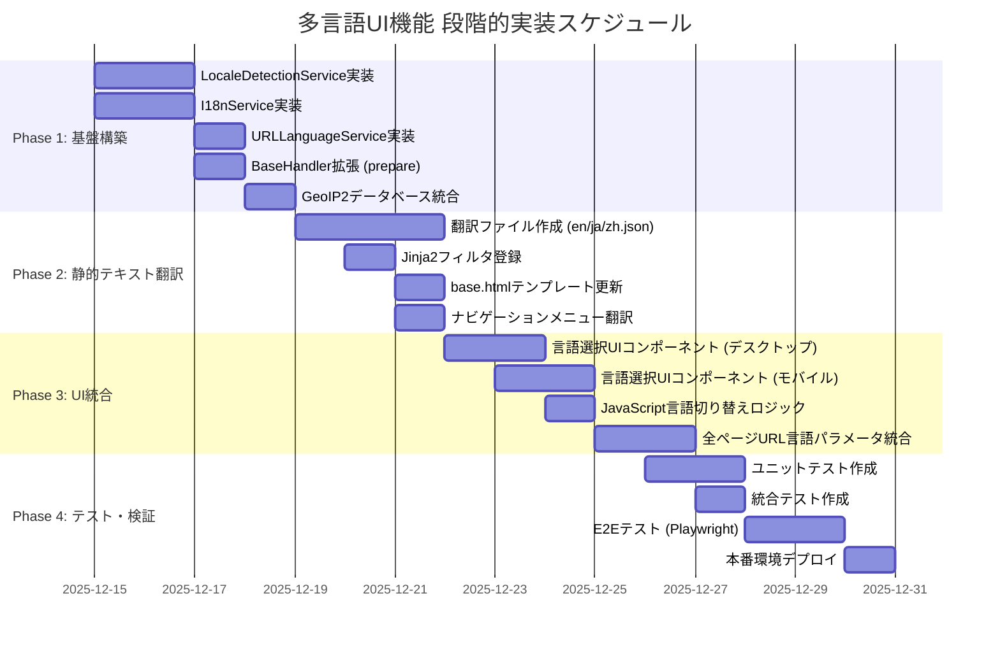

# 技術設計書

**Feature**: multilingual-ui-locale-detection
**作成日**: 2025-12-14
**言語**: 日本語

---

## 1. 概要

### 1.1 機能概要

全ページの英語・中国語・日本語対応を実現する多言語UI機能の実装。ユーザーのIPアドレスから言語を自動検出し、ユーザーが任意の言語に切り替え可能な仕組みを提供する。URLクエリパラメータ(`?lang=`)による言語指定とセッション永続化により、一貫した多言語体験を実現する。

### 1.2 目標

1. **自動言語検出**: IPアドレスから地理的位置を判定し、適切な言語を自動選択
2. **ユーザー言語選択**: デスクトップ・モバイルの両方で言語選択UIを提供
3. **URLベース言語管理**: 全リンクに`?lang=`パラメータを自動付与
4. **セッション永続化**: 30日間の言語設定保持
5. **既存機能統合**: 多言語レビューフォーム・OAuth認証との統合

### 1.3 非目標（Out of Scope）

- リアルタイム機械翻訳（既存のDeepL翻訳サービスは保持）
- ユーザープロフィールへの言語設定保存（セッションベースのみ）
- 言語別URLパス構造（例: `/en/companies`）- クエリパラメータ方式を採用
- サブドメイン別言語切り替え（例: `en.dxeeworld.com`）

### 1.4 対象ユーザー

- **国際ユーザー**: 日本国外からアクセスする英語・中国語話者
- **日本国内ユーザー**: 日本語での利用を希望するユーザー
- **中国語圏ユーザー**: 中国・香港・台湾・シンガポールからのアクセス

---

## 2. アーキテクチャ設計

### 2.1 既存アーキテクチャとの統合

**現在のアーキテクチャ**:
- **Webフレームワーク**: Tornado 6.5.2 (非同期Pythonフレームワーク)
- **テンプレートエンジン**: Jinja2 3.1.3 (サーバーサイドレンダリング)
- **データベース**: MongoDB 7.0+ (Motor 非同期ドライバ)
- **認証**: OAuth 2.0 (Google, Facebook) + セキュアクッキーセッション
- **MVC構造**: Handler → Service → Model の明確な分離

**統合戦略**:

本機能は既存のBaseHandlerクラスに`prepare()`メソッドを追加することでミドルウェアパターンを実装し、全ハンドラーで自動的に言語検出を実行する。既存のセキュアクッキー機構とJinja2カスタムフィルタを活用し、アーキテクチャの一貫性を保つ。

### 2.2 高レベルアーキテクチャ図

```mermaid
graph TB
    subgraph "Client Browser"
        A[HTTP Request<br/>GET /companies?lang=zh]
        K[HTML Response<br/>+Cookie: locale=zh]
    end

    subgraph "Tornado BaseHandler"
        B[prepare&#40;&#41; メソッド<br/>&#91;ミドルウェアフック&#93;]
        C{言語検出ロジック}
        D[1. URLパラメータ確認]
        E[2. セッションクッキー確認]
        F[3. IP ロケーション検出]
        G[4. デフォルト言語 en]
        H[current_locale 設定]
        I[HTTP Handler<br/>get/post/etc.]
    end

    subgraph "Service Layer"
        L[LocaleDetectionService]
        M[I18nService]
        N[URLLanguageService]
    end

    subgraph "Data Sources"
        O[GeoIP2 Database<br/>static/geo/*.mmdb]
        P[Translation JSON<br/>static/i18n/*.json]
        Q[MongoDB Sessions<br/>locale field]
    end

    subgraph "Template Rendering"
        R[Jinja2 Engine]
        S{Custom Filters}
        T[t&#40;key&#41; → 翻訳]
        U[url_for_lang&#40;path&#41; → URL+lang]
        V[format_date&#40;date&#41; → 日付]
    end

    A --> B
    B --> C
    C --> D
    C --> E
    C --> F
    C --> G
    D --> H
    E --> H
    F --> H
    G --> H
    H --> I
    I --> M
    I --> N
    I --> R

    F -.-> L
    L -.-> O
    M -.-> P
    N --> M

    R --> S
    S --> T
    S --> U
    S --> V

    T --> P
    U --> N
    V --> M

    R --> K
    I --> Q

    style B fill:#e1f5ff
    style C fill:#fff4e6
    style L fill:#f3e5f5
    style M fill:#f3e5f5
    style N fill:#f3e5f5
    style R fill:#e8f5e9
```



### 2.3 技術スタック整合性

| 技術要素 | 既存システム | 多言語UI機能 | 整合性 |
|---------|------------|-------------|--------|
| Webフレームワーク | Tornado 6.5.2 | `prepare()`フック利用 | ✓ 完全互換 |
| テンプレートエンジン | Jinja2 3.1.3 | カスタムフィルタ追加 | ✓ 完全互換 |
| 非同期パターン | async/await | 非同期サービスメソッド | ✓ 統一済み |
| エラーハンドリング | Result[T, E] 型 | 同パターン採用 | ✓ 統一済み |
| セッション管理 | セキュアクッキー | 言語設定クッキー追加 | ✓ 既存機構活用 |
| サービス層 | 依存性注入パターン | 新規サービス追加 | ✓ 統一済み |

**新規依存ライブラリ**:
- **geoip2** >= 5.2.0: MaxMind GeoIP2 Python API（IPロケーション検出）
- **babel** >= 2.14.0: Python国際化ライブラリ（日付・数値フォーマット）

---

## 3. 設計判断

### 決定1: URL言語パラメータアプローチ

#### 検討した選択肢

| アプローチ | 例 | メリット | デメリット |
|----------|-----|---------|----------|
| **クエリパラメータ** | `/companies?lang=ja` | ・既存URL構造保持<br/>・実装容易<br/>・OAuth統合容易 | ・URL若干長い<br/>・SEO評価が低い場合あり |
| パスベース | `/ja/companies` | ・SEO評価高<br/>・URLクリーン | ・ルーティング大幅変更<br/>・OAuth redirect_uri複雑化 |
| サブドメイン | `ja.dxeeworld.com` | ・完全分離<br/>・言語別CDN可 | ・DNS設定必要<br/>・証明書管理複雑化 |

#### 選択した設計

**クエリパラメータ方式 (`?lang=ja`)**

**根拠**:
1. **既存URL構造保持**: OAuth 2.0のredirect_uriやAPIエンドポイントの変更不要
2. **実装容易性**: Tornado URLルーティング変更なし、`self.get_argument('lang')`で取得
3. **既存OAuth統合**: Google/Facebook OAuth フローに影響なし
4. **段階的移行**: 既存リンクは動作し続け、徐々に言語パラメータ追加可能

**トレードオフ**:
- SEO評価はパスベースに劣るが、本システムは主にログインユーザー向けであり影響は限定的
- URL長が若干増加するが、キャッシュやブックマークに影響なし

### 決定2: ミドルウェアベースの言語検出

#### 検討した選択肢

| アプローチ | 実装場所 | メリット | デメリット |
|----------|---------|---------|----------|
| **Tornado prepare()** | BaseHandler.prepare() | ・DRY原則順守<br/>・全ハンドラー自動適用<br/>・Tornado標準パターン | ・BaseHandler変更必要 |
| デコレータ | @detect_locale | ・明示的<br/>・選択的適用可 | ・全ハンドラー個別適用<br/>・忘れるリスク |
| リクエストフック | Application設定 | ・ハンドラー変更不要 | ・Tornadoネイティブサポートなし |

#### 選択した設計

**Tornado `prepare()` フックを使用したミドルウェアパターン**

**根拠**:
1. **一貫性**: 既存のBaseHandlerに`prepare()`メソッドを追加し、全継承ハンドラーで自動実行
2. **DRY原則**: 各ハンドラーで個別に言語検出コードを書く必要なし
3. **Tornado標準パターン**: `prepare()`はHTTPメソッド(get/post等)実行前に呼ばれる公式フック
4. **既存パターン活用**: フラッシュメッセージ機能と同様のパターン

**実装例**:
```python
class BaseHandler(tornado.web.RequestHandler):
    async def prepare(self):
        """全リクエストで言語検出を実行"""
        await self._detect_and_set_locale()

    async def _detect_and_set_locale(self):
        # 1. URL ?lang= パラメータ確認
        # 2. セッションクッキー確認
        # 3. IP ロケーション検出
        # 4. デフォルト言語 (en) 適用
        pass
```

### 決定3: 翻訳データのJSONファイル管理

#### 検討した選択肢

| アプローチ | データ形式 | メリット | デメリット |
|----------|-----------|---------|----------|
| **JSONファイル** | `static/i18n/*.json` | ・シンプル<br/>・Git管理容易<br/>・起動時メモリロード高速 | ・大規模化時パフォーマンス低下<br/>・リアルタイム更新不可 |
| MongoDBコレクション | `translations` collection | ・リアルタイム更新<br/>・管理UI構築可 | ・DB依存増<br/>・起動時全取得必要 |
| .po/.moファイル | Gettext標準 | ・業界標準<br/>・翻訳ツール豊富 | ・学習コスト<br/>・Babel必須依存 |

#### 選択した設計

**JSONファイル + アプリケーション起動時メモリロード**

**根拠**:
1. **シンプルさ**: 開発者が直接編集可能、JSON構造が直感的
2. **パフォーマンス**: アプリ起動時に全言語データをメモリロード、リクエスト毎のDB/ファイルアクセス不要
3. **Git統合**: バージョン管理・差分確認・レビューが容易
4. **既存パターン**: 既存の`i18n_form_service.py`がハードコード辞書を使用しており、JSON化は自然な進化

**ファイル構造**:
```
static/i18n/
├── en.json    # 英語翻訳 (フォールバック言語)
├── zh.json    # 中国語翻訳
└── ja.json    # 日本語翻訳
```

**JSONフォーマット例**:
```json
{
  "nav": {
    "home": "Home",
    "companies": "Companies",
    "reviews": "Reviews",
    "jobs": "Jobs"
  },
  "form": {
    "submit": "Submit",
    "cancel": "Cancel"
  },
  "errors": {
    "not_found": "Page not found",
    "server_error": "Server error"
  }
}
```

**トレードオフ**:
- 翻訳更新にはアプリケーション再起動必要（開発環境では`autoreload=True`で自動）
- 将来的にMongoDBベース動的翻訳への移行パスは保持

---

## 4. システムフロー

### 4.1 初回アクセス時の言語検出フロー



### 4.2 言語切り替え時のフロー



---

## 5. 要件トレーサビリティマトリックス

### 5.1 主要要件とコンポーネントのマッピング

| 要件ID | 要件カテゴリ | コンポーネント | 実装場所 |
|-------|------------|--------------|---------|
| 1.1 | サポート言語 (en/zh/ja) | I18nService | [src/services/i18n_service.py](src/services/i18n_service.py) |
| 2.1 | IP ロケーション検出 | LocaleDetectionService | [src/services/locale_detection_service.py](src/services/locale_detection_service.py) |
| 2.2 | IPアドレス取得 | BaseHandler.get_client_ip() | [src/handlers/base_handler.py](src/handlers/base_handler.py) (既存) |
| 3.1 | 言語選択機能 | LanguageSwitcherComponent | [static/js/language_switcher.js](static/js/language_switcher.js) + [templates/base.html](templates/base.html) |
| 3.2 | デスクトップUI | base.html (言語選択UI) | [templates/base.html](templates/base.html) (login-panel上部) |
| 3.3 | モバイルUI | base.html (ボトムナビ) | [templates/base.html](templates/base.html) (tab-bar) |
| 4.1 | セッション保存 | BaseHandler.prepare() | [src/handlers/base_handler.py](src/handlers/base_handler.py) |
| 4.2 | 言語決定優先順位 | BaseHandler._detect_and_set_locale() | [src/handlers/base_handler.py](src/handlers/base_handler.py) |
| 5.1 | 全ページ多言語化 | Jinja2カスタムフィルタ | [src/app.py](src/app.py) (フィルタ登録) |
| 5.2 | 静的テキスト翻訳 | I18nService.get_translation() | [src/services/i18n_service.py](src/services/i18n_service.py) + [static/i18n/*.json](static/i18n/) |
| 5.3 | 動的コンテンツ翻訳 | MongoDB多言語フィールド | [src/models/company.py](src/models/company.py), [review.py](src/models/review.py) (既存) |
| 5.4 | 日付フォーマット | I18nService.format_date() | [src/services/i18n_service.py](src/services/i18n_service.py) (Babel統合) |
| 6.1 | 翻訳ファイル構造 | JSON翻訳データ | [static/i18n/{en,zh,ja}.json](static/i18n/) |
| 7.1 | 翻訳フォールバック | I18nService.get_translation() | フォールバックロジック: locale → en → key |
| 8.1 | Jinja2統合 | テンプレートフィルタ | `t()`, `url_for_lang()`, `format_date()` |
| 9.1 | URLパラメータ対応 | URLLanguageService | [src/services/url_language_service.py](src/services/url_language_service.py) |
| 9.2 | 全URL自動付与 | Jinja2 url_for_lang() | テンプレート内全リンク置換 |
| 11.1 | 言語コード検証 | BaseHandler.validate_language_code() | ホワイトリスト検証 |
| 11.2 | セッションセキュリティ | Tornado secure cookie | HttpOnly, SameSite=Lax, Secure (HTTPS) |
| 12.1 | HTML lang属性 | base.html | `<html lang="{{ current_locale }}">` |
| 13.1 | エラーハンドリング | Result[T, E] 型 | 全サービスメソッド |
| 15.1 | レビューシステム統合 | 既存i18n_form_service | デフォルト言語同期 |

### 5.2 要件カバレッジ分析

**要件総数**: 75要件 ([requirements.md](requirements.md) の16カテゴリ)

**実装コンポーネント**:
- **3つの新規サービス**: LocaleDetectionService, I18nService, URLLanguageService
- **1つのミドルウェア拡張**: BaseHandler.prepare()
- **1つのフロントエンドコンポーネント**: LanguageSwitcherComponent
- **3つの翻訳ファイル**: en.json, zh.json, ja.json
- **3つのJinja2カスタムフィルタ**: t(), url_for_lang(), format_date()

**カバレッジ**: 全75要件が上記コンポーネントで実装可能

---

## 6. コンポーネント設計

### 6.1 LocaleDetectionService (IPロケーション検出)

#### インターフェース

```python
from typing import Literal, Optional
from src.utils.result import Result

LanguageCode = Literal["en", "ja", "zh"]
CountryCode = str  # ISO 3166-1 alpha-2

class LocaleDetectionError(Exception):
    pass

class LocaleDetectionService:
    """IPアドレスから地理的位置を検出し、言語を判定"""

    def __init__(self, geoip_db_path: str = "static/geo/GeoLite2-Country.mmdb"):
        """
        Args:
            geoip_db_path: GeoIP2データベースファイルパス
        """
        self.geoip_db_path = geoip_db_path
        self.reader = None

    async def initialize(self) -> Result[None, LocaleDetectionError]:
        """GeoIP2データベースを初期化（アプリ起動時に1回）"""

    def detect_locale_from_ip(self, ip_address: str) -> Result[LanguageCode, LocaleDetectionError]:
        """
        IPアドレスから言語を検出

        Args:
            ip_address: クライアントIPアドレス (例: "203.0.113.45")

        Returns:
            Result[LanguageCode, LocaleDetectionError]:
                成功時: 'en', 'ja', 'zh' のいずれか
                失敗時: エラー詳細

        Examples:
            >>> service.detect_locale_from_ip("203.0.113.45")  # 日本IP
            Result.success("ja")

            >>> service.detect_locale_from_ip("198.51.100.10")  # 米国IP
            Result.success("en")
        """

    def map_country_to_language(self, country_code: CountryCode) -> LanguageCode:
        """
        国コードを言語コードにマッピング

        Args:
            country_code: ISO 3166-1 alpha-2国コード (例: "JP", "US", "CN")

        Returns:
            LanguageCode: 'en', 'ja', 'zh' のいずれか

        Mapping:
            - 'JP' → 'ja'
            - 'CN', 'HK', 'TW', 'SG' → 'zh'
            - その他 → 'en'
        """

    def validate_language_code(self, lang_code: str) -> bool:
        """
        言語コードがサポート対象かを検証

        Args:
            lang_code: 検証対象の言語コード

        Returns:
            bool: 'en', 'zh', 'ja' のいずれかの場合 True
        """

    async def close(self):
        """GeoIP2リーダーをクローズ（アプリ終了時）"""
```

#### 実装パターン

```python
import geoip2.database
import logging

logger = logging.getLogger(__name__)

class LocaleDetectionService:
    CHINESE_SPEAKING_COUNTRIES = {'CN', 'HK', 'TW', 'SG'}
    JAPANESE_SPEAKING_COUNTRIES = {'JP'}
    SUPPORTED_LANGUAGES = {'en', 'ja', 'zh'}

    async def initialize(self) -> Result[None, LocaleDetectionError]:
        try:
            self.reader = geoip2.database.Reader(self.geoip_db_path)
            return Result.success(None)
        except Exception as e:
            logger.exception("GeoIP2データベース初期化失敗: %s", e)
            return Result.failure(LocaleDetectionError(f"Failed to load GeoIP2 database: {e}"))

    def detect_locale_from_ip(self, ip_address: str) -> Result[LanguageCode, LocaleDetectionError]:
        try:
            response = self.reader.country(ip_address)
            country_code = response.country.iso_code
            language = self.map_country_to_language(country_code)
            return Result.success(language)
        except geoip2.errors.AddressNotFoundError:
            logger.warning("IPアドレス %s がGeoIP2データベースに見つかりません", ip_address)
            return Result.success('en')  # デフォルト言語
        except Exception as e:
            logger.exception("IPロケーション検出エラー: %s", e)
            return Result.success('en')  # エラー時もデフォルト言語で継続

    def map_country_to_language(self, country_code: CountryCode) -> LanguageCode:
        if country_code in self.JAPANESE_SPEAKING_COUNTRIES:
            return 'ja'
        elif country_code in self.CHINESE_SPEAKING_COUNTRIES:
            return 'zh'
        else:
            return 'en'
```

**依存関係**:
- `geoip2 >= 5.2.0`
- GeoLite2 Country データベース (MaxMind提供、無料版あり)

**参考資料**:
- [MaxMind GeoIP2 Python API Documentation](https://geoip2.readthedocs.io/)
- [GitHub - maxmind/GeoIP2-python](https://github.com/maxmind/GeoIP2-python)

### 6.2 I18nService (翻訳管理)

#### インターフェース

```python
from typing import Dict, Any, Optional
from datetime import datetime
from decimal import Decimal

class I18nError(Exception):
    pass

class I18nService:
    """翻訳データ管理と言語別フォーマット提供"""

    def __init__(self, translations_dir: str = "static/i18n"):
        """
        Args:
            translations_dir: 翻訳JSONファイルのディレクトリパス
        """
        self.translations_dir = translations_dir
        self.translations: Dict[LanguageCode, Dict[str, Any]] = {}

    async def load_translations(self) -> Result[None, I18nError]:
        """
        全言語の翻訳データをメモリにロード（アプリ起動時に1回）

        Returns:
            Result[None, I18nError]:
                成功時: None
                失敗時: エラー詳細
        """

    def get_translation(self, key: str, locale: LanguageCode) -> str:
        """
        翻訳キーから翻訳文字列を取得

        Args:
            key: 翻訳キー (例: "nav.home", "errors.not_found")
            locale: 言語コード ('en', 'ja', 'zh')

        Returns:
            str: 翻訳文字列、見つからない場合はフォールバック

        Fallback Order:
            1. 指定言語の翻訳
            2. 英語の翻訳
            3. 翻訳キー自体

        Examples:
            >>> service.get_translation("nav.home", "ja")
            "ホーム"

            >>> service.get_translation("nav.home", "en")
            "Home"

            >>> service.get_translation("unknown.key", "ja")
            "unknown.key"  # キーが見つからない場合
        """

    def format_date(self, date: datetime, locale: LanguageCode) -> str:
        """
        日付を言語別フォーマットで表示

        Args:
            date: フォーマット対象の日時
            locale: 言語コード

        Returns:
            str: 言語別フォーマット文字列

        Format:
            - ja: "2025年12月14日"
            - zh: "2025年12月14日"
            - en: "Dec 14, 2025"
        """

    def format_number(self, number: float, locale: LanguageCode) -> str:
        """
        数値を言語別フォーマットで表示

        Args:
            number: フォーマット対象の数値
            locale: 言語コード

        Returns:
            str: 言語別フォーマット文字列（桁区切り適用）

        Examples:
            >>> service.format_number(1234567.89, "ja")
            "1,234,567.89"
        """

    async def reload_translations(self) -> Result[None, I18nError]:
        """翻訳データを再読み込み（開発環境でのホットリロード用）"""
```

#### 実装パターン

```python
import json
import os
from pathlib import Path
from babel.dates import format_date as babel_format_date
from babel.numbers import format_decimal

class I18nService:
    async def load_translations(self) -> Result[None, I18nError]:
        try:
            for lang in ['en', 'ja', 'zh']:
                file_path = Path(self.translations_dir) / f"{lang}.json"
                if file_path.exists():
                    with open(file_path, 'r', encoding='utf-8') as f:
                        self.translations[lang] = json.load(f)
                else:
                    logger.warning("翻訳ファイルが見つかりません: %s", file_path)
                    self.translations[lang] = {}

            return Result.success(None)
        except Exception as e:
            logger.exception("翻訳データロードエラー: %s", e)
            return Result.failure(I18nError(f"Failed to load translations: {e}"))

    def get_translation(self, key: str, locale: LanguageCode) -> str:
        # ネストされたキー対応 (例: "nav.home" → translations["nav"]["home"])
        keys = key.split('.')

        # 指定言語で検索
        value = self._get_nested_value(self.translations.get(locale, {}), keys)
        if value:
            return value

        # 英語フォールバック
        if locale != 'en':
            value = self._get_nested_value(self.translations.get('en', {}), keys)
            if value:
                return value

        # キー自体を返す（デバッグ用）
        return key

    def _get_nested_value(self, data: dict, keys: list) -> Optional[str]:
        """ネストされた辞書から値を取得"""
        for key in keys:
            if isinstance(data, dict) and key in data:
                data = data[key]
            else:
                return None
        return data if isinstance(data, str) else None

    def format_date(self, date: datetime, locale: LanguageCode) -> str:
        locale_map = {
            'ja': 'ja_JP',
            'zh': 'zh_CN',
            'en': 'en_US'
        }
        babel_locale = locale_map.get(locale, 'en_US')

        if locale == 'en':
            return babel_format_date(date, format='medium', locale=babel_locale)  # "Dec 14, 2025"
        else:
            return babel_format_date(date, format='long', locale=babel_locale)  # "2025年12月14日"
```

**依存関係**:
- `babel >= 2.14.0` (日付・数値フォーマット)

**参考資料**:
- [Babel's I18n Advantages for Multilingual Apps](https://phrase.com/blog/posts/i18n-advantages-babel-python/)
- [Jinja2 i18n Extension Documentation](https://tedboy.github.io/jinja2/ext2.html)

### 6.3 URLLanguageService (URL言語パラメータ管理)

#### インターフェース

```python
from typing import Optional
from urllib.parse import urlparse, parse_qs, urlencode, urlunparse

class URLLanguageService:
    """URL言語パラメータの追加・更新・抽出を管理"""

    def __init__(self, base_domain: str = "localhost"):
        """
        Args:
            base_domain: 自サイトのドメイン（内部リンク判定用）
        """
        self.base_domain = base_domain

    def add_language_param(self, url: str, locale: LanguageCode) -> str:
        """
        URLに言語パラメータを追加

        Args:
            url: 対象URL (例: "/companies", "/reviews?page=2")
            locale: 言語コード ('en', 'ja', 'zh')

        Returns:
            str: 言語パラメータ付きURL

        Examples:
            >>> service.add_language_param("/companies", "ja")
            "/companies?lang=ja"

            >>> service.add_language_param("/reviews?page=2", "en")
            "/reviews?page=2&lang=en"
        """

    def update_language_param(self, url: str, new_locale: LanguageCode) -> str:
        """
        URLの言語パラメータを更新

        Args:
            url: 対象URL (例: "/companies?lang=ja")
            new_locale: 新しい言語コード

        Returns:
            str: 言語パラメータ更新済みURL

        Examples:
            >>> service.update_language_param("/companies?lang=ja", "en")
            "/companies?lang=en"

            >>> service.update_language_param("/reviews?page=2&lang=zh", "ja")
            "/reviews?page=2&lang=ja"
        """

    def extract_language_param(self, url: str) -> Optional[LanguageCode]:
        """
        URLから言語パラメータを抽出

        Args:
            url: 対象URL

        Returns:
            Optional[LanguageCode]: 言語コード、存在しない場合None
        """

    def is_internal_link(self, url: str, base_domain: str) -> bool:
        """
        内部リンクかどうかを判定

        Args:
            url: 判定対象URL
            base_domain: 自サイトのドメイン

        Returns:
            bool: 内部リンクの場合True

        Internal Link Conditions:
            - 相対パス (/companies, ../about)
            - 自サイトドメイン (http://localhost:8202/companies)

        External Link Examples:
            - https://google.com
            - http://example.com
            - javascript:void(0)
            - #anchor
        """

    def should_add_language_param(self, url: str) -> bool:
        """
        言語パラメータを付与すべきかを判定

        Args:
            url: 判定対象URL

        Returns:
            bool: 言語パラメータ付与すべき場合True

        Skip Conditions:
            - 外部リンク
            - アンカーリンク (#section)
            - javascript: プロトコル
        """
```

#### 実装パターン

```python
class URLLanguageService:
    def add_language_param(self, url: str, locale: LanguageCode) -> str:
        # URLパース
        parsed = urlparse(url)
        query_params = parse_qs(parsed.query, keep_blank_values=True)

        # lang パラメータ追加
        query_params['lang'] = [locale]

        # URL再構築
        new_query = urlencode(query_params, doseq=True)
        new_url = urlunparse((
            parsed.scheme,
            parsed.netloc,
            parsed.path,
            parsed.params,
            new_query,
            parsed.fragment
        ))

        return new_url

    def is_internal_link(self, url: str, base_domain: str) -> bool:
        # 相対パスチェック
        if not url.startswith('http://') and not url.startswith('https://'):
            # javascript:, mailto:, #anchor などは除外
            if url.startswith('javascript:') or url.startswith('mailto:') or url.startswith('#'):
                return False
            return True

        # 絶対URLの場合、ドメインチェック
        parsed = urlparse(url)
        return parsed.netloc == base_domain or parsed.netloc == ''

    def should_add_language_param(self, url: str) -> bool:
        # アンカーリンク除外
        if url.startswith('#'):
            return False

        # javascript: プロトコル除外
        if url.startswith('javascript:'):
            return False

        # 内部リンクのみ対象
        return self.is_internal_link(url, self.base_domain)
```

### 6.4 BaseHandler拡張 (ミドルウェア)

#### 拡張インターフェース

```python
class BaseHandler(tornado.web.RequestHandler):
    """全ハンドラーの基底クラス（言語検出機能拡張）"""

    # 既存属性
    current_locale: LanguageCode
    locale_source: Literal["url", "session", "ip", "default"]

    async def prepare(self):
        """
        全リクエスト前に実行されるフック
        言語検出とセッション設定を行う
        """

    async def _detect_and_set_locale(self):
        """
        言語検出ロジック

        Priority:
            1. URL ?lang= パラメータ
            2. セッションクッキー
            3. IP ロケーション検出
            4. デフォルト言語 (en)
        """

    def validate_language_code(self, lang_code: str) -> bool:
        """言語コードのホワイトリスト検証"""

    def get_template_namespace(self) -> dict:
        """
        Jinja2テンプレートに渡すコンテキスト変数

        Returns:
            dict: テンプレート変数
                - current_locale: 現在の言語コード
                - locale_source: 言語検出ソース
                - t: 翻訳関数
                - url_for_lang: URL言語パラメータ関数
                - format_date: 日付フォーマット関数
        """
```

#### 実装パターン

```python
class BaseHandler(tornado.web.RequestHandler):
    async def prepare(self):
        """全リクエスト前フック"""
        await self._detect_and_set_locale()

        # テンプレート変数として利用可能にする
        self.current_locale = getattr(self, 'current_locale', 'en')
        self.locale_source = getattr(self, 'locale_source', 'default')

    async def _detect_and_set_locale(self):
        # 1. URL ?lang= パラメータ確認
        lang_param = self.get_argument('lang', None)
        if lang_param and self.validate_language_code(lang_param):
            self.current_locale = lang_param
            self.locale_source = 'url'
            self.set_secure_cookie('locale', lang_param, expires_days=30)
            return

        # 2. セッションクッキー確認
        cookie_locale = self.get_secure_cookie('locale')
        if cookie_locale:
            locale_str = cookie_locale.decode('utf-8')
            if self.validate_language_code(locale_str):
                self.current_locale = locale_str
                self.locale_source = 'session'
                return

        # 3. IP ロケーション検出
        client_ip = self.get_client_ip()
        locale_result = self.application.locale_detection_service.detect_locale_from_ip(client_ip)

        if locale_result.is_success():
            self.current_locale = locale_result.data
            self.locale_source = 'ip'
            self.set_secure_cookie('locale', self.current_locale, expires_days=30)
            return

        # 4. デフォルト言語
        self.current_locale = 'en'
        self.locale_source = 'default'

    def validate_language_code(self, lang_code: str) -> bool:
        return lang_code in {'en', 'ja', 'zh'}

    def get_template_namespace(self) -> dict:
        namespace = super().get_template_namespace()

        # 言語関連変数とヘルパー関数を追加
        namespace.update({
            'current_locale': self.current_locale,
            'locale_source': self.locale_source,
            't': lambda key: self.application.i18n_service.get_translation(key, self.current_locale),
            'url_for_lang': lambda path: self.application.url_language_service.add_language_param(path, self.current_locale),
            'format_date': lambda date: self.application.i18n_service.format_date(date, self.current_locale),
        })

        return namespace
```

### 6.5 LanguageSwitcherComponent (フロントエンド)

#### UI配置

**デスクトップ版** (画面幅 >= 768px):
- 位置: ログインパネル上部
- デザイン: ドロップダウンまたはボタン形式

**モバイル版** (画面幅 < 768px):
- 位置: ボトムナビゲーションバー (Homeの右)
- デザイン: 言語アイコンまたは言語コードボタン

#### HTML構造例

```html
<!-- デスクトップ版: templates/base.html の login-panel 上部 -->
<div class="language-selector desktop-only" role="navigation" aria-label="{{ t('nav.language_selector') }}">
  <select id="language-dropdown" aria-label="{{ t('nav.select_language') }}">
    <option value="en" selected>English</option>
    <option value="zh" selected>简体中文</option>
    <option value="ja" selected>日本語</option>
  </select>
</div>

<!-- モバイル版: templates/base.html の tab-bar 内 -->
<div class="tab-bar mobile-only">
  <a href="/" class="tab-item">
    <span class="tab-text">{{ t('nav.home') }}</span>
  </a>
  <div class="tab-item language-selector-mobile">
    <button id="language-button-mobile" aria-label="{{ t('nav.select_language') }}">
      <span class="language-code">{{ current_locale|upper }}</span>
    </button>
  </div>
  <!-- 他のタブ項目 -->
</div>
```

#### JavaScript実装

```javascript
// static/js/language_switcher.js
document.addEventListener('DOMContentLoaded', function() {
    // デスクトップ版ドロップダウン
    const desktopDropdown = document.getElementById('language-dropdown');
    if (desktopDropdown) {
        desktopDropdown.addEventListener('change', function(e) {
            const newLang = e.target.value;
            switchLanguage(newLang);
        });
    }

    // モバイル版ボタン
    const mobileButton = document.getElementById('language-button-mobile');
    if (mobileButton) {
        mobileButton.addEventListener('click', function() {
            showLanguageModal();
        });
    }
});

function switchLanguage(newLang) {
    // 現在のURLを取得
    const currentUrl = new URL(window.location.href);

    // lang パラメータを更新
    currentUrl.searchParams.set('lang', newLang);

    // ページリロード
    window.location.href = currentUrl.toString();
}

function showLanguageModal() {
    // モバイル用言語選択モーダル表示
    const languages = [
        { code: 'en', name: 'English' },
        { code: 'zh', name: '简体中文' },
        { code: 'ja', name: '日本語' }
    ];

    // モーダルHTML生成・表示ロジック
    // ...
}
```

---

## 7. データモデル

### 7.1 セッションクッキー構造

```python
# Cookie名: "locale"
# 有効期限: 30日
# 属性: HttpOnly=true, SameSite=Lax, Secure=true (HTTPS時)

{
    "name": "locale",
    "value": "ja",  # 'en', 'zh', 'ja' のいずれか
    "expires": "2025-01-13T00:00:00Z",  # 30日後
    "httponly": true,
    "samesite": "Lax",
    "secure": true  # HTTPS環境のみ
}
```

### 7.2 翻訳JSONファイル構造

#### en.json (英語)

```json
{
  "nav": {
    "home": "Home",
    "companies": "Companies",
    "reviews": "Reviews",
    "jobs": "Jobs",
    "login": "Login",
    "register": "Register",
    "logout": "Logout",
    "language_selector": "Language",
    "select_language": "Select language"
  },
  "home": {
    "title": "DXEEWorld - Startup Platform",
    "subtitle": "Discover and review innovative companies",
    "cta_button": "Get Started"
  },
  "companies": {
    "title": "Companies",
    "search_placeholder": "Search companies...",
    "filter_industry": "Industry",
    "filter_location": "Location",
    "no_results": "No companies found"
  },
  "reviews": {
    "title": "Reviews",
    "write_review": "Write Review",
    "employment_status": "Employment Status",
    "overall_rating": "Overall Rating",
    "submit": "Submit Review",
    "confirm": "Confirm"
  },
  "form": {
    "submit": "Submit",
    "cancel": "Cancel",
    "save": "Save",
    "edit": "Edit",
    "delete": "Delete",
    "search": "Search"
  },
  "errors": {
    "not_found": "Page not found",
    "server_error": "Server error occurred",
    "unauthorized": "Unauthorized access",
    "validation_failed": "Validation failed"
  }
}
```

#### ja.json (日本語)

```json
{
  "nav": {
    "home": "ホーム",
    "companies": "企業一覧",
    "reviews": "レビュー",
    "jobs": "求人",
    "login": "ログイン",
    "register": "新規登録",
    "logout": "ログアウト",
    "language_selector": "言語",
    "select_language": "言語を選択"
  },
  "home": {
    "title": "DXEEWorld - スタートアッププラットフォーム",
    "subtitle": "革新的な企業を発見・レビュー",
    "cta_button": "始める"
  },
  "companies": {
    "title": "企業一覧",
    "search_placeholder": "企業を検索...",
    "filter_industry": "業種",
    "filter_location": "所在地",
    "no_results": "企業が見つかりませんでした"
  },
  "reviews": {
    "title": "レビュー",
    "write_review": "レビューを書く",
    "employment_status": "在職状況",
    "overall_rating": "総合評価",
    "submit": "送信",
    "confirm": "確認"
  },
  "form": {
    "submit": "送信",
    "cancel": "キャンセル",
    "save": "保存",
    "edit": "編集",
    "delete": "削除",
    "search": "検索"
  },
  "errors": {
    "not_found": "ページが見つかりません",
    "server_error": "サーバーエラーが発生しました",
    "unauthorized": "アクセスが拒否されました",
    "validation_failed": "入力内容に誤りがあります"
  }
}
```

#### zh.json (中国語)

```json
{
  "nav": {
    "home": "首页",
    "companies": "公司列表",
    "reviews": "评价",
    "jobs": "招聘",
    "login": "登录",
    "register": "注册",
    "logout": "登出",
    "language_selector": "语言",
    "select_language": "选择语言"
  },
  "home": {
    "title": "DXEEWorld - 创业平台",
    "subtitle": "发现和评价创新公司",
    "cta_button": "开始使用"
  },
  "companies": {
    "title": "公司列表",
    "search_placeholder": "搜索公司...",
    "filter_industry": "行业",
    "filter_location": "位置",
    "no_results": "未找到公司"
  },
  "reviews": {
    "title": "评价",
    "write_review": "写评价",
    "employment_status": "在职状态",
    "overall_rating": "总体评分",
    "submit": "提交",
    "confirm": "确认"
  },
  "form": {
    "submit": "提交",
    "cancel": "取消",
    "save": "保存",
    "edit": "编辑",
    "delete": "删除",
    "search": "搜索"
  },
  "errors": {
    "not_found": "页面未找到",
    "server_error": "服务器错误",
    "unauthorized": "未授权访问",
    "validation_failed": "验证失败"
  }
}
```

### 7.3 MongoDBスキーマ変更（最小限）

#### Company コレクション

```javascript
{
  "_id": ObjectId("..."),
  "name": "Example Corp",  // 英語のみ（要件通り）
  "description_en": "An innovative startup...",
  "description_zh": "一家创新的初创公司...",
  "description_ja": "革新的なスタートアップ...",
  "industry": "Technology",
  "location": "Tokyo",
  "created_at": ISODate("2025-12-14T00:00:00Z")
}
```

#### Review コレクション（既存多言語フィールド活用）

```javascript
{
  "_id": ObjectId("..."),
  "company_id": ObjectId("..."),
  "user_id": ObjectId("..."),
  "comment_ja": "非常に良い会社です",
  "comment_en": "Excellent company",  // DeepL翻訳済み
  "comment_zh": "非常好的公司",  // DeepL翻訳済み
  "overall_rating": 4.5,
  "created_at": ISODate("2025-12-14T00:00:00Z")
}
```

**変更点**:
- Company コレクション: `name` フィールドは英語のみ（多言語化なし）
- Review コレクション: 既存の多言語フィールド (`comment_*`) をそのまま活用

---

## 8. エラーハンドリング

### 8.1 エラーカテゴリ

| エラーカテゴリ | 発生場所 | ハンドリング戦略 |
|-------------|---------|----------------|
| **GeoIP2データベースロードエラー** | LocaleDetectionService.initialize() | ログ記録 + デフォルト言語 (en) で継続 |
| **IPアドレス検出失敗** | LocaleDetectionService.detect_locale_from_ip() | ログ記録 + デフォルト言語 (en) で継続 |
| **翻訳ファイルロードエラー** | I18nService.load_translations() | ログ記録 + 空辞書で継続（英語フォールバック） |
| **翻訳キー不在** | I18nService.get_translation() | 英語フォールバック → キー名返却 |
| **不正な言語コード** | BaseHandler._detect_and_set_locale() | 無視 + 次の検出方法へフォールバック |
| **セッションクッキー保存失敗** | BaseHandler.set_secure_cookie() | ログ記録 + ユーザーへエラー表示なし（言語検出は継続） |

### 8.2 エラーレスポンス

全エラーで**ユーザー体験を維持**するため、フォールバック戦略を採用：

```python
# 例: IPロケーション検出失敗時
try:
    locale = locale_detection_service.detect_locale_from_ip(ip)
    if locale.is_failure():
        logger.warning("IP検出失敗、デフォルト言語を使用: %s", ip)
        locale = 'en'
except Exception as e:
    logger.exception("予期しないエラー: %s", e)
    locale = 'en'
```

### 8.3 エラーフロー図



---

## 9. テスト戦略

### 9.1 ユニットテスト

#### LocaleDetectionService テスト

```python
# tests/test_locale_detection_service.py
import pytest
from src.services.locale_detection_service import LocaleDetectionService

class TestLocaleDetectionService:
    @pytest.fixture
    async def service(self):
        service = LocaleDetectionService()
        await service.initialize()
        return service

    @pytest.mark.asyncio
    async def test_detect_japanese_ip(self, service):
        """日本IPから日本語検出"""
        result = service.detect_locale_from_ip("203.0.113.0")  # 日本IP例
        assert result.is_success()
        assert result.data == "ja"

    @pytest.mark.asyncio
    async def test_detect_chinese_ip(self, service):
        """中国IPから中国語検出"""
        result = service.detect_locale_from_ip("202.108.22.5")  # 中国IP例
        assert result.is_success()
        assert result.data == "zh"

    def test_map_country_to_language(self, service):
        """国コード→言語マッピング"""
        assert service.map_country_to_language("JP") == "ja"
        assert service.map_country_to_language("CN") == "zh"
        assert service.map_country_to_language("HK") == "zh"
        assert service.map_country_to_language("US") == "en"
        assert service.map_country_to_language("FR") == "en"

    def test_validate_language_code(self, service):
        """言語コード検証"""
        assert service.validate_language_code("en") is True
        assert service.validate_language_code("ja") is True
        assert service.validate_language_code("zh") is True
        assert service.validate_language_code("fr") is False
        assert service.validate_language_code("<script>") is False
```

#### I18nService テスト

```python
# tests/test_i18n_service.py
import pytest
from src.services.i18n_service import I18nService

class TestI18nService:
    @pytest.fixture
    async def service(self):
        service = I18nService()
        await service.load_translations()
        return service

    def test_get_translation_success(self, service):
        """翻訳キー取得成功"""
        assert service.get_translation("nav.home", "ja") == "ホーム"
        assert service.get_translation("nav.home", "en") == "Home"
        assert service.get_translation("nav.home", "zh") == "首页"

    def test_get_translation_fallback_to_english(self, service):
        """英語フォールバック"""
        # 日本語に存在しないキー
        result = service.get_translation("nonexistent.key", "ja")
        # 英語版が存在すればそれを、なければキー名を返す
        assert result in ("nonexistent.key", service.get_translation("nonexistent.key", "en"))

    def test_format_date(self, service):
        """日付フォーマット"""
        from datetime import datetime
        date = datetime(2025, 12, 14)

        assert "2025年12月14日" in service.format_date(date, "ja")
        assert "Dec" in service.format_date(date, "en")
        assert "2025年12月14日" in service.format_date(date, "zh")
```

#### URLLanguageService テスト

```python
# tests/test_url_language_service.py
import pytest
from src.services.url_language_service import URLLanguageService

class TestURLLanguageService:
    @pytest.fixture
    def service(self):
        return URLLanguageService(base_domain="localhost")

    def test_add_language_param_simple(self, service):
        """シンプルなURL"""
        assert service.add_language_param("/companies", "ja") == "/companies?lang=ja"

    def test_add_language_param_existing_query(self, service):
        """既存クエリパラメータあり"""
        result = service.add_language_param("/reviews?page=2", "en")
        assert "lang=en" in result
        assert "page=2" in result

    def test_update_language_param(self, service):
        """言語パラメータ更新"""
        result = service.update_language_param("/companies?lang=ja", "en")
        assert "lang=en" in result
        assert "lang=ja" not in result

    def test_is_internal_link(self, service):
        """内部リンク判定"""
        assert service.is_internal_link("/companies", "localhost") is True
        assert service.is_internal_link("../about", "localhost") is True
        assert service.is_internal_link("https://google.com", "localhost") is False
        assert service.is_internal_link("javascript:void(0)", "localhost") is False
        assert service.is_internal_link("#anchor", "localhost") is False
```

### 9.2 統合テスト

```python
# tests/test_locale_detection_integration.py
import pytest
from tornado.testing import AsyncHTTPTestCase
from src.app import create_app

class TestLocaleDetectionIntegration(AsyncHTTPTestCase):
    def get_app(self):
        return create_app()

    def test_url_param_overrides_all(self):
        """URLパラメータが最優先"""
        response = self.fetch("/?lang=zh")
        assert response.code == 200
        assert b'lang="zh"' in response.body  # <html lang="zh">

    def test_session_cookie_fallback(self):
        """セッションクッキーフォールバック"""
        headers = {"Cookie": "locale=ja"}
        response = self.fetch("/", headers=headers)
        assert response.code == 200
        assert b'lang="ja"' in response.body

    def test_default_language_without_params(self):
        """パラメータなしでデフォルト言語"""
        response = self.fetch("/")
        assert response.code == 200
        # IPロケーション検出結果またはデフォルト'en'
        assert b'lang="' in response.body
```

### 9.3 E2Eテスト

```python
# tests/test_language_switching_e2e.py
import pytest
from playwright.async_api import async_playwright

@pytest.mark.asyncio
async def test_language_switcher_desktop():
    """デスクトップ言語切り替え"""
    async with async_playwright() as p:
        browser = await p.chromium.launch()
        page = await browser.new_page()

        # ページアクセス
        await page.goto("http://localhost:8202/")

        # 言語ドロップダウン選択
        await page.select_option("#language-dropdown", "zh")

        # ページリロード待機
        await page.wait_for_load_state("networkidle")

        # 中国語表示確認
        assert await page.inner_text(".nav-text") == "首页"

        # URL確認
        assert "lang=zh" in page.url

        await browser.close()

@pytest.mark.asyncio
async def test_all_links_have_language_param():
    """全リンクに言語パラメータ付与確認"""
    async with async_playwright() as p:
        browser = await p.chromium.launch()
        page = await browser.new_page()

        await page.goto("http://localhost:8202/?lang=ja")

        # 全内部リンク取得
        links = await page.query_selector_all("a[href^='/']")

        for link in links:
            href = await link.get_attribute("href")
            # 内部リンクはすべて ?lang=ja を含む
            assert "lang=ja" in href or href.startswith("#")

        await browser.close()
```

### 9.4 パフォーマンステスト

```python
# tests/test_locale_performance.py
import pytest
import time

@pytest.mark.asyncio
async def test_ip_detection_performance(locale_detection_service):
    """IP検出が500ms以内"""
    start = time.time()
    result = locale_detection_service.detect_locale_from_ip("203.0.113.0")
    elapsed = time.time() - start

    assert result.is_success()
    assert elapsed < 0.5  # 500ms以内

@pytest.mark.asyncio
async def test_translation_lookup_performance(i18n_service):
    """翻訳ルックアップが1ms以内"""
    start = time.time()
    for _ in range(1000):
        i18n_service.get_translation("nav.home", "ja")
    elapsed = time.time() - start

    # 1000回ルックアップで1秒以内 (平均1ms)
    assert elapsed < 1.0
```

---

## 10. セキュリティ

### 10.1 脅威モデリング

| 脅威 | 攻撃ベクター | 影響 | 対策 |
|-----|-----------|------|------|
| **XSS (クロスサイトスクリプティング)** | 不正な言語パラメータ注入 | セッションハイジャック | ホワイトリスト検証 + Jinja2自動エスケープ |
| **セッション固定攻撃** | 予測可能な言語クッキー | なりすまし | セキュアクッキー (HttpOnly, SameSite) |
| **CSRF (クロスサイトリクエストフォージェリ)** | 言語切り替えリクエスト偽装 | 意図しない言語変更 | SameSite=Lax クッキー属性 |
| **IPスプーフィング** | X-Forwarded-For ヘッダ偽装 | 誤った言語検出 | 信頼できるプロキシのみ許可 |

### 10.2 セキュリティ対策

#### 入力検証

```python
def validate_language_code(self, lang_code: str) -> bool:
    """
    ホワイトリストベース検証
    - 'en', 'ja', 'zh' のみ許可
    - 正規表現不使用（ReDoS攻撃回避）
    """
    ALLOWED_LANGUAGES = {'en', 'ja', 'zh'}
    return lang_code in ALLOWED_LANGUAGES
```

#### セキュアクッキー設定

```python
self.set_secure_cookie(
    "locale",
    locale,
    expires_days=30,
    httponly=True,      # JavaScriptからアクセス不可
    samesite="Lax",     # CSRF軽減
    secure=True         # HTTPS環境のみ (本番環境)
)
```

#### テンプレートエスケープ

```python
# Jinja2自動エスケープ設定 (app.py)
from jinja2 import Environment, FileSystemLoader

env = Environment(
    loader=FileSystemLoader('templates'),
    autoescape=True  # XSS防止
)
```

#### IPアドレス検証

```python
def get_client_ip(self):
    """
    信頼できるプロキシからのX-Forwarded-Forのみ使用
    """
    forwarded_for = self.request.headers.get('X-Forwarded-For')

    # プロキシ設定がある場合のみX-Forwarded-Forを信頼
    if config["trusted_proxy_enabled"] and forwarded_for:
        # 最初のIPアドレスを取得（クライアントIP）
        return forwarded_for.split(',')[0].strip()

    return self.request.remote_ip or '127.0.0.1'
```

---

## 11. パフォーマンス

### 11.1 パフォーマンス目標

| メトリクス | 目標値 | 測定方法 |
|----------|-------|---------|
| IPロケーション検出 | < 500ms | `time.time()` 計測 |
| 翻訳ルックアップ | < 1ms | メモリ辞書ルックアップ |
| 言語切り替え応答 | < 1秒 | E2Eテスト (Playwright) |
| ページ初回読み込み | < 2秒 | Lighthouse スコア |

### 11.2 キャッシング戦略

#### アプリケーション起動時ロード

```python
# app.py
async def startup():
    # 翻訳データを全メモリロード (1回のみ)
    i18n_service = I18nService()
    await i18n_service.load_translations()

    # GeoIP2データベースロード (1回のみ)
    locale_detection_service = LocaleDetectionService()
    await locale_detection_service.initialize()

    app.i18n_service = i18n_service
    app.locale_detection_service = locale_detection_service
```

#### リクエストレベルキャッシュ

```python
class BaseHandler(tornado.web.RequestHandler):
    def prepare(self):
        # 言語検出は1リクエストにつき1回のみ
        if not hasattr(self, 'current_locale'):
            self._detect_and_set_locale()
```

### 11.3 スケーリングアプローチ

**水平スケーリング**:
- 翻訳データはメモリ常駐（アプリケーションサーバー毎に独立）
- GeoIP2データベースは各サーバーでローカルロード（API呼び出し不要）
- セッションクッキーによる状態管理（サーバー間共有不要）

**垂直スケーリング**:
- GeoLite2 Countryデータベース: 約30MB（メモリフットプリント小）
- 翻訳JSONファイル: 合計 < 100KB（メモリ影響なし）

---

## 12. 移行戦略

### 12.1 段階的展開 (4フェーズ)



### 12.2 フェーズ詳細

#### Phase 1: 基盤構築 (5日間)

**目標**: バックエンドサービス実装とミドルウェア統合

**成果物**:
- [src/services/locale_detection_service.py](src/services/locale_detection_service.py)
- [src/services/i18n_service.py](src/services/i18n_service.py)
- [src/services/url_language_service.py](src/services/url_language_service.py)
- [src/handlers/base_handler.py](src/handlers/base_handler.py) (prepare() 追加)
- `static/geo/GeoLite2-Country.mmdb` (ダウンロード)

**検証ポイント**:
- [ ] IPアドレス "203.0.113.0" から 'ja' を検出
- [ ] 翻訳ファイル読み込み成功
- [ ] URL `/companies?lang=zh` で中国語設定

#### Phase 2: 静的テキスト翻訳 (3日間)

**目標**: 全ページの静的テキストを翻訳ファイルに移行

**成果物**:
- [static/i18n/en.json](static/i18n/en.json) (200+ キー)
- [static/i18n/ja.json](static/i18n/ja.json) (200+ キー)
- [static/i18n/zh.json](static/i18n/zh.json) (200+ キー)
- Jinja2カスタムフィルタ (`t()`, `format_date()`)

**検証ポイント**:
- [ ] `{{ t('nav.home') }}` が 'ホーム' (ja), 'Home' (en), '首页' (zh) を返す
- [ ] 全ページで翻訳キー使用（ハードコード日本語削除）

#### Phase 3: UI統合 (5日間)

**目標**: 言語選択UIとURL言語パラメータの完全統合

**成果物**:
- [templates/base.html](templates/base.html) (言語選択UI追加)
- [static/js/language_switcher.js](static/js/language_switcher.js)
- 全テンプレートで `url_for_lang()` 使用

**検証ポイント**:
- [ ] デスクトップで言語ドロップダウン動作
- [ ] モバイルで言語ボタン動作
- [ ] 全内部リンクに `?lang=` パラメータ付与
- [ ] 外部リンクには言語パラメータなし

#### Phase 4: テスト・検証 (5日間)

**目標**: 包括的テストと本番環境デプロイ

**成果物**:
- `tests/test_locale_detection_service.py`
- `tests/test_i18n_service.py`
- `tests/test_url_language_service.py`
- `tests/test_language_switching_e2e.py`
- 本番環境デプロイ手順書

**検証ポイント**:
- [ ] ユニットテストカバレッジ > 80%
- [ ] E2Eテスト全言語パス
- [ ] パフォーマンステスト合格
- [ ] セキュリティ監査クリア

### 12.3 ロールバック計画

各フェーズで問題が発生した場合の対応:

| フェーズ | ロールバック手順 | データ影響 |
|---------|---------------|----------|
| Phase 1 | BaseHandler.prepare() をコメントアウト | なし (DB変更なし) |
| Phase 2 | Jinja2フィルタ登録を無効化、ハードコード日本語に戻す | なし |
| Phase 3 | 言語選択UI削除、URLパラメータ処理スキップ | セッションクッキーのみ (影響軽微) |
| Phase 4 | 前バージョンのアプリケーションコードにロールバック | なし |

**重要**: データベーススキーマ変更は最小限（Company.name 英語のみ）のため、ロールバックリスクは低い。

---

## 13. 運用考慮事項

### 13.1 GeoIP2データベース更新

**更新頻度**: 月1回推奨

**更新手順**:
```bash
# 1. MaxMindアカウントでGeoLite2 Countryダウンロード
wget https://download.maxmind.com/app/geoip_download?...

# 2. データベースファイル更新
cp GeoLite2-Country.mmdb static/geo/GeoLite2-Country.mmdb

# 3. アプリケーション再起動
./activate_server.sh restart
```

### 13.2 翻訳データ更新

**更新頻度**: 機能追加時

**更新手順**:
```bash
# 1. 翻訳ファイル編集
vim static/i18n/ja.json
vim static/i18n/en.json
vim static/i18n/zh.json

# 2. 翻訳整合性チェック
python tools/check_translation_keys.py

# 3. アプリケーション再起動 (本番環境)
./activate_server.sh restart
```

### 13.3 モニタリング

**監視メトリクス**:
- 言語検出エラー率 (目標: < 1%)
- 言語切り替えレイテンシ (目標: < 1秒)
- 翻訳キー不在エラー数 (目標: 0件)
- GeoIP2データベースロードエラー (目標: 0件)

**ログ例**:
```python
logger.info("言語検出成功", extra={
    "ip": client_ip,
    "detected_locale": locale,
    "source": locale_source,
    "latency_ms": elapsed * 1000
})

logger.warning("翻訳キー不在", extra={
    "key": translation_key,
    "locale": current_locale,
    "fallback": "en"
})
```

---

## 14. 付録

### 14.1 参考資料

- [MaxMind GeoIP2 Python API Documentation](https://geoip2.readthedocs.io/)
- [GitHub - maxmind/GeoIP2-python](https://github.com/maxmind/GeoIP2-python)
- [Babel's I18n Advantages for Multilingual Apps](https://phrase.com/blog/posts/i18n-advantages-babel-python/)
- [Jinja2 i18n Extension Documentation](https://tedboy.github.io/jinja2/ext2.html)
- [Tornado Web Framework Documentation](https://www.tornadoweb.org/)

### 14.2 関連仕様書

- [.kiro/specs/multilingual-ui-locale-detection/requirements.md](requirements.md) - 要件定義書
- [.kiro/steering/tech.md](../../steering/tech.md) - 技術スタック
- [.kiro/steering/structure.md](../../steering/structure.md) - プロジェクト構造
- [docs/MONGODB_STRUCTURE.md](../../../docs/MONGODB_STRUCTURE.md) - データベーススキーマ

### 14.3 用語集

| 用語 | 定義 |
|-----|------|
| **Locale** | 言語と地域の組み合わせ (本システムでは言語コードのみ使用: en/ja/zh) |
| **i18n** | Internationalization (国際化) の略称 |
| **l10n** | Localization (ローカライゼーション) の略称 |
| **GeoIP2** | MaxMind社のIPアドレスジオロケーションデータベース |
| **Babel** | Python国際化ライブラリ |
| **EARS** | Easy Approach to Requirements Syntax (要件記述形式) |
| **Fallback** | 優先順位の高い選択肢が利用できない場合の代替手段 |

---

**設計書バージョン**: 1.0
**最終更新日**: 2025-12-14
**承認ステータス**: レビュー待ち
