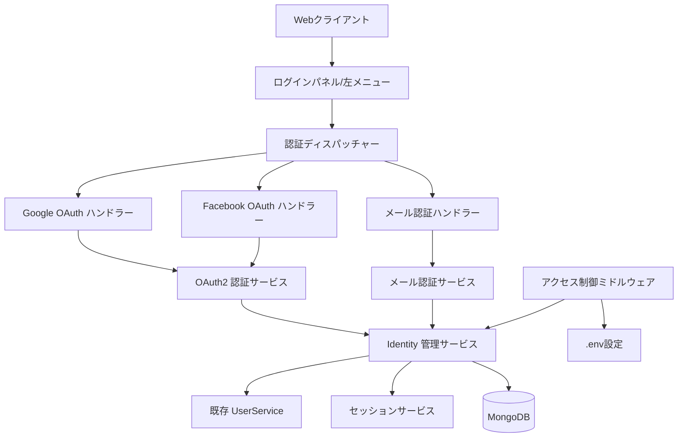
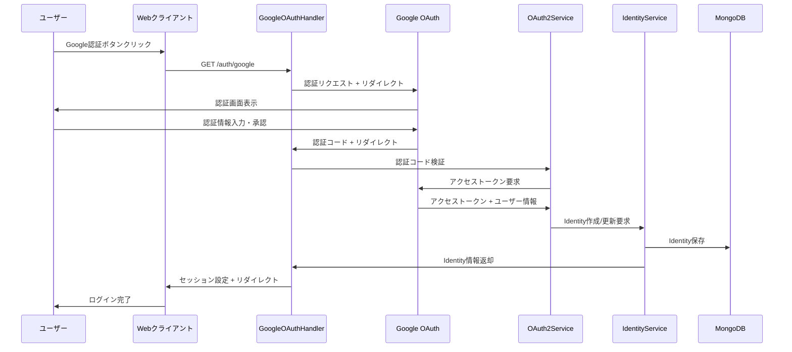
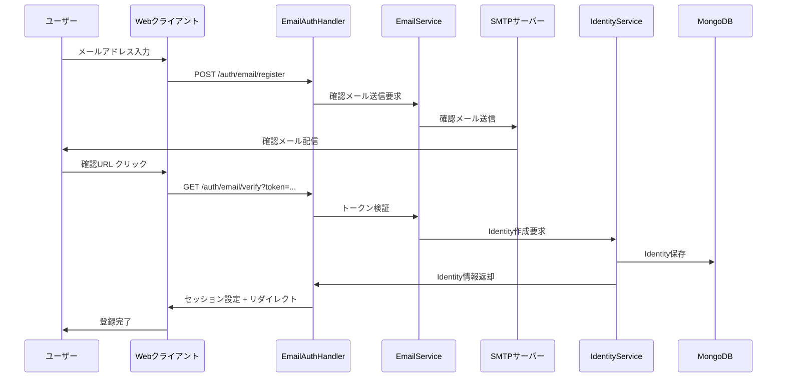
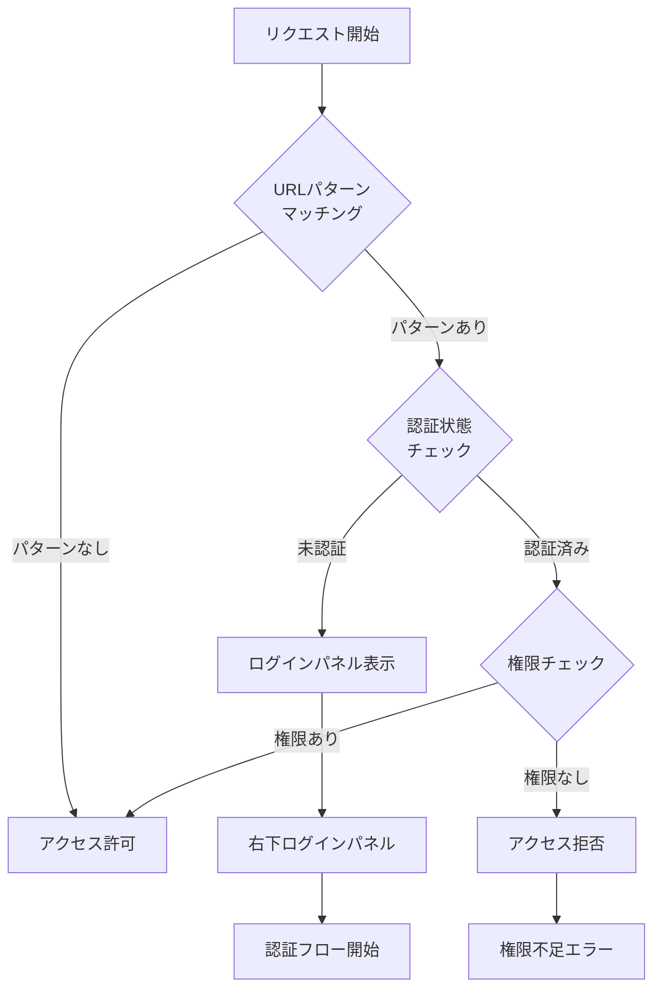

# OAuth認証サービス 技術設計書

## 概要

OAuth認証サービスは、既存のdxeeworldプラットフォームにGoogle認証、Facebook認証、メール認証の3つの認証方法を追加します。現在のTornado-based ウェブアプリケーションにセキュアで柔軟な認証システムを統合し、レビュー機能への適切なアクセス制御を実現します。

**目的**: このサービスは、既存ユーザーと新規ユーザーの両方に対して複数の認証選択肢を提供し、エントリーバリアを下げながらセキュリティを向上させます。

**ユーザー**: エンドユーザー（レビューアー、企業従業員）は認証機能を利用してレビュー閲覧・投稿を行い、システム管理者は.env設定によるアクセス制御を管理します。

**影響**: 現在の基本認証システムを拡張し、OAuth2.0標準に準拠した認証フローと設定ベースのアクセス制御を追加します。

### 目標

- 既存のTornadoアプリケーションにOAuth2.0認証を統合
- Google、Facebook、メール認証の統一されたユーザーエクスペリエンス
- 設定ベースの柔軟なアクセス制御システム
- 既存のセッション管理との統合
- 既存の基本認証システムの置き換え

### 非目標

- ソーシャルメディア連携機能（認証のみ）
- マルチファクタ認証（将来の拡張として考慮）

## アーキテクチャ

### 既存アーキテクチャ分析

現在のシステムはTornado webフレームワークベースで以下の構造を持ちます：

- **ハンドラー層**: BaseHandlerを継承したHTTPハンドラー群
- **サービス層**: UserService、SessionServiceによるビジネスロジック
- **データ層**: MotorドライバーによるMongoDB非同期アクセス
- **認証**: 既存のemail/password認証とセッション管理
- **設定**: python-dotenvによる環境変数管理

現在の認証フローを拡張し、OAuth2.0フローと統合する必要があります。

### 高レベルアーキテクチャ



**アーキテクチャ統合**:
- 既存パターン保持: Handler-Service-Model層構造、Result型パターン、非同期処理
- 新コンポーネント理由: OAuth2.0プロトコル対応、複数認証方式の統一管理、設定ベースアクセス制御
- 技術スタック適合: Tornado, Motor, MongoDB, python-dotenvとの完全互換
- ステアリング準拠: ドキュメント中心アーキテクチャ、段階的プロセス、コンテキスト保持

### 技術スタック統合

**既存技術スタックとの整合**:
- **Tornado**: 既存のGoogleOAuth2Mixin活用、カスタムFacebookOAuth2実装
- **Motor/MongoDB**: 新しいIdentityコレクション追加、既存DBサービス拡張
- **認証**: 既存SessionServiceとの統合、Identityベース認証の追加
- **設定**: python-dotenvによる.env設定拡張

**新規依存関係**:
- `requests-oauthlib`: Facebook OAuth2.0統合用
- `itsdangerous`: メール認証トークン生成用
- `email-validator`: メールアドレス検証強化用

**主要設計決定**:

**決定1: 統一Identity管理モデル**
- **決定**: 認証方式に関係なく統一されたIdentityモデルで管理
- **コンテキスト**: 複数認証方式の一元管理とユーザー体験の統一
- **代替案**: 認証方式別の個別管理、既存Userモデル拡張、外部認証プロバイダー依存
- **選択アプローチ**: 認証方式、メールアドレス、ユーザータイプの組み合わせによる統一Identity
- **理由**: 既存システムとの互換性維持、将来の認証方式追加への対応、一貫したアクセス制御
- **トレードオフ**: 実装の複雑さ vs. 拡張性とメンテナンス性

**決定2: .env設定ベースアクセス制御**
- **決定**: URLパターンマッチングによる動的アクセス制御設定
- **コンテキスト**: 運用時の柔軟な権限管理とデプロイメント環境対応
- **代替案**: ハードコードされた権限、データベース設定、YAML設定ファイル
- **選択アプローチ**: .envファイルでの"URLパターン,権限1,権限2..."形式設定
- **理由**: 既存の設定管理パターンとの一貫性、環境別設定の容易さ、セキュリティ設定の可視性
- **トレードオフ**: 設定の単純さ vs. 複雑な権限ルールの表現力

**決定3: 段階的OAuth実装（Googleから開始）**
- **決定**: Google OAuth → Facebook OAuth → メール認証の順次実装
- **コンテキスト**: リスク軽減と早期フィードバック獲得
- **代替案**: 全認証方式の同時実装、メール認証優先実装
- **選択アプローチ**: Tornadoの既存Google OAuth2.0サポートを活用した段階実装
- **理由**: 既存ライブラリの活用、実装リスクの分散、ユーザーフィードバックの早期獲得
- **トレードオフ**: 開発期間の延長 vs. 実装品質と安定性

## システムフロー

### Google OAuth認証フロー



### メール認証登録フロー



### アクセス制御フロー



## 要件トレーサビリティ

| 要件 | 要件概要 | コンポーネント | インターフェース | フロー |
|------|----------|----------------|------------------|--------|
| 1.1-1.5 | Google認証フロー | GoogleOAuthHandler, OAuth2Service | GoogleOAuth2Mixin API | Google OAuth認証フロー |
| 2.1-2.5 | Facebook認証フロー | FacebookOAuthHandler, OAuth2Service | requests-oauthlib API | Facebook OAuth認証フロー |
| 3.1-3.8 | メール認証フロー | EmailAuthHandler, EmailService | SMTP, Token API | メール認証登録・ログインフロー |
| 4.1-4.5 | セッション管理 | SessionService (既存拡張) | Session API | 既存セッションフロー |
| 5.1-5.5 | ユーザーデータ管理 | IdentityService | Identity Model API | Identity管理フロー |
| 6.1-6.5 | UI表示機能 | UIコンポーネント, BaseHandler | Template/JavaScript API | UI表示フロー |
| 7.1-7.15 | アクセス制御機能 | AccessControlMiddleware | .env設定 API | アクセス制御フロー |

## コンポーネントとインターフェース

### 認証ハンドラー層

#### GoogleOAuthHandler

**責任と境界**
- **主要責任**: Google OAuth2.0認証フローの処理とコールバック管理
- **ドメイン境界**: OAuth認証ドメイン内のGoogle固有処理
- **データ所有**: 一時的な認証状態データ（state、認証コード）
- **トランザクション境界**: リクエスト単位の認証処理

**依存関係**
- **インバウンド**: Webクライアント、ルーティング
- **アウトバウンド**: OAuth2Service、IdentityService、SessionService
- **外部**: Google OAuth2.0 API

**契約定義**

**APIコントラクト**:
| メソッド | エンドポイント | リクエスト | レスポンス | エラー |
|----------|---------------|------------|-------------|--------|
| GET | /auth/google | なし | Google認証URL リダイレクト | 500 |
| GET | /auth/google/callback | code, state | セッション設定 + リダイレクト | 400, 401, 500 |

**前提条件**: Google API認証情報が.envに設定済み
**事後条件**: 成功時はIdentity作成とセッション確立
**不変条件**: OAuth2.0仕様準拠

#### FacebookOAuthHandler

**責任と境界**
- **主要責任**: Facebook OAuth2.0認証フローの処理
- **ドメイン境界**: OAuth認証ドメイン内のFacebook固有処理
- **データ所有**: Facebook認証レスポンスデータ
- **トランザクション境界**: リクエスト単位の認証処理

**依存関係**
- **インバウンド**: Webクライアント、ルーティング
- **アウトバウンド**: OAuth2Service、IdentityService
- **外部**: Facebook Graph API、requests-oauthlib

**外部依存調査**:
Facebook OAuth2.0実装はrequests-oauthlibライブラリを使用。Facebook compliance fixが必要で、認証URLは`https://www.facebook.com/dialog/oauth`、トークンURLは`https://graph.facebook.com/oauth/access_token`。HTTPS必須、emailスコープ明示的要求、リダイレクトURI設定制限あり。レート制限とアクセストークン有効期限（通常2時間）に注意。

**契約定義**

**APIコントラクト**:
| メソッド | エンドポイント | リクエスト | レスポンス | エラー |
|----------|---------------|------------|-------------|--------|
| GET | /auth/facebook | なし | Facebook認証URL リダイレクト | 500 |
| GET | /auth/facebook/callback | code, state | セッション設定 + リダイレクト | 400, 401, 500 |

#### EmailAuthHandler

**責任と境界**
- **主要責任**: メールベース認証（登録・ログイン）の処理
- **ドメイン境界**: メール認証ドメイン
- **データ所有**: 認証コード、確認トークン
- **トランザクション境界**: メール送信から確認までの一連の処理

**依存関係**
- **インバウンド**: Webクライアント、メール確認リンク
- **アウトバウンド**: EmailService、IdentityService
- **外部**: SMTPサーバー

**契約定義**

**APIコントラクト**:
| メソッド | エンドポイント | リクエスト | レスポンス | エラー |
|----------|---------------|------------|-------------|--------|
| POST | /auth/email/register | {email} | 確認メール送信完了 | 400, 500 |
| GET | /auth/email/verify | token | セッション設定 + リダイレクト | 400, 401, 500 |
| POST | /auth/email/login | {email} | 認証コード送信完了 | 400, 500 |
| POST | /auth/email/verify-code | {email, code} | セッション設定 | 400, 401, 500 |

### サービス層

#### OAuth2Service

**責任と境界**
- **主要責任**: OAuth2.0プロトコルの実装とトークン管理
- **ドメイン境界**: OAuth認証ドメイン
- **データ所有**: アクセストークン、リフレッシュトークン（一時的）
- **トランザクション境界**: OAuth認証フロー単位

**依存関係**
- **インバウンド**: OAuth認証ハンドラー群
- **アウトバウンド**: 外部OAuth プロバイダー
- **外部**: Google OAuth2.0 API、Facebook Graph API

**サービスインターフェース**:
```typescript
interface OAuth2Service {
  get_authorization_url(provider: OAuthProvider, redirect_uri: string, state: string): Result<string, OAuth2Error>;
  exchange_authorization_code(provider: OAuthProvider, code: string, redirect_uri: string): Result<UserInfo, OAuth2Error>;
  validate_state(received_state: string, expected_state: string): Result<bool, OAuth2Error>;
}

interface UserInfo {
  email: string;
  name: string;
  provider_id: string;
  provider: OAuthProvider;
}
```

**前提条件**: プロバイダー認証情報が設定済み、有効なリダイレクトURI
**事後条件**: 有効なユーザー情報またはエラー詳細の返却
**不変条件**: OAuth2.0セキュリティ要件準拠

#### EmailService

**責任と境界**
- **主要責任**: メール認証に関する全処理（送信、トークン管理、検証）
- **ドメイン境界**: メール認証ドメイン
- **データ所有**: 認証トークン、認証コード
- **トランザクション境界**: メール認証セッション単位

**依存関係**
- **インバウンド**: EmailAuthHandler
- **アウトバウンド**: SMTPサーバー、トークン生成サービス
- **外部**: Gmail SMTP、itsdangerous

**外部依存調査**:
itsdangerous URLSafeTimedSerializerを使用してセキュアなトークン生成。有効期限設定可能（推奨：3600秒）、シークレットキー要求。email-validatorによる構文・配信可能性検証。SMTPはTLS必須、Gmail SMTPの場合アプリパスワード推奨。認証コードは6桁数字、有効期限5分、再送制限あり。

**サービスインターフェース**:
```typescript
interface EmailService {
  send_verification_email(email: string, redirect_url: string): Result<bool, EmailError>;
  verify_email_token(token: string): Result<string, EmailError>;
  send_login_code(email: string): Result<string, EmailError>;
  verify_login_code(email: string, code: string): Result<bool, EmailError>;
  cleanup_expired_codes(): Result<number, EmailError>;
}
```

#### IdentityService

**責任と境界**
- **主要責任**: 統一されたIdentity管理とユーザー情報の一元化
- **ドメイン境界**: Identity管理ドメイン
- **データ所有**: Identity情報、認証方式マッピング
- **トランザクション境界**: Identity作成・更新・検索単位

**依存関係**
- **インバウンド**: 全認証サービス
- **アウトバウンド**: 既存UserService、DatabaseService
- **外部**: MongoDB

**サービスインターフェース** (メールアドレス暗号化対応):
```typescript
interface IdentityService {
  create_or_update_identity(auth_method: AuthMethod, email: string, user_type: string, provider_data?: dict): Result<Identity, IdentityError>;
  find_identity_by_email_hash(auth_method: AuthMethod, email_hash: string): Result<Identity, IdentityError>;
  find_identity_by_email(auth_method: AuthMethod, email: string): Result<Identity, IdentityError>; // 内部でハッシュ化
  link_identities(primary_email: string, secondary_identity: Identity): Result<bool, IdentityError>;
  get_user_permissions(identity: Identity): Result<List[string], IdentityError>;
}

interface Identity {
  id: string;
  auth_method: AuthMethod; // "google", "facebook", "email"
  email: string; // 復号化されたメールアドレス（メモリ上のみ）
  email_masked: string; // 表示用マスキングメールアドレス
  user_type: string; // "user", "admin", "ally"
  created_at: datetime;
  updated_at: datetime;
  provider_data?: dict; // OAuth固有データ
}

interface EmailEncryptionService {
  encrypt_email(email: string): Result<EncryptedEmailData, EncryptionError>;
  decrypt_email(encrypted_email: string): Result<string, EncryptionError>;
  hash_email(email: string): string;
  mask_email(email: string): string;
}

interface EncryptedEmailData {
  encrypted: string; // AES-256-CBC暗号化された文字列
  hash: string;      // SHA-256ハッシュ
  masked: string;    // マスキング表示用
}
```

**統合戦略**: 既存UserServiceを拡張してIdentity情報を含む統合ユーザーモデルをサポート

#### EmailEncryptionService

**責任と境界**
- **主要責任**: メールアドレスの暗号化・復号化・ハッシュ化・マスキング処理
- **ドメイン境界**: データ保護・セキュリティドメイン
- **データ所有**: 暗号化キー、暗号化アルゴリズム設定
- **トランザクション境界**: 単一メールアドレス処理単位

**依存関係**
- **インバウンド**: IdentityService、EmailService、認証ハンドラー
- **アウトバウンド**: 暗号化ライブラリ、設定管理
- **外部**: Python cryptography ライブラリ

**暗号化実装詳細**:
- **暗号化方式**: AES-256-CBC + HMAC-SHA256 (Fernet)
- **キー管理**: .env環境変数による32バイトキー
- **ハッシュ方式**: SHA-256 + ソルト
- **マスキングルール**: `ユーザー名の前半数文字 + "***@**" + ドメインの最後5文字`

**マスキング仕様**:
```
user@example.com → us***@**le.com
a@domain.co.jp → a***@**o.jp
longuser@company.com → lo***@**ny.com
ab@test.jp → ab***@**st.jp
```

#### AccessControlMiddleware

**責任と境界**
- **主要責任**: .env設定ベースのURL・権限マッチング処理
- **ドメイン境界**: アクセス制御ドメイン
- **データ所有**: アクセス制御ルール、パターンマッチング結果
- **トランザクション境界**: リクエスト単位のアクセス判定

**依存関係**
- **インバウンド**: 全HTTPリクエスト
- **アウトバウンド**: IdentityService、設定管理
- **外部**: .env設定ファイル

**サービスインターフェース**:
```typescript
interface AccessControlMiddleware {
  check_access(request_path: string, identity?: Identity): Result<AccessDecision, AccessControlError>;
  load_access_rules(): Result<List[AccessRule], ConfigError>;
  match_url_pattern(url: string, pattern: string): bool;
}

interface AccessRule {
  url_pattern: string;
  required_permissions: List[string];
}

interface AccessDecision {
  allowed: bool;
  requires_auth: bool;
  missing_permissions?: List[string];
}
```

## データモデル

### ドメインモデル

**コア概念**:
- **Identity集約**: 認証方式別のユーザー識別情報管理
- **AuthSession エンティティ**: 認証セッション状態とメタデータ
- **AccessRule 値オブジェクト**: 不変のアクセス制御ルール定義
- **AuthenticationEvent**: 認証関連の重要な状態変化

**ビジネスルールと不変条件**:
- 同一認証方式・メールアドレスの組み合わせは一意
- セッションは有効期限内のみ有効
- アクセスルールは環境設定で定義され実行時は不変
- 認証イベントは監査証跡として保持

### 物理データモデル

**MongoDBコレクション設計**:

**identitiesコレクション** (メールアドレス暗号化設計):
```json
{
  "_id": ObjectId,
  "auth_method": "google|facebook|email",
  "email_encrypted": "AES256_ENCRYPTED_EMAIL_STRING",
  "email_hash": "SHA256_HASHED_EMAIL_FOR_LOOKUP",
  "email_masked": "ab***@**com.jp",
  "user_type": "user|admin|ally",
  "provider_data": {
    "provider_id": "google_user_id",
    "name": "User Name",
    "profile_url": "https://...",
    "last_login": ISODate
  },
  "created_at": ISODate,
  "updated_at": ISODate,
  "email_verified": Boolean,
  "is_active": Boolean
}
```

**メールアドレス暗号化戦略**:
- **email_encrypted**: AES-256-CBCで暗号化されたメールアドレス
- **email_hash**: SHA-256でハッシュ化されたメールアドレス（検索・一意性チェック用）
- **email_masked**: 表示用にマスキングされたメールアドレス

**auth_sessionsコレクション** (既存sessionsの拡張):
```json
{
  "_id": "session_id_string",
  "identity_id": ObjectId,
  "user_id": ObjectId, // 既存userとの互換性
  "auth_method": "google|facebook|email",
  "created_at": ISODate,
  "expires_at": ISODate,
  "metadata": {
    "user_agent": "string",
    "ip_address": "string",
    "auth_context": "oauth_callback|email_verification|login_code"
  }
}
```

**email_verificationsコレクション** (メールアドレス暗号化対応):
```json
{
  "_id": ObjectId,
  "email_hash": "SHA256_HASHED_EMAIL_FOR_LOOKUP",
  "verification_type": "registration|login",
  "token": "secure_token_string",
  "code": "123456", // ログイン用6桁コード
  "expires_at": ISODate,
  "verified_at": ISODate,
  "attempts": Number,
  "created_at": ISODate
}
```

**インデックス定義** (暗号化対応):
- `identities`: {auth_method: 1, email_hash: 1} (一意インデックス)
- `email_usertype`: {email_hash: 1, user_type: 1}
- `auth_sessions`: {identity_id: 1, expires_at: 1}
- `email_verifications`: {email_hash: 1, verification_type: 1}, {expires_at: 1} (TTL)

### データ契約とインテグレーション

**APIデータ転送**:
```typescript
interface AuthenticationRequest {
  auth_method: "google" | "facebook" | "email";
  credential: string; // コード、メールアドレス、トークン
  redirect_uri?: string;
  state?: string;
}

interface AuthenticationResponse {
  success: boolean;
  identity?: Identity;
  session_id?: string;
  redirect_url?: string;
  error?: AuthenticationError;
}
```

**イベントスキーマ**:
- **Identity Created**: {identity_id, auth_method, email, created_at}
- **Authentication Success**: {identity_id, auth_method, session_id, ip_address, timestamp}
- **Authentication Failed**: {email, auth_method, reason, ip_address, timestamp}
- **Access Denied**: {identity_id, requested_url, missing_permissions, timestamp}

## エラーハンドリング

### エラー戦略

OAuth認証サービスは3つのエラーカテゴリに対して具体的な回復戦略を実装します。

### エラーカテゴリと対応

**ユーザーエラー (4xx)**:
- **OAuth認証拒否** → ユーザーに認証選択画面を再表示し、代替認証方法を提案
- **無効なメールアドレス** → リアルタイム検証とフィールド固有エラーメッセージ表示
- **期限切れトークン/コード** → 自動的な再送オプションと新しいコード発行

**システムエラー (5xx)**:
- **OAuth APIタイムアウト** → サーキットブレーカーパターンで代替認証方法へフォールバック
- **SMTP接続失敗** → キューイングシステムで後続メール送信とユーザーへの遅延通知
- **MongoDB接続失敗** → 読み取り専用モードへの優雅な劣化と復旧時の自動同期

**ビジネスロジックエラー (422)**:
- **重複Identity作成** → 既存Identityとの統合選択肢をユーザーに提示
- **権限不足アクセス** → 必要権限の説明と権限申請フローへの誘導
- **認証方式競合** → Identity統合ワークフローの開始

### 監視

- **エラー追跡**: Tornadoログ + 構造化ログでエラー集約
- **ヘルスモニタリング**: OAuth プロバイダー接続性、SMTP可用性、認証成功率
- **アラート**: 認証失敗率異常、API レート制限到達、セッション生成失敗

## テスト戦略

### 単体テスト
- **OAuth2Service**: プロバイダー別認証フロー、トークン検証、エラーハンドリング
- **IdentityService**: Identity作成・更新・検索、権限マッピング
- **EmailService**: トークン生成・検証、認証コード管理、有効期限処理
- **AccessControlMiddleware**: URLパターンマッチング、権限チェック、設定読み込み
- **認証ハンドラー**: リクエスト処理、セッション管理、リダイレクト処理

### 統合テスト
- **OAuth認証フロー**: Google/Facebook APIモック使用の完全フロー
- **メール認証フロー**: SMTP モック使用の登録・ログインフロー
- **アクセス制御**: 複数認証方式での権限チェック統合
- **セッション統合**: 既存セッションサービスとの互換性確認
- **データベース統合**: Identityモデルと既存Userモデルの整合性

### E2Eテスト
- **ユーザー認証体験**: 3つの認証方式でのフル登録・ログインフロー
- **アクセス制御体験**: 権限有無でのレビュー機能アクセステスト
- **UI統合**: ログインパネル表示・非表示、左メニュー表示
- **エラーシナリオ**: 認証失敗時のユーザーエクスペリエンス
- **セッション管理**: ログアウト、セッション期限切れ処理

### パフォーマンス/負荷テスト
- **OAuth同時認証**: 100同時Google/Facebook認証処理
- **メール送信負荷**: 大量メール認証リクエストの処理性能
- **アクセス制御性能**: 毎秒1000リクエストでの権限チェック処理
- **データベース負荷**: Identity検索・作成の同時実行性能

## セキュリティ考慮事項

### 脅威モデリング

**OAuth認証攻撃**:
- **Authorization Code Interception**: HTTPS強制、Stateパラメーター検証、短期間コード有効期限
- **CSRF攻撃**: Stateパラメーター必須、SameSite Cookie属性、Refererヘッダー検証
- **Token Leakage**: セキュアCookie、HttpOnly属性、適切なスコープ制限

**メール認証攻撃**:
- **認証コード総当たり攻撃**: レート制限、試行回数制限、一時的アカウントロック
- **メール傍受**: SMTP over TLS、トークン短期有効期限、一回限り使用
- **タイミング攻撃**: 固定時間応答、secure比較関数使用

### 認証・認可パターン

**OAuth2.0セキュリティ**:
- **PKCE (Proof Key for Code Exchange)**: 将来の実装として検討
- **Token Rotation**: リフレッシュトークンローテーション
- **Scope Limitation**: 最小限の権限スコープ要求（email, profileのみ）

**セッション管理**:
- **Session Fixation Protection**: ログイン時のセッションID再生成
- **Session Hijacking Prevention**: IP アドレス/User-Agent検証、セッションタイムアウト
- **Concurrent Session Control**: 同一ユーザーの複数セッション制限

### データ保護・プライバシー

**メールアドレス暗号化セキュリティ**:
- **保存時暗号化**: AES-256-CBC + HMAC-SHA256による強力な暗号化
- **キー管理**: 環境変数による暗号化キー管理、定期的なキーローテーション計画
- **検索効率**: SHA-256ハッシュによる暗号化データの高速検索
- **表示制御**: マスキング表示により機密性保持とユーザビリティの両立

**暗号化実装のセキュリティ要件**:
- **暗号化キー**: 32バイト（256ビット）ランダムキー、BASE64エンコード
- **ソルト**: メールアドレスごとに異なるランダムソルト
- **メモリ保護**: 復号化データのメモリ上での最小限保持時間
- **キー分離**: 暗号化キーとアプリケーションデータの分離保存

**ログ・監査セキュリティ**:
- **ログからの機密情報除外**: メールアドレス・認証コードの完全マスキング
- **監査証跡**: 暗号化・復号化操作のログ記録（データ内容は除外）
- **アクセス追跡**: 暗号化メールアドレスへのアクセス履歴記録

**データ保持・削除**:
- **認証コード**: 5分自動削除、検証後即座削除
- **未使用トークン**: 24時間TTL、使用後即座無効化
- **セッション**: 30日最大、非活性時短縮
- **暗号化データ**: ユーザー削除時の確実な暗号化キー削除

**GDPR/プライバシー準拠**:
- **データ最小化**: 認証に必要な最小限の情報のみ暗号化保存
- **忘れられる権利**: 暗号化キー削除による実質的データ削除
- **データポータビリティ**: 復号化可能な形式でのIdentity情報エクスポート
- **同意管理**: 暗号化処理に対するユーザー同意の明示的取得

**暗号化キー管理**:
- **キーエスクロー**: 災害復旧用の安全なキーバックアップ
- **キーローテーション**: 定期的な暗号化キー更新戦略
- **HSM考慮**: 将来的なハードウェアセキュリティモジュール利用
- **多重暗号化**: 重要度に応じた追加暗号化層の検討
