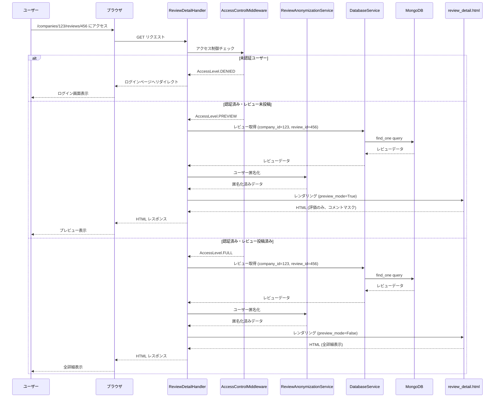
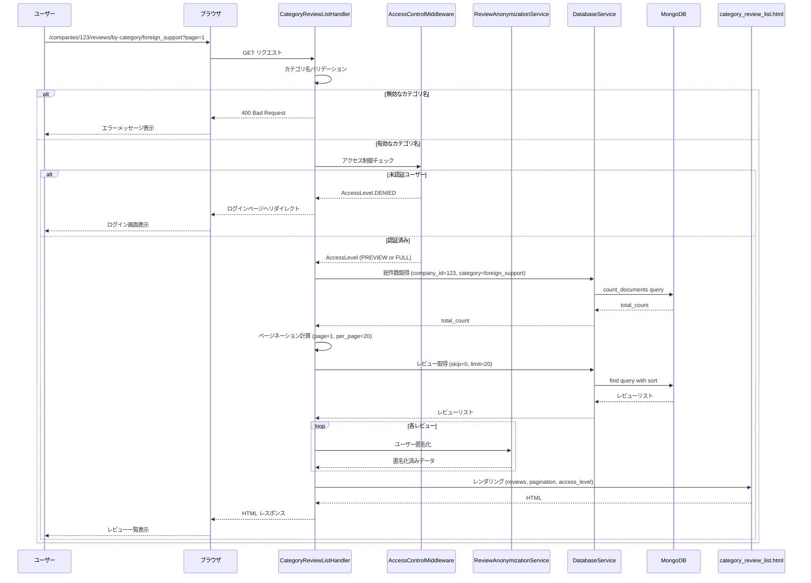
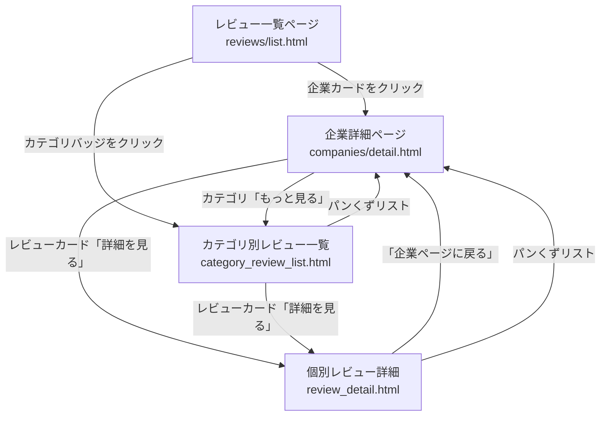
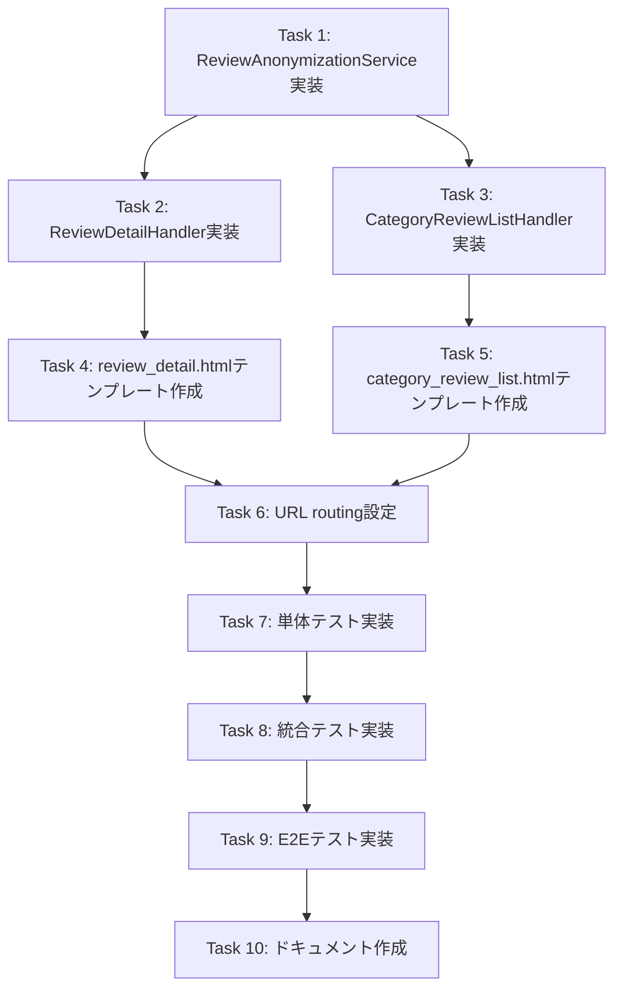

# レビュー詳細ページ機能 - 設計書

## 1. 概要

### 1.1 目的
既存のレビューシステムに2種類の詳細表示ページを追加し、ユーザーがレビュー内容をより深く理解できるようにする。

### 1.2 対象ユーザー
- **フルアクセスユーザー**: レビューを投稿済みのユーザー - 全レビュー詳細を閲覧可能
- **プレビューユーザー**: 認証済みだがレビュー未投稿のユーザー - 評価スコアと投稿日時のみ閲覧可能
- **拒否ユーザー**: 未認証ユーザー - アクセス拒否
- **クローラー**: 検索エンジンボット - 最小限のSEOコンテンツのみ

### 1.3 提供機能
1. **個別レビュー詳細ページ**: 1つの企業に対する1人のユーザーのレビュー全詳細を表示
2. **質問別レビュー一覧ページ**: 1つの企業の特定評価項目に対する複数ユーザーのレビューをリスト表示

### 1.4 ゴール
- レビュー内容の詳細な閲覧体験の提供
- ユーザープライバシーの保護（匿名化）
- 既存アクセス制御システムとのシームレスな統合
- レスポンシブデザインによるモバイル対応

### 1.5 非ゴール
- レビューの編集・削除機能（既存機能で対応）
- レビューへのコメント・いいね機能
- レビュー投稿者のプロフィールページ
- レビューのソート・フィルタリング機能（質問別一覧では将来対応）

---

## 2. アーキテクチャ

### 2.1 システム構成図

```mermaid
graph TB
    subgraph "クライアント層"
        Browser[ブラウザ]
    end

    subgraph "プレゼンテーション層"
        ReviewDetailHandler[ReviewDetailHandler<br/>個別レビュー詳細]
        CategoryReviewHandler[CategoryReviewListHandler<br/>質問別レビュー一覧]
    end

    subgraph "ミドルウェア層"
        AccessControl[access_control_middleware<br/>アクセス制御]
    end

    subgraph "サービス層"
        ReviewAnonymizer[ReviewAnonymizationService<br/>ユーザー匿名化]
        ReviewAggregation[ReviewAggregationService<br/>既存レビュー集計]
    end

    subgraph "データアクセス層"
        DatabaseService[DatabaseService<br/>MongoDB接続]
    end

    subgraph "データ層"
        MongoDB[(MongoDB<br/>reviews collection)]
    end

    subgraph "テンプレート層"
        ReviewDetailTemplate[review_detail.html]
        CategoryReviewTemplate[category_review_list.html]
    end

    Browser -->|GET /companies/{id}/reviews/{review_id}| ReviewDetailHandler
    Browser -->|GET /companies/{id}/reviews/by-category/{category}| CategoryReviewHandler

    ReviewDetailHandler --> AccessControl
    CategoryReviewHandler --> AccessControl

    AccessControl --> ReviewDetailHandler
    AccessControl --> CategoryReviewHandler

    ReviewDetailHandler --> ReviewAnonymizer
    CategoryReviewHandler --> ReviewAnonymizer

    ReviewDetailHandler --> DatabaseService
    CategoryReviewHandler --> DatabaseService

    DatabaseService --> MongoDB

    ReviewDetailHandler --> ReviewDetailTemplate
    CategoryReviewHandler --> CategoryReviewTemplate
```

### 2.2 技術スタック

| レイヤー | 技術 | 理由 |
|---------|------|------|
| Webフレームワーク | Tornado 6.5.2 | 既存システムとの統合 |
| データベース | MongoDB + Motor | 既存データ構造との互換性 |
| テンプレート | Jinja2 | 既存テンプレートシステムとの統合 |
| CSS | Bootstrap 5 | 既存デザインシステムとの統合 |
| 非同期処理 | asyncio | Tornadoの非同期アーキテクチャに準拠 |

### 2.3 主要設計決定

#### 決定1: URL構造
- **個別レビュー詳細**: `/companies/{company_id}/reviews/{review_id}`
- **質問別レビュー一覧**: `/companies/{company_id}/reviews/by-category/{category_name}`

**理由**:
- RESTfulな設計原則に準拠
- 階層構造が明確（企業 → レビュー → 詳細）
- SEOフレンドリー

#### 決定2: ユーザー匿名化方式
- user_idからSHA-256ハッシュ値を生成
- ハッシュ値の最初の8文字を使用してアルファベット（A-Z）に変換
- 表示形式: 「ユーザーA」「ユーザーB」など

**理由**:
- 同じユーザーのレビューで一貫性のある表示
- user_idからの逆算が不可能
- 実装がシンプルで高速

#### 決定3: アクセス制御の統合
- 既存の`access_control_middleware.py`を再利用
- review-listing-page仕様と同じアクセスレベルを適用
- ハンドラーレベルでのアクセス制御チェック

**理由**:
- コードの重複を避ける
- 一貫性のあるアクセス制御ポリシー
- 保守性の向上

#### 決定4: ページネーション実装
- 1ページあたり20件のレビュー表示
- MongoDBのskip/limit機能を使用
- ページ番号はクエリパラメータで指定: `?page=2`

**理由**:
- データベースレベルでの効率的なページング
- 標準的なページネーションパターン
- 既存のcompany_search_serviceと同じアプローチ

---

## 3. システムフロー

### 3.1 個別レビュー詳細ページ表示フロー



### 3.2 質問別レビュー一覧ページ表示フロー



---

## 4. コンポーネントとインターフェース

### 4.1 ReviewDetailHandler

**責務**: 個別レビュー詳細ページのHTTPリクエスト処理

**ファイルパス**: `src/handlers/review_detail_handler.py`

**インターフェース**:
```python
class ReviewDetailHandler(tornado.web.RequestHandler):
    """個別レビュー詳細ページハンドラー"""

    def initialize(
        self,
        db_service: DatabaseService,
        anonymization_service: ReviewAnonymizationService
    ):
        """
        ハンドラーの初期化

        Args:
            db_service: データベースサービス
            anonymization_service: 匿名化サービス
        """
        pass

    @access_control_middleware(required_level=AccessLevel.PREVIEW)
    async def get(self, company_id: str, review_id: str):
        """
        個別レビュー詳細ページ表示

        Args:
            company_id: 企業ID
            review_id: レビューID

        Returns:
            HTML: レビュー詳細ページ

        Raises:
            HTTPError(404): レビューが見つからない場合
            HTTPError(500): データベースエラーの場合
        """
        pass

    async def _get_review(
        self,
        company_id: str,
        review_id: str
    ) -> Optional[Review]:
        """
        レビューを取得

        Args:
            company_id: 企業ID
            review_id: レビューID

        Returns:
            Review: レビューオブジェクト
            None: レビューが見つからない場合
        """
        pass

    def _render_review_detail(
        self,
        review: Review,
        company_name: str,
        access_level: AccessLevel
    ) -> str:
        """
        レビュー詳細ページをレンダリング

        Args:
            review: レビューオブジェクト
            company_name: 企業名
            access_level: アクセスレベル

        Returns:
            str: レンダリングされたHTML
        """
        pass
```

**依存関係**:
- `src.database.DatabaseService` - レビューデータ取得
- `src.services.review_anonymization_service.ReviewAnonymizationService` - ユーザー匿名化
- `src.middleware.access_control_middleware.access_control_middleware` - アクセス制御
- `src.models.review.Review` - レビューデータモデル

**エラーハンドリング**:
- 404: レビューが見つからない、または`is_active=False`の場合
- 404: 企業が見つからない場合
- 500: データベースクエリエラー

---

### 4.2 CategoryReviewListHandler

**責務**: 質問別レビュー一覧ページのHTTPリクエスト処理

**ファイルパス**: `src/handlers/category_review_list_handler.py`

**インターフェース**:
```python
class CategoryReviewListHandler(tornado.web.RequestHandler):
    """質問別レビュー一覧ページハンドラー"""

    VALID_CATEGORIES = {
        "recommendation",
        "foreign_support",
        "company_culture",
        "employee_relations",
        "evaluation_system",
        "promotion_treatment"
    }

    REVIEWS_PER_PAGE = 20

    def initialize(
        self,
        db_service: DatabaseService,
        anonymization_service: ReviewAnonymizationService
    ):
        """
        ハンドラーの初期化

        Args:
            db_service: データベースサービス
            anonymization_service: 匿名化サービス
        """
        pass

    @access_control_middleware(required_level=AccessLevel.PREVIEW)
    async def get(self, company_id: str, category_name: str):
        """
        質問別レビュー一覧ページ表示

        Args:
            company_id: 企業ID
            category_name: 評価項目名（recommendation, foreign_support, etc.）

        Query Parameters:
            page: ページ番号（デフォルト: 1）

        Returns:
            HTML: レビュー一覧ページ

        Raises:
            HTTPError(400): 無効なカテゴリ名の場合
            HTTPError(404): 企業が見つからない場合
            HTTPError(500): データベースエラーの場合
        """
        pass

    def _validate_category_name(self, category_name: str) -> bool:
        """
        カテゴリ名のバリデーション

        Args:
            category_name: 評価項目名

        Returns:
            bool: 有効な場合True
        """
        pass

    async def _get_reviews_for_category(
        self,
        company_id: str,
        category_name: str,
        page: int,
        per_page: int
    ) -> tuple[List[Review], int]:
        """
        指定カテゴリのレビューを取得

        Args:
            company_id: 企業ID
            category_name: 評価項目名
            page: ページ番号
            per_page: 1ページあたりの件数

        Returns:
            tuple[List[Review], int]: (レビューリスト, 総件数)
        """
        pass

    def _render_category_review_list(
        self,
        reviews: List[Review],
        company_name: str,
        category_name: str,
        pagination_info: Dict[str, Any],
        access_level: AccessLevel
    ) -> str:
        """
        質問別レビュー一覧ページをレンダリング

        Args:
            reviews: レビューリスト
            company_name: 企業名
            category_name: 評価項目名
            pagination_info: ページネーション情報
            access_level: アクセスレベル

        Returns:
            str: レンダリングされたHTML
        """
        pass
```

**依存関係**:
- `src.database.DatabaseService` - レビューデータ取得
- `src.services.review_anonymization_service.ReviewAnonymizationService` - ユーザー匿名化
- `src.middleware.access_control_middleware.access_control_middleware` - アクセス制御
- `src.models.review.Review` - レビューデータモデル

**エラーハンドリング**:
- 400: 無効なカテゴリ名の場合
- 404: 企業が見つからない場合
- 400: ページ番号が無効な場合
- 500: データベースクエリエラー

---

### 4.3 ReviewAnonymizationService

**責務**: レビュー投稿者のユーザーIDを匿名化表示に変換

**ファイルパス**: `src/services/review_anonymization_service.py`

**インターフェース**:
```python
import hashlib
from typing import Dict

class ReviewAnonymizationService:
    """レビュー投稿者の匿名化サービス"""

    def __init__(self, salt: str = ""):
        """
        サービスの初期化

        Args:
            salt: ハッシュ化のためのソルト（オプション）
        """
        self.salt = salt

    def anonymize_user_id(self, user_id: str) -> str:
        """
        ユーザーIDを匿名化表示に変換

        Args:
            user_id: ユーザーID

        Returns:
            str: 匿名化表示（例: "ユーザーA"）

        Example:
            >>> service = ReviewAnonymizationService()
            >>> service.anonymize_user_id("user123")
            "ユーザーA"
            >>> service.anonymize_user_id("user456")
            "ユーザーB"
        """
        pass

    def _hash_user_id(self, user_id: str) -> str:
        """
        ユーザーIDをハッシュ化

        Args:
            user_id: ユーザーID

        Returns:
            str: SHA-256ハッシュ値（16進数文字列）
        """
        pass

    def _hash_to_letter(self, hash_value: str) -> str:
        """
        ハッシュ値をアルファベット1文字に変換

        Args:
            hash_value: ハッシュ値（16進数文字列）

        Returns:
            str: A-Zのいずれか1文字
        """
        pass

    def anonymize_review(self, review: Review) -> Dict[str, Any]:
        """
        レビューオブジェクトを匿名化して辞書形式で返す

        Args:
            review: レビューオブジェクト

        Returns:
            Dict[str, Any]: 匿名化済みレビューデータ
        """
        pass
```

**アルゴリズム詳細**:
1. user_id文字列にソルトを追加
2. SHA-256でハッシュ化
3. ハッシュ値の最初の8文字を取得
4. 16進数を10進数に変換し、26で割った余りを計算
5. 余りをA-Zのアルファベットに変換
6. 「ユーザー{アルファベット}」形式で返す

**依存関係**:
- `src.models.review.Review` - レビューデータモデル
- 標準ライブラリ: `hashlib`, `typing`

---

### 4.4 access_control_middleware統合

**既存コンポーネント**: `src/middleware/access_control_middleware.py`

**統合方法**:
```python
# ハンドラーでのデコレータ使用例
from src.middleware.access_control_middleware import (
    access_control_middleware,
    AccessLevel
)

class ReviewDetailHandler(tornado.web.RequestHandler):
    @access_control_middleware(required_level=AccessLevel.PREVIEW)
    async def get(self, company_id: str, review_id: str):
        # self.current_user_access_level でアクセスレベル取得可能
        access_level = self.current_user_access_level

        if access_level == AccessLevel.PREVIEW:
            # プレビューモードでレンダリング
            preview_mode = True
        else:
            # フルアクセスモードでレンダリング
            preview_mode = False
```

**アクセスレベル判定ロジック**:
- `AccessLevel.DENIED`: 未認証ユーザー → ログインページへリダイレクト
- `AccessLevel.PREVIEW`: 認証済み・レビュー未投稿 → 評価のみ表示、コメントマスク
- `AccessLevel.FULL`: 認証済み・レビュー投稿済み → 全詳細表示
- `AccessLevel.CRAWLER`: 検索エンジンボット → 最小限のSEOコンテンツ

---

## 5. データモデル

### 5.1 Reviewモデル（既存）

**ファイルパス**: `src/models/review.py`

**構造**:
```python
@dataclass
class Review:
    id: str                                      # レビューID
    company_id: str                              # 企業ID
    user_id: str                                 # ユーザーID（匿名化対象）
    employment_status: EmploymentStatus          # 現職/元職
    ratings: Dict[str, Optional[int]]            # 評価（1-5またはNone）
    comments: Dict[str, Optional[str]]           # コメント
    individual_average: float                    # 個別平均スコア
    answered_count: int                          # 回答した項目数
    created_at: datetime                         # 投稿日時
    updated_at: datetime                         # 更新日時
    is_active: bool = True                       # アクティブフラグ
    employment_period: Optional[EmploymentPeriod] = None  # 勤務期間
    language: str = "ja"                         # 言語（ja, en, zh）
    comments_ja: Optional[Dict[str, Optional[str]]] = None  # 日本語コメント
    comments_zh: Optional[Dict[str, Optional[str]]] = None  # 中国語コメント
    comments_en: Optional[Dict[str, Optional[str]]] = None  # 英語コメント
```

**評価項目（ratingsキー）**:
- `recommendation`: 推薦度
- `foreign_support`: 受入制度
- `company_culture`: 会社風土
- `employee_relations`: 関係性
- `evaluation_system`: 評価制度
- `promotion_treatment`: 昇進待遇

**注意**: 個別レビューには「overall」評価は存在しない。`individual_average`は6項目の平均値。

---

### 5.2 匿名化済みレビューデータ

**形式**: 辞書型（テンプレートレンダリング用）

**構造**:
```python
{
    "id": "review123",
    "company_id": "company456",
    "anonymous_user": "ユーザーA",           # 匿名化済み表示名
    "employment_status": "現職",
    "employment_period": {
        "start_year": 2020,
        "end_year": None
    },
    "ratings": {
        "recommendation": 4,
        "foreign_support": 3,
        "company_culture": 5,
        "employee_relations": 4,
        "evaluation_system": None,          # 未回答
        "promotion_treatment": 3
    },
    "comments": {
        "recommendation": "働きやすい会社です",
        "foreign_support": "サポート体制が充実",
        # ...
    },
    "individual_average": 3.8,
    "answered_count": 5,
    "created_at": "2025-11-15T10:30:00Z",
    "language": "ja"
}
```

**プレビューモード時の変換**:
```python
{
    # 同じ構造だが、commentsフィールドを以下に置換
    "comments": {
        "recommendation": "***このコメントを見るにはレビューを投稿してください***",
        "foreign_support": "***このコメントを見るにはレビューを投稿してください***",
        # ...
    }
}
```

---

### 5.3 ページネーション情報

**形式**: 辞書型

**構造**:
```python
{
    "current_page": 1,          # 現在のページ番号
    "total_pages": 5,           # 総ページ数
    "total_count": 87,          # 総レビュー数
    "per_page": 20,             # 1ページあたりの件数
    "has_prev": False,          # 前ページの有無
    "has_next": True,           # 次ページの有無
    "prev_page": None,          # 前ページ番号
    "next_page": 2              # 次ページ番号
}
```

---

## 6. テンプレート設計

### 6.1 review_detail.html

**ファイルパス**: `templates/review_detail.html`

**レイアウト構造**:
```
┌─────────────────────────────────────────┐
│ ナビゲーション（base.html継承）          │
├─────────────────────────────────────────┤
│ パンくずリスト                           │
│ ホーム > 企業一覧 > {企業名} > レビュー │
├─────────────────────────────────────────┤
│ レビュー詳細ヘッダー                     │
│ ・企業名（リンク）                       │
│ ・投稿者: ユーザーA                      │
│ ・投稿日時: 2025-11-15                  │
│ ・在籍状況: 元職（2018年〜2023年）      │
├─────────────────────────────────────────┤
│ 評価サマリー                             │
│ ・個別平均: ★★★★☆ 3.8 (5項目回答)    │
├─────────────────────────────────────────┤
│ 詳細評価（6項目×カード形式）            │
│ ┌───────────────────────────────────┐ │
│ │ 推薦度                              │ │
│ │ ★★★★☆ 4                          │ │
│ │ 働きやすい会社です（※プレビュー時）│ │
│ └───────────────────────────────────┘ │
│ ┌───────────────────────────────────┐ │
│ │ 受入制度                            │ │
│ │ ★★★☆☆ 3                          │ │
│ │ サポート体制が充実（※プレビュー時）│ │
│ └───────────────────────────────────┘ │
│ （以下4項目同様）                        │
├─────────────────────────────────────────┤
│ アクション                               │
│ [企業ページに戻る] [他のレビューを見る] │
└─────────────────────────────────────────┘
```

**テンプレート変数**:
```python
{
    "review": {anonymized_review_dict},
    "company_name": "株式会社Example",
    "company_id": "company123",
    "preview_mode": False,
    "access_level": "FULL",
    "category_labels": {
        "recommendation": "推薦度",
        "foreign_support": "受入制度",
        # ...
    }
}
```

---

### 6.2 category_review_list.html

**ファイルパス**: `templates/category_review_list.html`

**レイアウト構造**:
```
┌─────────────────────────────────────────┐
│ ナビゲーション（base.html継承）          │
├─────────────────────────────────────────┤
│ パンくずリスト                           │
│ ホーム > 企業一覧 > {企業名} > 受入制度 │
├─────────────────────────────────────────┤
│ ページヘッダー                           │
│ {企業名}の「受入制度」に関するレビュー  │
│ 全87件中 1-20件を表示                   │
├─────────────────────────────────────────┤
│ レビューリスト（20件）                   │
│ ┌───────────────────────────────────┐ │
│ │ ユーザーA │ 元職 │ 2025-11-15      │ │
│ │ ★★★★☆ 4                          │ │
│ │ サポート体制が充実しています...     │ │
│ │ [詳細を見る]                        │ │
│ └───────────────────────────────────┘ │
│ ┌───────────────────────────────────┐ │
│ │ ユーザーB │ 現職 │ 2025-11-10      │ │
│ │ ★★★☆☆ 3                          │ │
│ │ ***プレビューモード時マスク***      │ │
│ │ [詳細を見る]                        │ │
│ └───────────────────────────────────┘ │
│ （以下18件同様）                         │
├─────────────────────────────────────────┤
│ ページネーション                         │
│ [前へ] [1] [2] [3] [4] [5] [次へ]      │
└─────────────────────────────────────────┘
```

**テンプレート変数**:
```python
{
    "reviews": [list_of_anonymized_reviews],
    "company_name": "株式会社Example",
    "company_id": "company123",
    "category_name": "foreign_support",
    "category_label": "受入制度",
    "pagination": {pagination_info_dict},
    "preview_mode": False,
    "access_level": "FULL"
}
```

---

## 7. エラーハンドリング

### 7.1 エラーレスポンス設計

| HTTPステータス | 発生条件 | ユーザー表示メッセージ | ログ出力 |
|---------------|---------|----------------------|---------|
| 400 Bad Request | 無効なカテゴリ名 | 「無効な評価項目です」 | `logger.warning("Invalid category: %s", category_name)` |
| 400 Bad Request | 無効なページ番号 | 「無効なページ番号です」 | `logger.warning("Invalid page number: %s", page)` |
| 404 Not Found | レビューが見つからない | 「レビューが見つかりません」 | `logger.info("Review not found: %s", review_id)` |
| 404 Not Found | 企業が見つからない | 「企業が見つかりません」 | `logger.info("Company not found: %s", company_id)` |
| 404 Not Found | レビューが非アクティブ | 「レビューが見つかりません」 | `logger.info("Review is inactive: %s", review_id)` |
| 500 Internal Server Error | データベースエラー | 「サーバーエラーが発生しました」 | `logger.exception("Database error")` |

### 7.2 エラーテンプレート

**404エラー（レビュー/企業が見つからない）**:
- `templates/error_404.html` を使用（既存）
- メッセージ: 「お探しのレビューは見つかりませんでした」
- アクション: [企業ページに戻る] [トップページへ]

**400エラー（無効なパラメータ）**:
- `templates/error_400.html` を使用（既存）
- メッセージ: 「無効なリクエストです」
- アクション: [前のページに戻る] [トップページへ]

**500エラー（サーバーエラー）**:
- `templates/error_500.html` を使用（既存）
- メッセージ: 「サーバーエラーが発生しました。しばらくしてから再度お試しください」
- アクション: [前のページに戻る] [トップページへ]

### 7.3 ロギング戦略

```python
import logging
logger = logging.getLogger(__name__)

# 情報ログ（正常系）
logger.info("Review detail page accessed: company_id=%s, review_id=%s", company_id, review_id)

# 警告ログ（バリデーションエラー）
logger.warning("Invalid category name: %s", category_name)

# エラーログ（予期しないエラー）
logger.exception("Failed to retrieve review: company_id=%s, review_id=%s", company_id, review_id)

# デバッグログ（開発時のみ）
logger.debug("Anonymized user_id %s to %s", user_id, anonymous_name)
```

---

## 8. テスト戦略

### 8.1 単体テスト（ユニットテスト）

**テストファイル**: `tests/test_review_anonymization_service.py`

**テストケース**:
1. 同じuser_idは常に同じ匿名化表示になることを確認
2. 異なるuser_idは異なる匿名化表示になることを確認（高確率）
3. 匿名化表示が「ユーザー[A-Z]」形式であることを確認
4. ソルトを変更すると異なる匿名化表示になることを確認

```python
def test_anonymize_user_id_consistency():
    service = ReviewAnonymizationService()
    user_id = "user123"
    result1 = service.anonymize_user_id(user_id)
    result2 = service.anonymize_user_id(user_id)
    assert result1 == result2

def test_anonymize_user_id_format():
    service = ReviewAnonymizationService()
    result = service.anonymize_user_id("user123")
    assert result.startswith("ユーザー")
    assert len(result) == 5  # "ユーザー" + 1文字
    assert result[-1].isalpha()
```

---

### 8.2 統合テスト（インテグレーションテスト）

**テストファイル**:
- `tests/test_review_detail_handler.py`
- `tests/test_category_review_list_handler.py`

**テストケース（ReviewDetailHandler）**:
1. フルアクセスユーザーが個別レビュー詳細ページにアクセスし、全詳細が表示されることを確認
2. プレビューユーザーがアクセスし、コメントがマスクされることを確認
3. 未認証ユーザーがアクセスし、ログインページにリダイレクトされることを確認
4. 存在しないreview_idでアクセスし、404エラーが返されることを確認
5. is_active=Falseのレビューにアクセスし、404エラーが返されることを確認

**テストケース（CategoryReviewListHandler）**:
1. 有効なカテゴリ名でアクセスし、レビュー一覧が表示されることを確認
2. 無効なカテゴリ名でアクセスし、400エラーが返されることを確認
3. ページネーションが正しく動作することを確認（page=2にアクセス）
4. レビューが20件以下の場合、ページネーションが表示されないことを確認
5. レビューが0件の場合、「レビューがありません」メッセージが表示されることを確認

```python
@pytest.mark.asyncio
async def test_review_detail_full_access(
    app, db_service, test_user_full_access, test_review
):
    # フルアクセスユーザーとしてログイン
    response = await fetch(
        f"/companies/{test_review.company_id}/reviews/{test_review.id}",
        headers={"Cookie": f"session_id={test_user_full_access.session_id}"}
    )

    assert response.code == 200
    assert "働きやすい会社です" in response.body.decode()  # コメントが表示される
    assert "★★★★☆" in response.body.decode()  # 評価が表示される
```

---

### 8.3 E2Eテスト（エンドツーエンドテスト）

**テストツール**: Playwright または Selenium

**テストシナリオ**:

**シナリオ1: フルアクセスユーザーの個別レビュー詳細閲覧**
1. ユーザーがログイン
2. 企業一覧ページでレビュー投稿済み企業をクリック
3. レビュー一覧から1つのレビューの「詳細を見る」をクリック
4. 個別レビュー詳細ページが表示される
5. 6つの評価項目すべてのコメントが表示されることを確認
6. 「企業ページに戻る」リンクをクリックし、企業詳細ページに戻ることを確認

**シナリオ2: プレビューユーザーの質問別レビュー一覧閲覧**
1. ユーザーがログイン（レビュー未投稿）
2. 企業詳細ページで「受入制度のレビューを見る」リンクをクリック
3. 質問別レビュー一覧ページが表示される
4. コメントがマスクされていることを確認
5. 「レビューを投稿して全てを見る」CTAボタンが表示されることを確認

**シナリオ3: ページネーション動作確認**
1. 20件以上のレビューがある企業の質問別レビュー一覧にアクセス
2. ページネーションが表示されることを確認
3. 「次へ」ボタンをクリックし、2ページ目に移動
4. URLに`?page=2`が含まれることを確認
5. 2ページ目のレビュー内容が表示されることを確認

---

## 9. パフォーマンス考慮事項

### 9.1 データベースクエリ最適化

**インデックス設計**:
```javascript
// reviews collection
db.reviews.createIndex({ "company_id": 1, "is_active": 1, "created_at": -1 })
db.reviews.createIndex({ "company_id": 1, "ratings.foreign_support": 1, "is_active": 1 })
db.reviews.createIndex({ "company_id": 1, "ratings.recommendation": 1, "is_active": 1 })
// 他の評価項目についても同様
```

**クエリパフォーマンス**:
- 個別レビュー詳細: 単一ドキュメント取得（_idインデックス使用） - ~1ms
- 質問別レビュー一覧: company_id + category複合インデックス使用 - ~10ms（20件取得）
- 総件数取得: count_documents with index - ~5ms

### 9.2 キャッシング戦略（将来実装）

**Redisキャッシュ候補**:
1. 匿名化表示名のキャッシュ（user_id → "ユーザーA"）
   - TTL: 1日
   - キー: `anon:user:{user_id}`
2. レビュー詳細のキャッシュ
   - TTL: 1時間
   - キー: `review:detail:{review_id}`
   - 無効化トリガー: レビュー更新時

### 9.3 レスポンスタイム目標

| ページ | 目標レスポンスタイム | 備考 |
|--------|---------------------|------|
| 個別レビュー詳細 | < 200ms | データベース取得 + レンダリング |
| 質問別レビュー一覧（1ページ目） | < 300ms | 20件取得 + 匿名化処理 |
| 質問別レビュー一覧（2ページ目以降） | < 250ms | ページネーション済み |

---

## 10. セキュリティ考慮事項

### 10.1 ユーザープライバシー保護

- **user_idの完全匿名化**: SHA-256ハッシュ化により、匿名化表示からuser_idの逆算を不可能にする
- **個人情報の非表示**: レビューコメント内にメールアドレスや電話番号が含まれる場合、正規表現でマスキング（将来実装）
- **レビュー削除**: `is_active=False`のレビューは完全に非表示

### 10.2 アクセス制御

- **認証チェック**: すべてのページでaccess_control_middlewareによる認証チェック
- **アクセスレベル検証**: プレビューモード時はコメントを確実にマスキング
- **URL直接アクセス対策**: ハンドラーレベルでのアクセス制御により、URLを知っていても認証が必要

### 10.3 入力検証

- **company_id**: ObjectId形式のバリデーション
- **review_id**: ObjectId形式のバリデーション
- **category_name**: ホワイトリスト方式（6つの有効なカテゴリのみ許可）
- **page**: 正の整数のみ許可、1以上

### 10.4 XSS対策

- **テンプレートエスケープ**: Jinja2のauto-escape機能により、すべてのユーザー入力を自動エスケープ
- **HTMLタグの削除**: レビューコメント内のHTMLタグをサニタイズ（既存のレビュー投稿時に実施）

---

## 11. 将来の拡張性

### 11.1 フェーズ2機能（優先度高）

1. **レビューソート機能（質問別一覧）**
   - 評価順（高→低、低→高）
   - 投稿日順（新→古、古→新）
   - 参考になった順（いいね機能実装後）

2. **レビューフィルタリング機能**
   - 在籍状況フィルター（現職のみ、元職のみ）
   - 評価範囲フィルター（4-5星のみなど）
   - 勤務期間フィルター（2020年以降など）

3. **レビュー検索機能**
   - コメント内のキーワード検索
   - 全文検索インデックス（MongoDB text index）

### 11.2 フェーズ3機能（優先度中）

1. **レビューへのリアクション機能**
   - 「参考になった」ボタン
   - レビューの有用性スコア計算
   - リアクション数による並び替え

2. **レビュー比較機能**
   - 複数企業の同じ評価項目を並べて比較
   - レーダーチャート表示

3. **レビューエクスポート機能**
   - PDF形式でレビュー詳細をダウンロード
   - 企業のレビューサマリーをCSVエクスポート

### 11.3 技術的改善候補

1. **パフォーマンス最適化**
   - Redisキャッシュ導入（匿名化表示名、レビュー詳細）
   - データベースクエリのさらなる最適化
   - 静的アセットのCDN配信

2. **多言語対応**
   - 英語・中国語でのUIローカライズ
   - comments_en, comments_zhフィールドの活用
   - 言語切り替え機能

3. **SEO最適化**
   - 構造化データ（JSON-LD）の追加
   - OGPタグの最適化
   - サイトマップへのレビュー詳細ページ追加

---

## 11. 既存テンプレートとのナビゲーション統合

### 11.1 概要

新しく実装したレビュー詳細ページおよび質問別レビュー一覧ページは、既存のテンプレートからアクセス可能にする必要があります。このセクションでは、既存テンプレートに追加すべきナビゲーションリンクの設計を定義します。

### 11.2 統合対象テンプレート

| テンプレート | ファイルパス | 追加すべきリンク |
|-------------|------------|----------------|
| 企業詳細ページ | `templates/companies/detail.html` | 個別レビュー詳細へのリンク、カテゴリ別レビュー一覧へのリンク |
| レビュー一覧ページ | `templates/reviews/list.html` | 個別レビュー詳細へのリンク、カテゴリ別レビュー一覧へのリンク |

### 11.3 企業詳細ページ (`companies/detail.html`) への統合

#### 11.3.1 個別レビューカードへの「詳細を見る」リンク追加

**現在の状態**:
- レビューカードは表示されているが、詳細ページへのリンクがない
- コメントは truncate されているのみ

**追加すべき機能**:
```html
<!-- 各レビューカードに以下のボタンを追加 -->
<a href="/companies/{{ company['id'] }}/reviews/{{ review['id'] }}"
   class="btn btn-sm btn-outline-primary">
  詳細を見る
</a>
```

**配置場所**: レビューカードの下部、既存の操作ボタンと並べて配置

**条件**:
- すべてのアクティブレビューに表示
- プレビューモードユーザーにも表示（詳細ページで適切にマスキングされるため）

#### 11.3.2 カテゴリ別レビュー一覧へのリンク追加

**現在の状態**:
- 企業の平均評価は表示されているが、カテゴリ別のレビュー一覧にはリンクされていない

**追加すべき機能**:

オプション1: 各カテゴリ名をクリッカブルリンクに変更
```html
<a href="/companies/{{ company['id'] }}/reviews/by-category/recommendation"
   class="text-decoration-none">
  <strong>推薦度</strong> ★★★★☆ 3.8
</a>
```

オプション2: 「もっと見る」リンクを追加
```html
<div class="category-rating">
  <strong>推薦度</strong> ★★★★☆ 3.8
  <a href="/companies/{{ company['id'] }}/reviews/by-category/recommendation"
     class="ms-2 text-primary small">
    もっと見る »
  </a>
</div>
```

**推奨**: オプション2（「もっと見る」リンク）
- 理由: より明示的で、UIが煩雑にならない

**配置場所**: 各カテゴリ評価の右側またはカテゴリセクションの下部

**条件**:
- 各カテゴリに1件以上のレビューがある場合のみ表示
- すべてのアクセスレベルのユーザーに表示

### 11.4 レビュー一覧ページ (`reviews/list.html`) への統合

#### 11.4.1 企業カードのカテゴリバッジをクリッカブルに変更

**現在の状態**:
- カテゴリ別平均評価がバッジ形式で表示されている
- バッジは静的で、クリック不可

**追加すべき機能**:
```html
<!-- 既存のバッジをリンクに変更 -->
<a href="/companies/{{ company['id'] }}/reviews/by-category/foreign_support"
   class="badge bg-info text-dark text-decoration-none">
  受入制度 ★★★★☆ 3.8
</a>
```

**配置場所**: 既存のカテゴリバッジ表示部分を置き換え

**スタイリング**:
- バッジのホバー効果を追加（透明度変更やカーソル変更）
- アクセシビリティのため、リンクであることを明示

#### 11.4.2 企業カードからの個別レビュー詳細アクセス（オプション）

**現在の状態**:
- 企業カードには「詳細を見る」ボタンがあるが、企業詳細ページへのリンク

**追加すべき機能**:

オプション: 最新レビューへの直接リンクを追加
```html
<a href="/companies/{{ company['id'] }}/reviews/{{ company['latest_review_id'] }}"
   class="btn btn-sm btn-link">
  最新レビューを見る
</a>
```

**推奨**: 優先度低（将来実装）
- 理由: 現状は企業詳細ページ経由でのアクセスで十分

### 11.5 ナビゲーションフロー図



### 11.6 実装要件

#### 11.6.1 必須実装

1. **企業詳細ページ**: 各レビューカードに「詳細を見る」ボタンを追加
2. **企業詳細ページ**: 各カテゴリ評価に「もっと見る」リンクを追加
3. **レビュー一覧ページ**: カテゴリバッジをクリッカブルリンクに変更

#### 11.6.2 オプション実装（将来対応）

1. **レビュー一覧ページ**: 最新レビューへの直接リンク
2. **企業詳細ページ**: カテゴリ名自体をリンクに変更（「もっと見る」の代わり）

#### 11.6.3 アクセス制御との統合

- **すべてのリンク**: 認証ユーザーのみがアクセス可能
- **プレビューモードユーザー**: リンクは表示されるが、詳細ページでコメントがマスキングされる
- **未認証ユーザー**: リンククリック時にログインページへリダイレクト（既存のaccess_control_middlewareが対応）

#### 11.6.4 エラーハンドリング

- **存在しないレビューID**: 404エラーページを表示（既存実装で対応済み）
- **無効なカテゴリ名**: 400エラーページを表示（既存実装で対応済み）

### 11.7 テスト要件

#### 11.7.1 手動テスト項目

1. 企業詳細ページで「詳細を見る」ボタンをクリックし、正しい個別レビュー詳細ページに遷移すること
2. 企業詳細ページでカテゴリ「もっと見る」リンクをクリックし、正しいカテゴリ別レビュー一覧ページに遷移すること
3. レビュー一覧ページでカテゴリバッジをクリックし、正しいカテゴリ別レビュー一覧ページに遷移すること
4. すべてのリンクがレスポンシブデザインで正しく動作すること（モバイル・デスクトップ）

#### 11.7.2 E2Eテスト項目

1. ユーザーがレビュー一覧ページから企業詳細ページを経由してレビュー詳細ページにアクセスできること
2. ユーザーがカテゴリバッジをクリックしてカテゴリ別レビュー一覧にアクセスできること
3. プレビューモードユーザーが詳細ページでコメントマスキングを確認できること

---

## 12. 実装計画

### 12.1 実装順序



### 12.2 依存関係

- **Task 1 → Task 2, 3**: 匿名化サービスなしではハンドラーが実装できない
- **Task 2 → Task 4**: ハンドラーのテンプレート変数構造が確定しないとテンプレートが作れない
- **Task 3 → Task 5**: 同上
- **Task 4, 5 → Task 6**: テンプレートとハンドラーが揃わないとルーティング設定ができない
- **Task 6 → Task 7, 8, 9**: ルーティングが動作しないとテストが実行できない

### 12.3 推定工数

| タスク | 工数（時間） | 備考 |
|-------|------------|------|
| Task 1: ReviewAnonymizationService | 2h | 単純なロジック |
| Task 2: ReviewDetailHandler | 4h | エラーハンドリング含む |
| Task 3: CategoryReviewListHandler | 6h | ページネーションロジック含む |
| Task 4: review_detail.html | 4h | レスポンシブデザイン含む |
| Task 5: category_review_list.html | 5h | ページネーションUI含む |
| Task 6: URL routing設定 | 1h | app.pyへの追加 |
| Task 7: 単体テスト | 3h | 匿名化サービスのテスト |
| Task 8: 統合テスト | 6h | ハンドラーのテストケース |
| Task 9: E2Eテスト | 4h | Playwrightシナリオ作成 |
| Task 10: ドキュメント | 2h | README更新 |
| **合計** | **37時間** | 約5人日 |

---

## 13. まとめ

### 13.1 設計の強み

1. **既存システムとの統合**: access_control_middleware、DatabaseService、Reviewモデルを再利用し、一貫性を保つ
2. **プライバシー保護**: SHA-256ベースの匿名化により、ユーザーIDの逆算を防止
3. **スケーラビリティ**: MongoDB複合インデックスとページネーションにより、大量データに対応
4. **保守性**: 責務分離された3つのコンポーネント（Handler、Service、Middleware）による明確なアーキテクチャ

### 13.2 設計の制約

1. **リアルタイム更新なし**: レビューが更新されても、ページリロードまで反映されない
2. **ソート・フィルタ機能なし**: フェーズ2で実装予定
3. **キャッシュなし**: 初期実装ではRedisキャッシュを使用しない（パフォーマンス最適化は将来対応）

### 13.3 次のステップ

1. ✅ 設計書レビュー（このドキュメント）
2. 📋 タスク分解（`/kiro:spec-tasks review-detail-pages -y`）
3. 💻 実装開始（Task 1から順次）
4. 🧪 テスト実施
5. 🚀 本番デプロイ

---

## 付録A: APIエンドポイント仕様

### A.1 個別レビュー詳細API

**エンドポイント**: `GET /companies/{company_id}/reviews/{review_id}`

**パスパラメータ**:
- `company_id` (string, required): 企業ID（ObjectId形式）
- `review_id` (string, required): レビューID（ObjectId形式）

**クエリパラメータ**: なし

**レスポンス**:
- **200 OK**: HTML（レビュー詳細ページ）
- **404 Not Found**: レビューまたは企業が見つからない
- **500 Internal Server Error**: サーバーエラー

**認証**: 必須（access_control_middleware）

**アクセス制御**:
- DENIED → 302 Redirect to /login
- PREVIEW → 200 OK（コメントマスク）
- FULL → 200 OK（全詳細）

---

### A.2 質問別レビュー一覧API

**エンドポイント**: `GET /companies/{company_id}/reviews/by-category/{category_name}`

**パスパラメータ**:
- `company_id` (string, required): 企業ID（ObjectId形式）
- `category_name` (string, required): 評価項目名（recommendation, foreign_support, など）

**クエリパラメータ**:
- `page` (integer, optional): ページ番号（デフォルト: 1）

**レスポンス**:
- **200 OK**: HTML（レビュー一覧ページ）
- **400 Bad Request**: 無効なカテゴリ名またはページ番号
- **404 Not Found**: 企業が見つからない
- **500 Internal Server Error**: サーバーエラー

**認証**: 必須（access_control_middleware）

**アクセス制御**:
- DENIED → 302 Redirect to /login
- PREVIEW → 200 OK（コメントマスク）
- FULL → 200 OK（全詳細）

---

## 付録B: データベーススキーマ

### B.1 reviews コレクション

```javascript
{
  _id: ObjectId("..."),
  company_id: "company123",           // 企業ID（文字列）
  user_id: "user456",                 // ユーザーID（文字列）
  employment_status: "FORMER",        // 現職/元職（CURRENT or FORMER）
  ratings: {
    recommendation: 4,                // 1-5 or null
    foreign_support: 3,
    company_culture: 5,
    employee_relations: 4,
    evaluation_system: null,          // 未回答
    promotion_treatment: 3
  },
  comments: {
    recommendation: "働きやすい会社です",
    foreign_support: "サポート体制が充実",
    // ... 他の項目
  },
  individual_average: 3.8,            // 6項目の平均（未回答除く）
  answered_count: 5,                  // 回答した項目数
  created_at: ISODate("2025-11-15T10:30:00Z"),
  updated_at: ISODate("2025-11-15T10:30:00Z"),
  is_active: true,                    // アクティブフラグ
  employment_period: {
    start_year: 2018,
    end_year: 2023
  },
  language: "ja",                     // en, ja, zh
  comments_ja: { /* ... */ },         // 日本語コメント
  comments_zh: null,                  // 中国語コメント
  comments_en: null                   // 英語コメント
}
```

### B.2 インデックス設計

```javascript
// 既存インデックス
db.reviews.createIndex({ "company_id": 1, "is_active": 1 })

// 新規追加インデックス（質問別レビュー一覧用）
db.reviews.createIndex({
  "company_id": 1,
  "ratings.recommendation": 1,
  "is_active": 1,
  "created_at": -1
})

db.reviews.createIndex({
  "company_id": 1,
  "ratings.foreign_support": 1,
  "is_active": 1,
  "created_at": -1
})

// 他の評価項目についても同様のインデックスを作成
```

---

## 付録C: 参考資料

### C.1 関連仕様書
- `review-listing-page` 仕様: レビュー一覧ページのアクセス制御設計
- `auth-access-control-enhancements` 仕様: アクセス制御ミドルウェアの実装

### C.2 既存コード
- `src/middleware/access_control_middleware.py`: アクセス制御ロジック
- `src/models/review.py`: Reviewデータモデル
- `src/services/review_aggregation_service.py`: レビュー集計サービス
- `src/services/company_search_service.py`: ページネーション実装例

### C.3 外部リソース
- Tornado公式ドキュメント: https://www.tornadoweb.org/
- Motor（MongoDB async driver）: https://motor.readthedocs.io/
- Bootstrap 5ドキュメント: https://getbootstrap.com/docs/5.0/

---

**設計書バージョン**: 1.0
**作成日**: 2025-11-26
**最終更新**: 2025-11-26
