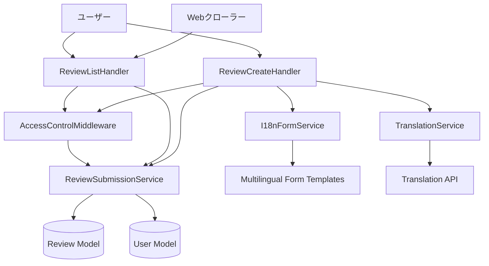
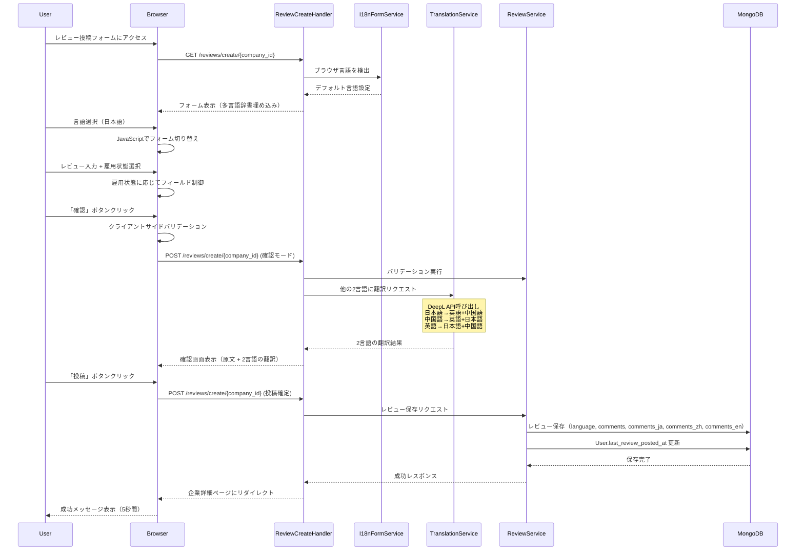
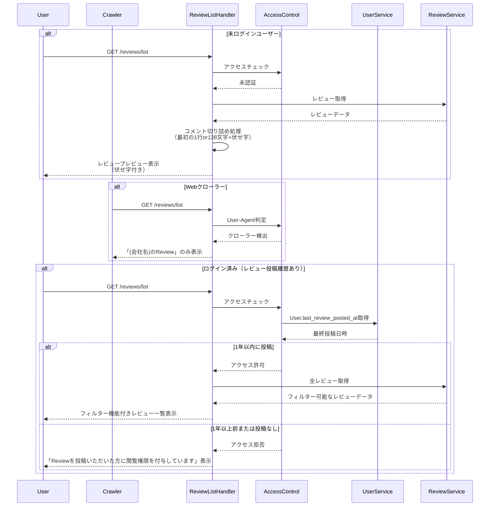
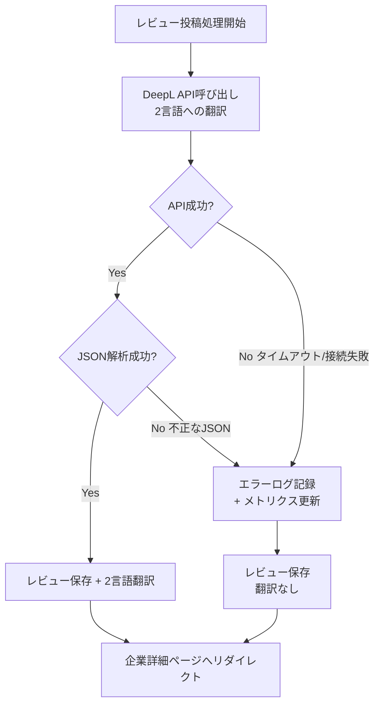
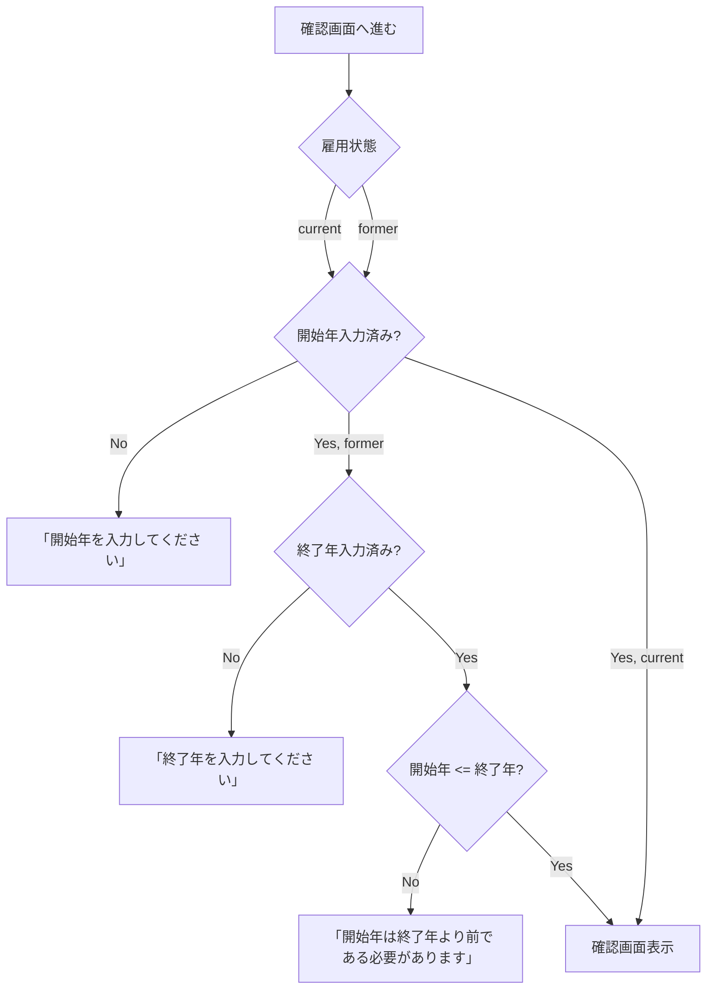
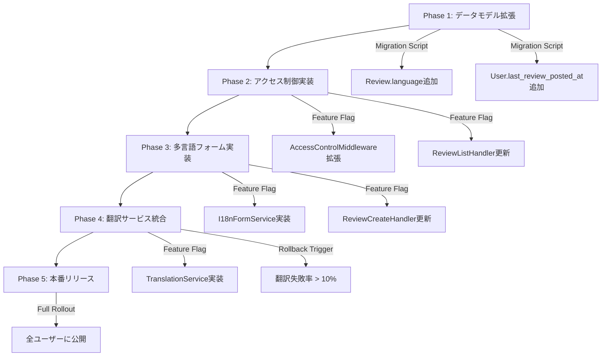

# 技術設計書

## Overview

本設計は、DXEEWorldプラットフォームの企業レビューシステムに3つの主要改善を実装する。既存のレビューシステムを拡張し、グローバルユーザー対応、SEO最適化、データ品質向上を実現する。

**Purpose**: 認証済みレビュー投稿者への詳細なレビューアクセス提供、多言語でのレビュー投稿サポート、雇用期間データの正確性保証を実現し、プラットフォームの国際競争力とデータ品質を向上させる。

**Users**: 未ログインユーザー（SEO経由の訪問者）、認証済みユーザー（レビュー投稿者）、企業レビュー検索者（1年以内のレビュー投稿者）、Webクローラー（検索エンジン）が対象となる。

**Impact**: 既存のレビューシステム（`src/handlers/review_handler.py`、`src/models/review.py`）を拡張し、新規にアクセス制御ミドルウェアとの統合、多言語対応フォームコンポーネント、翻訳サービス統合を追加する。MongoDBのReviewドキュメントスキーマに言語フィールドを追加し、Userドキュメントに最終レビュー投稿日時を追加する。

### Goals

- 認証状態とレビュー投稿履歴に基づいた段階的アクセス制御の実装
- 英語・日本語・中国語の3言語に対応した動的レビュー投稿フォームの構築
- レビュー投稿確認画面の実装と多言語コメントの英語翻訳機能の統合
- 現従業員・元従業員選択時の自動入力サポートとバリデーション強化
- SEO最適化されたコンテンツ表示とWebクローラー対応

### Non-Goals

- レビュー一覧の検索機能強化（既存機能を維持）
- 多言語表示機能（投稿のみ対応、表示は将来対応）
- レビュー編集機能の多言語対応（新規投稿のみ対応）
- ソーシャルログイン機能との統合（既存認証システムを使用）
- リアルタイム翻訳プレビュー（確認画面でのみ翻訳表示）

## Architecture

### 既存アーキテクチャ分析

本機能は既存のTornado MVCアーキテクチャを拡張する形で実装する。既存システムの主要コンポーネント：

- **Handler層**: `ReviewListHandler`、`ReviewCreateHandler`、`ReviewEditHandler`（`src/handlers/review_handler.py`）
- **Service層**: `ReviewSubmissionService`、`ReviewCalculationService`
- **Model層**: `Review`、`EmploymentPeriod`、`User`モデル（MongoDB ODM）
- **Template層**: `templates/reviews/list.html`、`templates/reviews/create.html`
- **Middleware**: `AccessControlMiddleware`（既存、統合済み）

既存のドメイン境界を尊重し、以下の統合ポイントを維持：
- 認証ミドルウェアとの統合（既に`ReviewCreateHandler`と`ReviewEditHandler`で実装済み）
- セッション管理サービスとの統合（`SessionService`）
- 企業情報サービスとの統合（`CompanySearchService`）

### 高レベルアーキテクチャ



### 技術スタック適合性

既存の技術スタックに完全適合：

**Backend**
- Tornado 6.5.2（既存フレームワーク、非同期処理対応）
- Motor（MongoDB非同期ドライバ、既存DB接続を利用）
- Python 3.9+（既存環境）

**Frontend**
- Jinja2テンプレート（既存テンプレートエンジン、多言語対応拡張）
- Vanilla JavaScript（フォーム言語切り替え、雇用状態制御）

**新規依存関係**
- 翻訳API連携ライブラリ（要調査：Google Translate API、DeepL API、またはローカル翻訳モデル）

### 主要設計決定

#### 決定1: アクセス制御戦略 - Middleware統合 vs Handler個別実装

**Decision**: 既存の`AccessControlMiddleware`を活用し、新規にレビュー投稿履歴チェック機能を追加する

**Context**: レビュー一覧へのアクセス制御は「1年以内のレビュー投稿履歴」という時間ベースの条件を必要とする。既存の`AccessControlMiddleware`は認証チェックのみを提供。

**Alternatives**:
1. Handler内で個別にアクセス制御ロジックを実装
2. 新規に`ReviewAccessControlMiddleware`を作成
3. 既存`AccessControlMiddleware`を拡張し、レビュー投稿履歴チェック機能を追加

**Selected Approach**: オプション3を選択。`User`モデルに`last_review_posted_at`フィールドを追加し、`AccessControlMiddleware`に時間ベースのアクセス権限チェック機能を拡張する。

**Rationale**:
- 既存の認証フローとの一貫性を維持
- アクセス制御ロジックの一元管理
- テスト容易性（ミドルウェアレベルでのユニットテスト）
- 将来的な他機能への再利用可能性

**Trade-offs**:
- 利点: 一元化されたアクセス制御、再利用性高い、テスト容易
- 欠点: ミドルウェアの複雑性が増加、レビュー投稿時のUser更新処理が必須

#### 決定2: 多言語フォーム実装 - サーバーサイド vs クライアントサイド

**Decision**: クライアントサイドでJavaScriptによる動的フォーム切り替え + サーバーサイドでのバリデーションと翻訳

**Context**: 3言語（英語・日本語・中国語）に対応したフォームラベルとプレースホルダーの切り替えが必要。ユーザーはドロップダウンで言語を選択し、即座にフォーム全体が切り替わる必要がある。

**Alternatives**:
1. 完全サーバーサイドレンダリング（言語変更時にページリロード）
2. 完全クライアントサイドSPA（React/Vueなど）
3. ハイブリッド: クライアントサイド切り替え + サーバーサイドバリデーション

**Selected Approach**: オプション3のハイブリッドアプローチ。フォームテンプレートにJSON形式で3言語の翻訳辞書を埋め込み、JavaScriptで動的に切り替える。

**Rationale**:
- 既存のJinja2テンプレートエンジンとの互換性維持
- ページリロード不要でUX向上
- 新規フレームワーク導入のコスト回避
- サーバーサイドバリデーションによるセキュリティ保証

**Trade-offs**:
- 利点: 高速なUI応答、既存技術スタック活用、段階的実装可能
- 欠点: 翻訳辞書のメンテナンスコスト、初回ページロード時の若干の増加

#### 決定3: 翻訳サービス選定 - 外部API vs ローカルモデル

**Decision**: DeepL API（専用翻訳API）を使用した高品質翻訳サービス統合、3言語すべての相互翻訳を実装

**Context**: レビューコメントを元言語で保存し、他の2言語に翻訳して確認画面とデータベースに保存する必要がある。高品質かつ高速な翻訳が必要。

**Alternatives**:
1. Google Cloud Translation API（有料、高品質、全言語対応）
2. DeepL API（有料、最高品質、英語・日本語・中国語対応）
3. ローカル翻訳モデル（MarianMT、無料、品質やや低い）
4. 翻訳なし（将来的に手動翻訳）

**Selected Approach**: オプション2のDeepL APIを選択。専用の翻訳APIを使用し、元言語に応じて他の2言語に翻訳。すべての翻訳をMongoDBに保存。

翻訳マトリックス:
- **元言語が日本語**: 英語と中国語に翻訳
- **元言語が中国語**: 英語と日本語に翻訳
- **元言語が英語**: 日本語と中国語に翻訳

**Rationale**:
- 業界最高品質の翻訳精度（特にビジネス文書・レビューコメント）
- 高速なレスポンスタイム（通常 < 1秒）
- 3言語すべてに対応（英語・日本語・中国語簡体字）
- シンプルなREST API（統合が容易）
- 確実な翻訳品質（プロンプトエンジニアリング不要）
- 予測可能なレスポンスタイムとコスト

**Trade-offs**:
- 利点: 最高品質の翻訳、高速（< 1秒）、安定したレスポンスタイム、シンプルなAPI
- 欠点: LLMベース翻訳より高コスト、文字数制限あり（5000文字/リクエスト）

実装時の調査事項:
- DeepL APIの認証方法（APIキー、Auth-Key HTTPヘッダー）
- エンドポイント: https://api-free.deepl.com/v2/translate（無料版）または https://api.deepl.com/v2/translate（有料版）
- 対応言語コード: EN（英語）、JA（日本語）、ZH（中国語簡体字）
- レート制限と料金体系の確認（Free: 500,000文字/月、Pro: 従量課金）
- エラーハンドリング戦略（翻訳失敗時は翻訳なしで投稿可能とする）
- バッチ処理戦略（カテゴリー別に個別API呼び出し、並列処理可能）
- キャッシュ戦略（同一コメントの重複翻訳回避）
- タイムアウト設定: 5秒（高速なため短めに設定）

## System Flows

### レビュー投稿フロー（多言語対応）



### レビュー一覧アクセス制御フロー



## Requirements Traceability

| Requirement | 要件概要 | コンポーネント | インターフェース | フロー |
|-------------|---------|-------------|--------------|-------|
| 1.1 | 未ログインユーザー向けプレビュー表示 | ReviewListHandler, AccessControlMiddleware | `GET /reviews/list`, `truncate_comment_for_preview()` | レビュー一覧アクセス制御フロー |
| 1.2 | Webクローラー向けテキスト表示 | ReviewListHandler, AccessControlMiddleware | `GET /reviews/list` | レビュー一覧アクセス制御フロー |
| 1.3 | 認証済みレビュー投稿者向け一覧表示 | ReviewListHandler, UserService | `GET /reviews/list` | レビュー一覧アクセス制御フロー |
| 1.4-1.6 | フィルター機能（会社別・地域別・評価） | ReviewService, ReviewListHandler | `search_reviews()` | レビュー一覧アクセス制御フロー |
| 1.7 | 1年以内投稿なしのアクセス制限 | AccessControlMiddleware, UserService | `check_review_access()` | レビュー一覧アクセス制御フロー |
| 1.8 | レビュー投稿時のアクセス権限付与 | ReviewSubmissionService, UserModel | `update_last_review_posted_at()` | レビュー投稿フロー |
| 2.1-2.3 | 多言語フォーム切り替え | I18nFormService, ReviewCreateHandler | `render_multilingual_form()` | レビュー投稿フロー |
| 2.4 | 言語情報のフォームデータ含有 | ReviewCreateHandler | `POST /reviews/create/{company_id}` | レビュー投稿フロー |
| 2.5-2.8 | 言語別ラベル・プレースホルダー | I18nFormService | `get_translations()` | レビュー投稿フロー |
| 3.1-3.3 | 確認画面表示 | ReviewCreateHandler | `render_confirmation()` | レビュー投稿フロー |
| 3.4 | 2言語翻訳表示 | TranslationService | `translate_to_languages()` | レビュー投稿フロー |
| 3.5-3.8 | 確認画面ナビゲーション | ReviewCreateHandler | `POST /reviews/create/{company_id}` | レビュー投稿フロー |
| 4.1-4.5 | 多言語データ保存（3言語） | ReviewModel, ReviewSubmissionService | `save_review()` | レビュー投稿フロー |
| 5.1-5.5 | 投稿完了フィードバック | ReviewCreateHandler | リダイレクト + フラッシュメッセージ | レビュー投稿フロー |
| 6.1-6.5 | 雇用状態自動入力サポート | ReviewCreateHandler (JavaScript) | クライアントサイドロジック | レビュー投稿フロー |
| 7.1-7.7 | 雇用期間バリデーション | ReviewSubmissionService, EmploymentPeriod | `validate_employment_period()` | レビュー投稿フロー |

## Components and Interfaces

### レビューアクセス制御層

#### ReviewListHandler (拡張)

**Responsibility & Boundaries**
- **Primary Responsibility**: レビュー一覧の表示、アクセス制御に基づくコンテンツフィルタリング、未認証ユーザー向けプレビュー生成
- **Domain Boundary**: HTTPリクエスト/レスポンス処理層
- **Data Ownership**: レビュー一覧表示用のビューモデル、プレビューテキスト生成
- **Transaction Boundary**: 単一HTTPリクエスト単位

**Dependencies**
- **Inbound**: HTTPクライアント（ブラウザ、Webクローラー）
- **Outbound**: AccessControlMiddleware、ReviewService、CompanySearchService
- **External**: なし

**Contract Definition**

```typescript
interface ReviewListHandler {
  async get(): Promise<void>;  // 既存メソッド拡張

  // 新規ヘルパーメソッド
  truncate_comment_for_preview(
    comment: string,
    max_chars: number = 128
  ): PreviewText;
}

interface PreviewText {
  visible_text: string;   // 表示する部分（最初の1行or128文字）
  masked_text: string;     // 伏せ字部分（"●●●●●"）
  has_more: boolean;       // 続きがあるかどうか
}
```

**Preview Generation Logic**:
1. コメントを改行で分割し、最初の1行を取得
2. 最初の1行が128文字を超える場合、128文字で切り詰め
3. 残りの部分を伏せ字（"●●●●●"、全角5文字）で置き換え
4. 残りが存在する場合、`has_more: true`を設定

**Preconditions**: レビューコメントが存在すること
**Postconditions**: プレビューテキストが正しく生成され、伏せ字が適用されること
**Invariants**: 未認証ユーザーには常にプレビューテキストのみを表示

#### AccessControlMiddleware (拡張)

**Responsibility & Boundaries**
- **Primary Responsibility**: ユーザーの認証状態とレビュー投稿履歴に基づくアクセス権限の判定
- **Domain Boundary**: 認証・認可ドメイン、レビュードメインとの境界
- **Data Ownership**: アクセス権限の判定結果、セッション情報
- **Transaction Boundary**: 単一リクエスト単位（ステートレス）

**Dependencies**
- **Inbound**: ReviewListHandler、ReviewCreateHandler、ReviewEditHandler
- **Outbound**: SessionService、UserService（新規メソッド追加）
- **External**: なし

**Contract Definition**

```typescript
interface AccessControlMiddleware {
  // 既存メソッド（拡張）
  check_access(
    path: string,
    session_id: string | None,
    remote_ip: string
  ): Promise<AccessResult>;

  // 新規メソッド
  check_review_list_access(
    user_id: string | None
  ): Promise<ReviewListAccessResult>;
}

interface ReviewListAccessResult {
  access_level: "full" | "preview" | "crawler" | "denied";
  can_filter: boolean;
  message: string | None;
  user_last_posted_at: datetime | None;
}

// access_level説明:
// - "full": 全文表示可能（1年以内のレビュー投稿者）
// - "preview": プレビュー表示（最初の1行or128文字+伏せ字、未認証ユーザー）
// - "crawler": SEO用テキスト表示（Webクローラー）
// - "denied": アクセス拒否（認証済みだがレビュー投稿履歴なし）

interface AccessResult {
  is_success: boolean;
  data: {
    access_granted: boolean;
    user_context: UserContext | None;
  };
}
```

**Preconditions**: SessionServiceとUserServiceが正常に動作していること
**Postconditions**: アクセスレベルが正しく判定され、適切なメッセージが返されること
**Invariants**: 未認証ユーザーは常に`access_level: "preview"`、Webクローラーは常に`access_level: "crawler"`

#### UserService (拡張)

**Responsibility & Boundaries**
- **Primary Responsibility**: ユーザーの最終レビュー投稿日時の管理と取得
- **Domain Boundary**: ユーザードメイン
- **Data Ownership**: User.last_review_posted_at フィールド
- **Transaction Boundary**: 単一ユーザー更新単位

**Dependencies**
- **Inbound**: AccessControlMiddleware、ReviewSubmissionService
- **Outbound**: MongoDB (users collection)
- **External**: なし

**Contract Definition**

```typescript
interface UserService {
  // 新規メソッド
  async get_last_review_posted_at(user_id: string): Promise<datetime | None>;
  async update_last_review_posted_at(user_id: string): Promise<void>;
  async check_review_access_eligibility(user_id: string): Promise<boolean>;
}
```

**Preconditions**: user_idが有効なObjectIdであること
**Postconditions**: last_review_posted_atが正確に更新されること
**Invariants**: レビュー投稿時は必ずlast_review_posted_atが現在時刻に更新される

### 多言語対応レビュー投稿層

#### I18nFormService (新規)

**Responsibility & Boundaries**
- **Primary Responsibility**: レビューフォームの多言語翻訳辞書管理とデフォルト言語検出
- **Domain Boundary**: プレゼンテーション層（View Helper）
- **Data Ownership**: 翻訳辞書データ（JSON形式）
- **Transaction Boundary**: リクエスト単位（ステートレス）

**Dependencies**
- **Inbound**: ReviewCreateHandler
- **Outbound**: なし（静的翻訳データのみ）
- **External**: なし

**Contract Definition**

```typescript
interface I18nFormService {
  get_form_translations(): Promise<FormTranslations>;
  detect_browser_language(accept_language_header: string): LanguageCode;
  get_supported_languages(): Promise<Array<LanguageOption>>;
}

interface FormTranslations {
  labels: {
    [key: string]: {
      en: string;
      ja: string;
      zh: string;
    };
  };
  placeholders: {
    [key: string]: {
      en: string;
      ja: string;
      zh: string;
    };
  };
  buttons: {
    [key: string]: {
      en: string;
      ja: string;
      zh: string;
    };
  };
}

type LanguageCode = "en" | "ja" | "zh";

interface LanguageOption {
  code: LanguageCode;
  name: string;
  native_name: string;
}
```

**Preconditions**: 翻訳辞書ファイルが存在し、正しいJSON形式であること
**Postconditions**: 3言語すべてで整合性のある翻訳が返されること
**Invariants**: サポートされる言語は常に英語・日本語・中国語の3つのみ

#### TranslationService (新規)

**Responsibility & Boundaries**
- **Primary Responsibility**: レビューコメントの多言語翻訳（DeepL API統合）
- **Domain Boundary**: 外部サービス統合層
- **Data Ownership**: 翻訳リクエストとレスポンスのキャッシュ（オプション）
- **Transaction Boundary**: 単一翻訳リクエスト単位

**Dependencies**
- **Inbound**: ReviewCreateHandler
- **Outbound**: DeepL API
- **External**: DeepL Translation API (REST API)

**External Dependencies Investigation**:
- **API Documentation**: https://www.deepl.com/docs-api/
- **API Endpoint**:
  - Free版: https://api-free.deepl.com/v2/translate
  - Pro版: https://api.deepl.com/v2/translate
- **Authentication**: Auth-Key HTTPヘッダーでAPIキーを送信（環境変数で管理）
- **Supported Languages**: EN（英語）、JA（日本語）、ZH（中国語簡体字）
- **Rate Limits**:
  - Free版: 500,000文字/月
  - Pro版: 従量課金（無制限）
- **Pricing**:
  - Free版: 無料（500,000文字/月まで）
  - Pro版: 約$25/100万文字
- **Response Format**: JSON形式
- **Error Handling**: APIエラー時は翻訳なしで投稿可能とする（degradation strategy）
- **Timeout**: 5秒（高速なレスポンスタイムのため）
- **Character Limit**: 5000文字/リクエスト

**Contract Definition**

```typescript
interface TranslationService {
  // 他の2言語に翻訳（元言語以外の2言語）
  async translate_to_other_languages(
    text: string,
    source_language: LanguageCode
  ): Promise<MultiLanguageTranslationResult>;

  // 複数カテゴリーのコメントを一括翻訳
  async batch_translate_comments(
    comments: { [category: string]: string },
    source_language: LanguageCode
  ): Promise<BatchTranslationResult>;

  // DeepL APIへのリクエスト（内部ヘルパー）
  async call_deepl_api(
    text: string,
    source_lang: string,
    target_lang: string
  ): Promise<DeepLApiResponse>;
}

interface MultiLanguageTranslationResult {
  success: boolean;
  source_language: LanguageCode;
  translations: {
    ja?: string;  // 日本語翻訳（元言語が日本語以外の場合）
    zh?: string;  // 中国語翻訳（元言語が中国語以外の場合）
    en?: string;  // 英語翻訳（元言語が英語以外の場合）
  };
  errors: Array<TranslationError>;
}

interface BatchTranslationResult {
  success: boolean;
  translated_comments: {
    ja?: { [category: string]: string };
    zh?: { [category: string]: string };
    en?: { [category: string]: string };
  };
  errors: Array<TranslationError>;
}

interface DeepLApiResponse {
  success: boolean;
  translated_text: string;
  detected_source_language?: string;
  error_message: string | None;
}

interface TranslationError {
  category: string;
  target_language: LanguageCode;
  error_message: string;
}
```

**Preconditions**: DeepL APIキーが環境変数（DEEPL_API_KEY）に設定されていること、ソース言語が有効な言語コードであること
**Postconditions**: 翻訳が成功した場合、元言語以外の2言語の翻訳が返されること
**Invariants**: 元言語の翻訳は含まれない（例: 日本語で投稿した場合、translations.jaは存在しない）

**DeepL API Request Example**:
```python
import httpx

async def call_deepl_api(text: str, source_lang: str, target_lang: str):
    url = "https://api-free.deepl.com/v2/translate"
    headers = {"Authorization": f"DeepL-Auth-Key {api_key}"}
    data = {
        "text": [text],
        "source_lang": source_lang,  # "JA", "EN", "ZH"
        "target_lang": target_lang   # "JA", "EN", "ZH"
    }
    response = await httpx.post(url, headers=headers, data=data, timeout=5.0)
    return response.json()
```

#### ReviewCreateHandler (拡張)

**Responsibility & Boundaries**
- **Primary Responsibility**: レビュー投稿フォームの表示、確認画面の表示、レビュー投稿処理
- **Domain Boundary**: HTTPリクエスト/レスポンス処理層
- **Data Ownership**: フォーム入力データのバリデーション
- **Transaction Boundary**: 単一HTTPリクエスト単位

**Dependencies**
- **Inbound**: HTTPクライアント（ブラウザ）
- **Outbound**: I18nFormService、TranslationService、ReviewSubmissionService、AccessControlMiddleware
- **External**: なし

**Contract Definition**

API Contract:

| Method | Endpoint | Request | Response | Errors |
|--------|----------|---------|----------|--------|
| GET | /reviews/create/{company_id} | - | HTML (多言語フォーム) | 401, 403, 404, 500 |
| POST | /reviews/create/{company_id}?mode=confirm | ReviewFormData | HTML (確認画面) | 400, 401, 422, 500 |
| POST | /reviews/create/{company_id}?mode=submit | ReviewFormData | Redirect (企業詳細ページ) | 400, 401, 422, 500 |

```typescript
interface ReviewFormData {
  language: LanguageCode;
  employment_status: "current" | "former";
  employment_period: {
    start_year: number;
    end_year: number | None;
  };
  ratings: {
    [category: string]: number | None; // 1-5 or None
  };
  comments: {
    [category: string]: string | None;
  };
}
```

**State Management**: 確認画面とフォーム画面間でフォームデータをセッションに保持（または隠しフィールドで保持）

**Integration Strategy**: 既存の`ReviewCreateHandler.post()`メソッドを拡張し、`mode`パラメータで確認画面表示と投稿処理を分岐

### レビューデータ管理層

#### ReviewSubmissionService (拡張)

**Responsibility & Boundaries**
- **Primary Responsibility**: レビューの投稿、バリデーション、多言語データの保存、User更新
- **Domain Boundary**: レビュービジネスロジック層
- **Data Ownership**: Reviewドキュメント、User.last_review_posted_at
- **Transaction Boundary**: レビュー投稿とUser更新を単一トランザクションで実行

**Dependencies**
- **Inbound**: ReviewCreateHandler
- **Outbound**: ReviewModel、UserModel、ReviewCalculationService
- **External**: MongoDB

**Contract Definition**

```typescript
interface ReviewSubmissionService {
  // 拡張メソッド
  async submit_review(review_data: ReviewFormData): Promise<SubmissionResult>;

  async validate_review(review_data: ReviewFormData): Promise<ValidationResult>;

  // 既存メソッド（インターフェース維持）
  async get_review(review_id: string): Promise<Review | None>;
  async check_review_permission(user_id: string, company_id: string): Promise<PermissionResult>;
}

interface SubmissionResult {
  status: "success" | "error";
  review_id: string | None;
  message: string;
}

interface ValidationResult {
  is_valid: boolean;
  errors: Array<ValidationError>;
}

interface ValidationError {
  field: string;
  message: string;
  code: string;
}
```

**Preconditions**: review_dataが必須フィールドをすべて含むこと、user_idが有効であること
**Postconditions**: レビュー保存成功時、User.last_review_posted_atが現在時刻に更新されること
**Invariants**: 雇用状態が"former"の場合、employment_period.end_yearが必須

## Data Models

### 物理データモデル（MongoDB）

#### Reviewコレクション拡張

既存のReviewドキュメントに言語フィールドを追加：

```typescript
interface ReviewDocument {
  _id: ObjectId;
  company_id: string;
  user_id: string;
  employment_status: "current" | "former";
  employment_period: {
    start_year: number;
    end_year: number | None; // None = 現在勤務中
  };
  ratings: {
    [category: string]: number | None; // 1-5 or None
  };
  comments: {
    [category: string]: string | None;
  };
  individual_average: number;
  answered_count: number;
  created_at: datetime;
  updated_at: datetime;
  is_active: boolean;

  // 新規フィールド
  language: "en" | "ja" | "zh";  // 元言語
  comments_ja?: {
    [category: string]: string | None; // 日本語翻訳（元言語が日本語以外の場合）
  };
  comments_zh?: {
    [category: string]: string | None; // 中国語翻訳（元言語が中国語以外の場合）
  };
  comments_en?: {
    [category: string]: string | None; // 英語翻訳（元言語が英語以外の場合）
  };
}
```

**インデックス**:
- 既存: `{ company_id: 1, created_at: -1 }`
- 新規: `{ language: 1 }` （多言語分析用、オプション）

#### Userコレクション拡張

Userドキュメントに最終レビュー投稿日時を追加：

```typescript
interface UserDocument {
  _id: ObjectId;
  email: string;
  name: string;
  user_type: "JOB_SEEKER" | "RECRUITER";
  password_hash: string;
  company_id: string | None;
  position: string | None;
  profile: UserProfile;
  created_at: datetime;
  updated_at: datetime;
  is_active: boolean;

  // 新規フィールド
  last_review_posted_at?: datetime; // 最終レビュー投稿日時
}
```

**インデックス**:
- 新規: `{ last_review_posted_at: -1 }` （アクセス制御チェック用）

### データ整合性とマイグレーション

**既存データのマイグレーション**:
1. 既存のReviewドキュメントに`language: "ja"`をデフォルト設定（日本語プラットフォームのため）
2. 既存のUserドキュメントに`last_review_posted_at`を追加（各ユーザーの最新レビューのcreated_atを設定）

**整合性ルール**:
- `language`が"ja"の場合、`comments_en`と`comments_zh`が存在することを推奨（必須ではない、翻訳失敗時対応）
- `language`が"zh"の場合、`comments_en`と`comments_ja`が存在することを推奨
- `language`が"en"の場合、`comments_ja`と`comments_zh`が存在することを推奨
- 元言語のコメントフィールド（例: 日本語投稿なら`comments_ja`）は存在しない（`comments`フィールドが元言語）
- `employment_status`が"former"の場合、`employment_period.end_year`が必須
- `last_review_posted_at`は常にユーザーの最新レビューのcreated_atと一致すること

## Error Handling

### エラー戦略

本機能では以下のエラー分類とリカバリー戦略を採用：

**User Errors (4xx)**
- 400 Bad Request: 無効な企業ID、不正なフォームデータ → クライアントサイドバリデーションで事前防止
- 401 Unauthorized: 未認証ユーザー → ログイン画面へリダイレクト
- 403 Forbidden: レビュー投稿権限なし → エラーメッセージ表示
- 404 Not Found: 企業が存在しない → 企業一覧ページへリダイレクト
- 422 Unprocessable Entity: バリデーションエラー → フィールド単位のエラーメッセージ表示

**System Errors (5xx)**
- 500 Internal Server Error: データベース接続失敗、予期しない例外 → エラーページ表示
- 503 Service Unavailable: DeepL API接続失敗 → 翻訳なしで投稿継続（degradation）
- 504 Gateway Timeout: DeepL APIタイムアウト（5秒超過） → 翻訳なしで投稿継続

**Business Logic Errors (422)**
- 雇用期間バリデーションエラー: 開始年 > 終了年 → フィールド近くにエラー表示
- レビュー重複投稿エラー: 同一企業に複数投稿 → 編集画面へリダイレクト

### エラーカテゴリーと対応

**DeepL API失敗時のGraceful Degradation**:



**雇用期間バリデーションエラー処理**:



### 監視とログ

**エラートラッキング**:
- DeepL API失敗率の監視（Prometheusメトリクス推奨）
- DeepL APIレスポンスタイムの監視（p50, p95, p99）
- 翻訳文字数使用量の監視（コスト管理、月次制限）
- バリデーションエラー頻度の分析（ユーザビリティ改善指標）
- アクセス制御拒否ログ（不正アクセス検知）

**ログレベル**:
- ERROR: DeepL API失敗、データベース接続失敗、予期しない例外
- WARNING: バリデーションエラー、アクセス制御拒否、JSON解析失敗
- INFO: レビュー投稿成功、ユーザーのlast_review_posted_at更新、翻訳成功
- DEBUG: DeepL APIリクエスト/レスポンス（本番環境では無効化）

## Testing Strategy

### ユニットテスト

**AccessControlMiddleware**:
- `test_check_review_list_access_unauthenticated()`: 未認証ユーザーは`access_level: "preview"`
- `test_check_review_list_access_crawler()`: User-Agent判定でクローラー検出
- `test_check_review_list_access_within_one_year()`: 1年以内のレビュー投稿者は`access_level: "full"`
- `test_check_review_list_access_over_one_year()`: 1年以上前の投稿者は`access_level: "denied"`
- `test_check_review_list_access_no_review_history()`: レビュー履歴なしユーザーは`access_level: "denied"`

**ReviewListHandler**:
- `test_truncate_comment_short()`: 128文字以下のコメントはそのまま表示、伏せ字なし
- `test_truncate_comment_long()`: 128文字を超えるコメントは128文字+伏せ字
- `test_truncate_comment_multiline_short_first_line()`: 複数行で最初の1行が128文字以下の場合、最初の1行+伏せ字
- `test_truncate_comment_multiline_long_first_line()`: 複数行で最初の1行が128文字超の場合、128文字+伏せ字
- `test_preview_has_more_flag()`: 伏せ字がある場合、`has_more: true`

**I18nFormService**:
- `test_get_form_translations()`: 3言語すべての翻訳が返される
- `test_detect_browser_language_ja()`: Accept-Languageヘッダーから日本語を検出
- `test_detect_browser_language_fallback()`: 未対応言語は英語にフォールバック
- `test_get_supported_languages()`: 英語・日本語・中国語の3つのみ

**TranslationService**:
- `test_translate_to_other_languages_from_ja()`: 日本語→英語+中国語の翻訳成功
- `test_translate_to_other_languages_from_zh()`: 中国語→英語+日本語の翻訳成功
- `test_translate_to_other_languages_from_en()`: 英語→日本語+中国語の翻訳成功
- `test_deepl_api_failure()`: DeepL APIエラー時のエラーハンドリング
- `test_deepl_api_timeout()`: タイムアウト時のGraceful Degradation
- `test_deepl_json_parse_error()`: 不正なJSON応答時のエラーハンドリング
- `test_batch_translate_comments()`: 複数カテゴリーのコメント一括翻訳
- `test_deepl_character_limit()`: 5000文字制限のハンドリング

**EmploymentPeriodバリデーション**:
- `test_validate_current_employee()`: 現従業員は終了年なしで有効
- `test_validate_former_employee_valid()`: 元従業員は開始年 <= 終了年で有効
- `test_validate_former_employee_invalid()`: 開始年 > 終了年でバリデーションエラー
- `test_validate_missing_end_year_for_former()`: 元従業員で終了年なしはエラー

### 統合テスト

**レビュー投稿フロー（多言語）**:
- `test_review_submission_flow_japanese()`: 日本語でのレビュー投稿と英語+中国語翻訳保存
- `test_review_submission_flow_chinese()`: 中国語でのレビュー投稿と英語+日本語翻訳保存
- `test_review_submission_flow_english()`: 英語でのレビュー投稿と日本語+中国語翻訳保存
- `test_review_submission_updates_last_posted_at()`: レビュー投稿後、User.last_review_posted_at更新確認
- `test_review_submission_with_translation_failure()`: DeepL API失敗時も投稿成功（degradation）
- `test_review_data_structure()`: MongoDBに正しい構造で保存（comments, comments_ja, comments_zh, comments_en）

**アクセス制御統合**:
- `test_review_list_access_after_posting()`: レビュー投稿直後は一覧アクセス可能
- `test_review_list_access_after_one_year()`: 1年後にアクセス権限が失効
- `test_review_list_filter_access_control()`: フィルター機能はアクセス権限ありの場合のみ

### E2E/UIテスト

**レビュー投稿ユーザージャーニー**:
- `test_e2e_review_submission_ja()`: 日本語で完全なレビュー投稿フロー（フォーム表示→入力→確認→投稿→成功メッセージ）
- `test_e2e_language_switching()`: フォーム言語切り替え（英語→日本語→中国語）の動作確認
- `test_e2e_employment_status_auto_fill()`: 現従業員選択時の終了年自動設定
- `test_e2e_validation_errors_display()`: バリデーションエラーメッセージの表示位置と色

**レビュー一覧アクセス制御**:
- `test_e2e_unauthenticated_review_list()`: 未認証ユーザーにはプレビュー表示（最初の1行or128文字+伏せ字）
- `test_e2e_authenticated_with_access()`: 認証済み+レビュー投稿者には全文表示
- `test_e2e_authenticated_without_access()`: 認証済み+投稿履歴なしには制限メッセージ
- `test_e2e_preview_masking()`: 未認証ユーザーに伏せ字が正しく表示される

### パフォーマンステスト

**DeepL API負荷テスト**:
- `test_deepl_api_concurrency()`: 同時10件のレビュー投稿時のDeepL API処理時間
- `test_deepl_api_response_time()`: DeepL APIのレスポンスタイム測定（p50, p95, p99）
- `test_deepl_api_rate_limit()`: APIレート制限到達時の挙動確認
- `test_translation_character_usage()`: 文字数使用量の測定とコスト試算

**レビュー一覧パフォーマンス**:
- `test_review_list_load_time_with_filters()`: フィルター適用時のレスポンスタイム（< 500ms目標）
- `test_review_list_pagination_performance()`: 大量レビュー（1000件以上）のページネーション速度

## Security Considerations

### アクセス制御とデータ保護

**レビュー一覧のアクセス制御**:
- 未認証ユーザーには最初の1行または最初の128文字のみ表示し、残りは伏せ字（例: "●●●●●"）で表示（スクレイピング防止とプレビュー提供のバランス）
- 1年以内のレビュー投稿者のみ全文閲覧可能（貢献インセンティブ）
- WebクローラーにはSEO用の最小限テキストのみ表示

**多言語データの保護**:
- DeepL APIへの送信データにPII（個人識別情報）が含まれないことを確認
- レビューコメントのみを送信し、ユーザー情報や企業情報は含めない
- DeepL APIのデータ保持ポリシーを確認（送信データは保持されない）
- 翻訳失敗時のログにコメント全文を記録しない（データ漏洩防止）
- APIキーの安全な管理（環境変数、シークレット管理システム）

**入力検証とサニタイゼーション**:
- レビューコメントのHTMLタグ除去（XSS防止）
- 言語コードのホワイトリスト検証（"en", "ja", "zh"のみ許可）
- 雇用期間の範囲検証（1970年〜現在年）

### セキュリティ脅威モデリング

**脅威1: 不正なレビュー一覧アクセス**
- 攻撃: レビュー投稿せずに一覧データをスクレイピング
- 対策: アクセス制御ミドルウェアでlast_review_posted_atチェック、画像表示
- 残存リスク: 画像OCRによるデータ抽出（低リスク）

**脅威2: DeepL APIの悪用**
- 攻撃: 大量のレビュー投稿によるAPI費用増加、文字数制限の超過
- 対策: ユーザーあたりのレビュー投稿頻度制限（1企業1レビュー）、翻訳リクエストのログ監視、月次文字数制限の設定
- 残存リスク: 複数アカウント作成による回避（中リスク）、Free版の月次制限超過（低リスク）

**脅威3: XSS攻撃**
- 攻撃: レビューコメントに悪意のあるスクリプトを埋め込み
- 対策: Jinja2の自動エスケープ機能、コメント保存前のHTMLタグ除去
- 残存リスク: なし（適切なエスケープで完全防止）

## Performance & Scalability

### パフォーマンス目標

**レスポンスタイム**:
- レビュー投稿フォーム表示: < 500ms
- レビュー確認画面表示（翻訳含む): < 3秒（DeepL API応答時間を考慮）
- レビュー投稿完了: < 3秒
- レビュー一覧表示: < 500ms

**DeepL APIパフォーマンス**:
- DeepL API: 通常 < 1秒/リクエスト（高速な専用翻訳API）
- タイムアウト設定: 5秒（高速なレスポンスのため）
- リトライ戦略: 1回まで（タイムアウト時のみ、Graceful Degradation優先）
- 並列処理: 2言語への翻訳を並列実行（asyncio.gather）

### スケーラビリティ戦略

**水平スケーリング**:
- Tornadoサーバーの複数インスタンス起動（ロードバランサー経由）
- MongoDBのレプリカセット構成（読み取り負荷分散）

**キャッシング戦略**:
- 翻訳結果のキャッシュ（同一コメントの重複翻訳回避、Redis使用）
- I18nFormServiceの翻訳辞書キャッシュ（メモリキャッシュ）
- レビュー一覧のクエリ結果キャッシュ（5分TTL、Redis使用）

**最適化施策**:
- MongoDBインデックスの適切な設計（last_review_posted_at、language）
- DeepL APIの並列リクエスト活用（2言語への翻訳を同時実行）
- クライアントサイドでのフォーム切り替え（サーバーリクエスト削減）

## Migration Strategy

本機能は既存システムの拡張であるため、段階的な移行戦略を採用：



### 移行フェーズ

**Phase 1: データモデル拡張（1週間）**
- Reviewコレクションに`language`フィールド追加（デフォルト: "ja"）
- Userコレクションに`last_review_posted_at`フィールド追加
- マイグレーションスクリプト実行（既存データの更新）
- バリデーション: 全Reviewドキュメントに`language`が存在することを確認

**Phase 2: アクセス制御実装（1週間）**
- `AccessControlMiddleware`の拡張
- `UserService`の新規メソッド追加
- `ReviewListHandler`の更新
- Feature Flag: `ENABLE_REVIEW_ACCESS_CONTROL=false`（初期は無効）
- テスト: ユニットテスト、統合テスト実行
- ロールバックトリガー: アクセス制御エラー率 > 5%

**Phase 3: 多言語フォーム実装（2週間）**
- `I18nFormService`の実装
- `ReviewCreateHandler`の多言語対応
- フォームテンプレートの更新（翻訳辞書埋め込み）
- JavaScript実装（言語切り替え、雇用状態制御）
- Feature Flag: `ENABLE_MULTILINGUAL_FORM=false`
- テスト: E2Eテスト、ブラウザ互換性テスト
- ロールバックトリガー: フォーム送信エラー率 > 10%

**Phase 4: 翻訳サービス統合（1週間）**
- `TranslationService`の実装
- DeepL API統合（REST APIエンドポイント）
- 確認画面での3言語翻訳表示
- Feature Flag: `ENABLE_TRANSLATION=false`
- テスト: 翻訳品質確認、API負荷テスト、並列処理最適化
- ロールバックトリガー: 翻訳失敗率 > 10%、APIレスポンスタイム > 5秒、月次文字数制限超過

**Phase 5: 本番リリース（1週間）**
- Feature Flagを段階的に有効化（10% → 50% → 100%）
- 監視ダッシュボードでメトリクス確認
- ユーザーフィードバック収集
- 問題なければ全機能を完全公開

### ロールバック計画

各フェーズでのロールバックトリガーとアクション：

| フェーズ | トリガー | ロールバックアクション | データ復旧 |
|---------|---------|---------------------|----------|
| Phase 2 | アクセス制御エラー率 > 5% | Feature Flag無効化 | 不要（既存データ維持） |
| Phase 3 | フォーム送信エラー率 > 10% | Feature Flag無効化、旧フォーム復帰 | 不要 |
| Phase 4 | 翻訳失敗率 > 10%、月次制限超過 | Feature Flag無効化、翻訳なし投稿に変更 | 不要（comment_en等欠損許容） |
| Phase 5 | ユーザークレーム多数 | 段階的ロールバック（100% → 50% → 0%） | 不要 |

### バリデーションチェックポイント

各フェーズ完了時の検証項目：

**Phase 1完了時**:
- [ ] 全Reviewドキュメントに`language`フィールドが存在
- [ ] 全Userドキュメントに`last_review_posted_at`フィールドが存在
- [ ] 既存レビュー表示機能が正常動作

**Phase 2完了時**:
- [ ] 未認証ユーザーに画像表示される
- [ ] 1年以内のレビュー投稿者に一覧表示される
- [ ] アクセス制御エラーログが0件

**Phase 3完了時**:
- [ ] 3言語でフォームが正しく切り替わる
- [ ] 言語選択が正しくPOSTデータに含まれる
- [ ] 雇用状態選択で終了年フィールドが適切に制御される

**Phase 4完了時**:
- [ ] 日本語レビューが英語+中国語に翻訳される
- [ ] 中国語レビューが英語+日本語に翻訳される
- [ ] 英語レビューが日本語+中国語に翻訳される
- [ ] 翻訳失敗時もレビュー投稿が成功する
- [ ] 翻訳結果が確認画面に表示される（2言語）

**Phase 5完了時**:
- [ ] 全機能が本番環境で正常動作
- [ ] パフォーマンス目標達成（レスポンスタイム）
- [ ] ユーザーからの肯定的フィードバック
