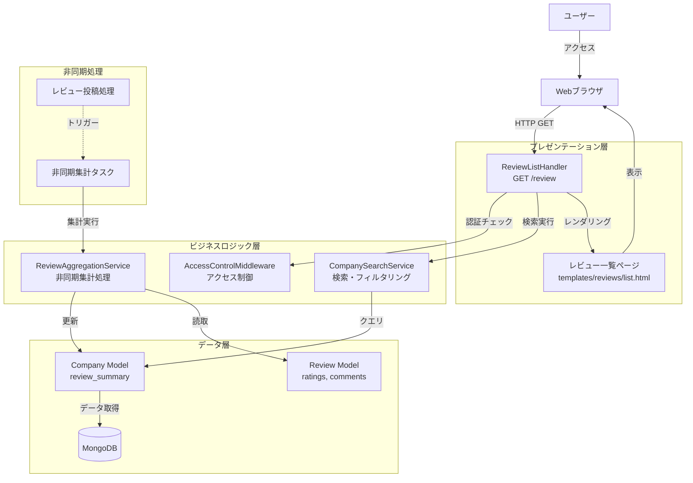
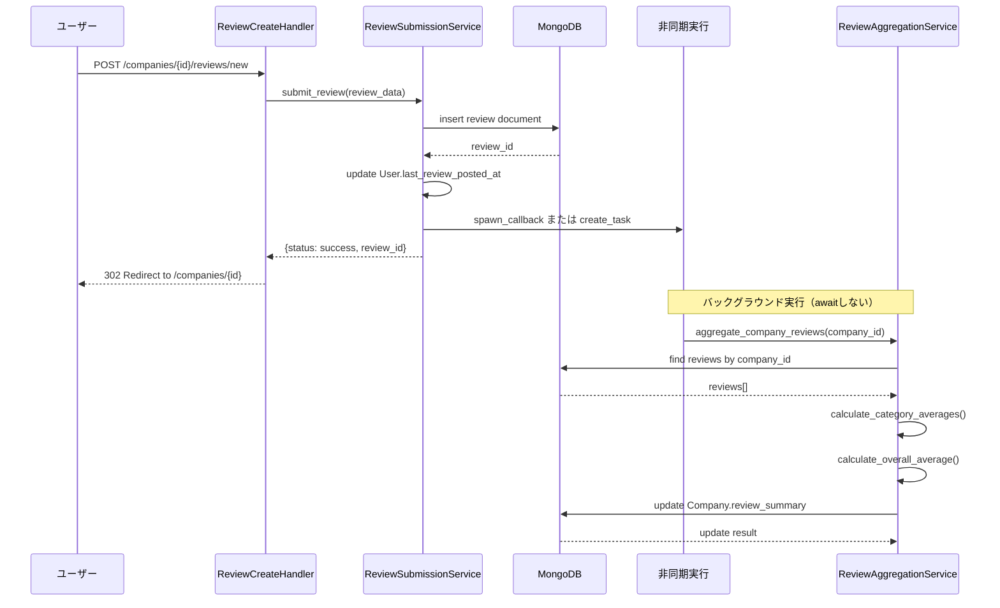
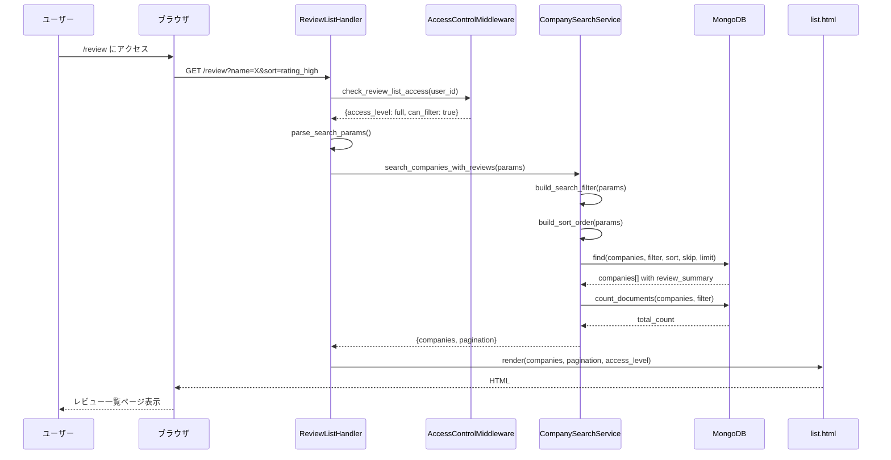
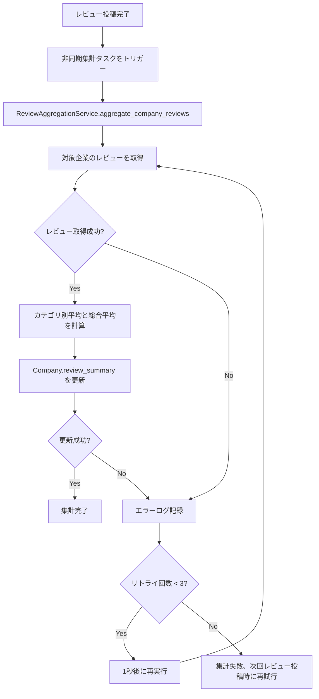
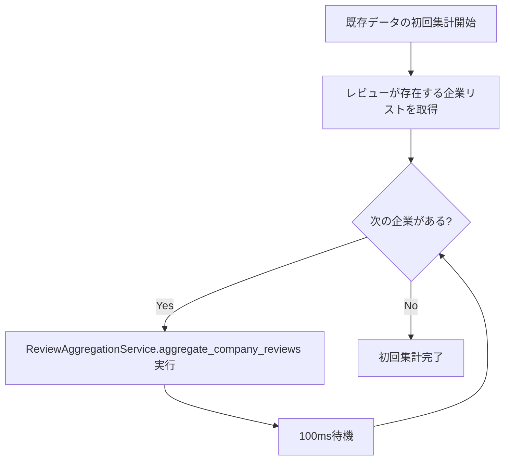

# 技術設計書

## 概要

レビュー一覧ページ（/review）は、企業のレビュー情報を効率的に閲覧・比較するための検索機能を提供するWebページです。本機能は、レビュー投稿時に非同期で事前集計されたデータを活用することで、大量のレビューデータを高速に表示し、評価順・レビュー数順などの多様なソート機能、企業名・所在地・評価範囲による柔軟な検索・フィルター機能を実現します。

**ユーザー価値**: 転職検討者や投資家は、企業の評価情報を効率的に閲覧・比較し、意思決定に必要な情報を容易に取得できます。

**影響範囲**: 既存のレビューシステムを拡張し、企業データモデルに集計データフィールドを追加、レビュー投稿処理に非同期集計タスクを統合します。

### 目標

- レビュー投稿時の非同期集計により、ページ表示時のレスポンスタイムを200ms以内に維持
- 20件/ページのページネーションで、1000件以上の企業データを効率的に表示
- 企業名・所在地・評価範囲による柔軟なフィルタリング機能の提供
- アクセス制御と連動したフィルター機能の有効化・無効化

### 非目標

- リアルタイム集計（レビュー投稿直後の即時反映は不要、数秒の遅延は許容）
- 全文検索機能（企業名・所在地の部分一致検索のみ）
- カテゴリ別評価での詳細フィルタリング（総合評価のみ）
- レビュー内容の表示（企業カードには集計データのみ表示、詳細は企業詳細ページで閲覧）

## アーキテクチャ

### 既存アーキテクチャ分析

既存のレビューシステムは以下のパターンを採用しています：

- **MVC パターン**: Handler (Controller) → Service (Business Logic) → Model (Data) の明確な責任分離
- **非同期処理**: Tornado フレームワークによる async/await ベースの非同期処理
- **MongoDB データストレージ**: Motor による非同期 MongoDB ドライバー使用
- **アクセス制御**: AccessControlMiddleware による認証・認可チェック

本機能では以下の既存パターンを維持します：

- `ReviewHandler` パターンを踏襲した `ReviewListHandler` の実装
- `CompanySearchService` の既存検索ロジックを拡張
- `ReviewCalculationService` を活用した集計処理の実装
- `AccessControlMiddleware` との統合によるフィルター制御

### 高レベルアーキテクチャ



### 技術スタック整合性

本機能は既存の技術スタックと完全に整合します：

- **フレームワーク**: Tornado 6.5.2（既存と同じ）
- **データベース**: MongoDB 7.0+ with Motor（既存と同じ）
- **テンプレート**: Jinja2 3.1.3（既存パターンを踏襲）
- **認証**: AccessControlMiddleware による既存アクセス制御機構を利用
- **非同期処理**: Tornado の spawn_callback または asyncio.create_task による非同期集計実行（既存の標準機能を活用）

新規依存関係：なし（既存ライブラリのみで実装可能）

### 主要な設計決定

#### 決定1: 非同期集計 vs リアルタイム集計

**コンテキスト**: レビューが投稿されたとき、企業の集計データをいつ更新するかを決定する必要がある。

**選択肢**:
1. **リアルタイム集計**: レビュー投稿のリクエストハンドリング中に同期的に集計を実行
2. **非同期集計（企業単位）**: レビュー投稿後に当該企業のみを対象とした非同期タスクで集計
3. **バッチ集計**: 定期的（例: 毎時）にすべての企業を再集計

**選択したアプローチ**: 非同期集計（企業単位）

**根拠**:
- **パフォーマンス**: レビュー投稿のレスポンスタイムを最小化（同期集計は200-500ms追加）
- **即時性**: 数秒以内にレビュー一覧ページに反映（バッチ集計は最大1時間の遅延）
- **スケーラビリティ**: 企業単位の集計は対象データが限定的で高速（全体バッチは負荷が高い）

**トレードオフ**:
- 得られるもの: 高速な投稿レスポンス、適度な即時性、低い計算コスト
- 失うもの: 完全なリアルタイム性（数秒の遅延が発生）

#### 決定2: 集計データストレージ戦略

**コンテキスト**: 企業ごとの集計データ（総合評価、レビュー数など）をどこに保存するかを決定する必要がある。

**選択肢**:
1. **専用集計テーブル**: `company_review_aggregates` コレクションを新規作成
2. **Company モデル内埋め込み**: `Company.review_summary` として既存モデルに追加
3. **動的計算**: 集計データを保存せず、毎回計算

**選択したアプローチ**: Company モデル内埋め込み（`Company.review_summary`）

**根拠**:
- **データ整合性**: 企業データとレビュー集計データが同じドキュメントに存在し、結合不要
- **既存パターン**: `Company.review_summary` フィールドが既に定義済み（`src/models/company.py:59`）
- **クエリ効率**: 企業データ取得時にレビュー集計も同時取得可能（追加クエリ不要）

**トレードオフ**:
- 得られるもの: シンプルなデータモデル、高速なクエリ、既存コードとの互換性
- 失うもの: 集計データの独立管理（企業データとの結合コストは低い）

#### 決定3: ソート・フィルタリングのデータベース層実装

**コンテキスト**: 検索条件に基づく企業のフィルタリングとソートをどの層で実装するかを決定する必要がある。

**選択肢**:
1. **データベース層（MongoDB クエリ）**: find() の filter と sort を使用
2. **アプリケーション層（Python）**: 全データ取得後に Python でフィルタ・ソート
3. **ハイブリッド**: 基本フィルタは DB、詳細フィルタは Python

**選択したアプローチ**: データベース層（MongoDB クエリ）

**根拠**:
- **パフォーマンス**: MongoDB のインデックスを活用した高速フィルタリング・ソート
- **スケーラビリティ**: 大量データでもメモリ効率が高い（必要なデータのみ取得）
- **ページネーション**: データベース層での skip/limit 実装が効率的

**トレードオフ**:
- 得られるもの: 高速な検索、低いメモリ使用量、大規模データ対応
- 失うもの: 複雑なフィルタリングロジックの柔軟性（MongoDBクエリの制約内）

## システムフロー

### レビュー投稿時の非同期集計フロー



### レビュー一覧ページ表示フロー



## 要件トレーサビリティ

| 要件 | 要件概要 | コンポーネント | インターフェース | フロー |
|------|----------|--------------|-----------------|--------|
| 1.1-1.12 | レビュー投稿時の非同期集計 | ReviewAggregationService | aggregate_company_reviews() | レビュー投稿時の非同期集計フロー |
| 2.1-2.6 | ソート機能 | CompanySearchService | build_sort_order() | レビュー一覧ページ表示フロー |
| 3.1-3.5 | 検索・フィルタリング | CompanySearchService | build_search_filter() | レビュー一覧ページ表示フロー |
| 4.1-4.4 | アクセス制御連動フィルタリング | AccessControlMiddleware | check_review_list_access() | レビュー一覧ページ表示フロー |
| 5.1-5.11 | ページネーション | CompanySearchService | search_companies_with_reviews() | レビュー一覧ページ表示フロー |
| 6.1-6.9 | 企業カード表示 | templates/reviews/list.html | - | レビュー一覧ページ表示フロー |

## コンポーネントとインターフェース

### ビジネスロジック層

#### ReviewAggregationService

**責任と境界**

- **主要責任**: 企業単位でレビューデータを集計し、Company.review_summary を更新
- **ドメイン境界**: レビュー集計ドメイン（Review → Company への集約）
- **データ所有権**: なし（読み取りのみ、Company モデルを更新）
- **トランザクション境界**: 企業単位の集計処理（1企業ずつ独立して実行）

**依存関係**

- **インバウンド**: ReviewSubmissionService（レビュー投稿後に非同期タスクをトリガー）
- **アウトバウンド**: Review モデル（集計対象データ読み取り）、Company モデル（集計結果書き込み）
- **外部**: MongoDB（データストレージ）

**契約定義**

サービスインターフェース:

```typescript
interface ReviewAggregationService {
  // 企業単位でレビューを集計し、Company.review_summary を更新
  aggregate_company_reviews(company_id: str): Promise<AggregationResult>;

  // カテゴリ別評価平均を計算（None値を除外）
  calculate_category_averages(reviews: List<Review>): CategoryAverages;

  // 総合評価平均を計算（全カテゴリの平均値の平均）
  calculate_overall_average(category_averages: CategoryAverages): float;
}

interface AggregationResult {
  success: boolean;
  company_id: str;
  total_reviews: int;
  overall_average: float;
  category_averages: CategoryAverages;
  last_review_date: datetime;
  error?: str;
}

interface CategoryAverages {
  recommendation: float;
  foreign_support: float;
  company_culture: float;
  employee_relations: float;
  evaluation_system: float;
  promotion_treatment: float;
}
```

- **事前条件**: company_id が有効な ObjectId 形式、対象企業が MongoDB に存在する
- **事後条件**: Company.review_summary が最新の集計データで更新される、エラー時はログ記録
- **不変条件**: 評価値は0.0〜5.0の範囲内、total_reviews は非負整数

**状態管理**

- **状態モデル**: ステートレス（集計処理は冪等性あり、複数回実行しても結果は同じ）
- **永続化**: なし（結果は Company モデルに保存）
- **並行性**: 企業単位でロックなし（最後の集計結果が勝つ、レース条件は許容）

**統合戦略**

- **修正アプローチ**: 新規サービス追加（既存コードへの影響なし）
- **後方互換性**: Company.review_summary フィールドは既存（新規フィールド追加なし）
- **移行パス**: 既存レビューデータの初回集計バッチ処理が必要

**非同期実行の実装方法**

ReviewSubmissionService からの呼び出し例:

```python
# 方法1: Tornado の spawn_callback を使用
import tornado.ioloop

async def submit_review(self, review_data):
    # レビューを保存
    review_id = await self.db.create("reviews", review.to_dict())

    # 非同期で集計実行（awaitしない = バックグラウンド実行）
    tornado.ioloop.IOLoop.current().spawn_callback(
        self.aggregation_service.aggregate_company_reviews,
        review_data["company_id"]
    )

    return {"status": "success", "review_id": review_id}

# 方法2: asyncio.create_task を使用（推奨）
import asyncio

async def submit_review(self, review_data):
    # レビューを保存
    review_id = await self.db.create("reviews", review.to_dict())

    # 非同期で集計実行
    asyncio.create_task(
        self.aggregation_service.aggregate_company_reviews(review_data["company_id"])
    )

    return {"status": "success", "review_id": review_id}
```

どちらの方法も、レビュー投稿のレスポンスを待たずにバックグラウンドで集計処理を実行します。

#### CompanySearchService（既存サービスの拡張）

**責任と境界**

- **主要責任**: 検索条件に基づく企業の検索・フィルタリング・ソート・ページネーション
- **ドメイン境界**: 企業検索ドメイン（ユーザー入力 → 企業データ取得）
- **データ所有権**: なし（Company モデルからの読み取りのみ）
- **トランザクション境界**: なし（読み取り専用）

**依存関係**

- **インバウンド**: ReviewListHandler（レビュー一覧ページからの検索リクエスト）
- **アウトバウンド**: Company モデル（検索対象データ）
- **外部**: MongoDB（データストレージ）

**契約定義**

サービスインターフェース:

```typescript
interface CompanySearchService {
  // レビュー情報付きで企業を検索
  search_companies_with_reviews(search_params: SearchParams): Promise<SearchResult>;

  // 検索フィルタを構築
  build_search_filter(search_params: SearchParams): MongoDBFilter;

  // ソート順序を構築
  build_sort_order(search_params: SearchParams): MongoDBSort;

  // 検索パラメータのバリデーション
  validate_search_params(search_params: SearchParams): List<str>;
}

interface SearchParams {
  name?: str;               // 企業名（部分一致）
  location?: str;           // 所在地（部分一致）
  min_rating?: float;       // 最低評価（0.0-5.0）
  max_rating?: float;       // 最高評価（0.0-5.0）
  page: int;                // ページ番号（1始まり）
  limit: int;               // 1ページあたりの件数（デフォルト20）
  sort: str;                // ソートキー（rating_high, rating_low, review_count, name, latest）
}

interface SearchResult {
  companies: List<CompanyWithReviews>;
  pagination: PaginationInfo;
}

interface CompanyWithReviews {
  id: str;
  name: str;
  location: str;
  overall_average: float;
  total_reviews: int;
  category_averages: CategoryAverages;
  last_review_date: datetime;
}

interface PaginationInfo {
  page: int;
  limit: int;
  total: int;
  pages: int;
}
```

- **事前条件**: search_params のバリデーションが成功、ページ番号が1以上
- **事後条件**: 検索条件に合致する企業リストとページネーション情報を返す
- **不変条件**: companies の件数は limit 以下、page は 1 〜 pages の範囲内

**統合戦略**

- **修正アプローチ**: 既存サービスを拡張（`search_companies_with_reviews()` メソッドを追加）
- **後方互換性**: 既存の `search_companies()` メソッドは維持（影響なし）
- **移行パス**: 既存の CompanySearchService を段階的に拡張

### プレゼンテーション層

#### ReviewListHandler

**責任と境界**

- **主要責任**: レビュー一覧ページのHTTPリクエストハンドリングとレンダリング
- **ドメイン境界**: プレゼンテーション層（HTTP → HTML変換）
- **データ所有権**: なし（サービス層からのデータ取得のみ）
- **トランザクション境界**: なし（読み取り専用）

**依存関係**

- **インバウンド**: ユーザーのブラウザ（HTTP GET /review）
- **アウトバウンド**: CompanySearchService（検索実行）、AccessControlMiddleware（アクセス制御）
- **外部**: なし

**契約定義**

API契約:

| Method | Endpoint | Request | Response | Errors |
|--------|----------|---------|----------|--------|
| GET | /review | SearchParams（クエリパラメータ） | HTML（レビュー一覧ページ） | 500（内部エラー） |

リクエスト例:
```
GET /review?name=テスト&location=東京&min_rating=3.0&max_rating=4.5&page=2&limit=20&sort=rating_high
```

レスポンス例:
```html
<!DOCTYPE html>
<html>
  <body>
    <div class="search-results">
      <!-- 企業カード × 20件 -->
      <!-- ページネーション -->
    </div>
  </body>
</html>
```

- **事前条件**: HTTP GET リクエスト、クエリパラメータが正しい形式
- **事後条件**: 検索結果を含む HTML ページを返す、エラー時は空のリストを表示
- **不変条件**: ページは必ず HTML を返す（エラー時もレンダリング）

**統合戦略**

- **修正アプローチ**: 既存の ReviewListHandler を拡張（GET メソッドの実装を改善）
- **後方互換性**: 既存のルーティング（/review）を維持
- **移行パス**: 段階的に機能を追加（アクセス制御 → 検索 → ページネーション）

## データモデル

### 物理データモデル（MongoDB）

#### Company コレクション（拡張）

既存の Company モデルに `review_summary` フィールドを活用します（既に定義済み）。

```typescript
interface CompanyDocument {
  _id: ObjectId;
  name: string;
  industry: string;
  size: string;
  country: string;
  location: string;
  founded_year?: number;
  employee_count?: number;
  created_at: datetime;
  updated_at: datetime;
  is_active: boolean;

  // レビュー集計データ（既存フィールド）
  review_summary?: {
    total_reviews: number;           // レビュー総数
    overall_average: number;         // 総合評価平均（0.0-5.0）
    category_averages: {
      recommendation: number;        // 推薦度合い平均
      foreign_support: number;       // 外国人受入制度平均
      company_culture: number;       // 会社風土平均
      employee_relations: number;    // 社員関係性平均
      evaluation_system: number;     // 成果評価制度平均
      promotion_treatment: number;   // 昇進昇給待遇平均
    };
    last_updated: datetime;          // 最終集計日時
  };
}
```

**インデックス定義**:

```javascript
// 既存インデックス
db.companies.createIndex({ name: 1 });
db.companies.createIndex({ location: 1 });

// 新規インデックス（レビュー一覧ページのクエリ最適化）
db.companies.createIndex({ "review_summary.overall_average": -1 });
db.companies.createIndex({ "review_summary.total_reviews": -1 });
db.companies.createIndex({ "review_summary.last_updated": -1 });

// 複合インデックス（フィルタ + ソート）
db.companies.createIndex({
  "review_summary.overall_average": -1,
  "review_summary.total_reviews": -1
});
```

#### Review コレクション（既存、変更なし）

```typescript
interface ReviewDocument {
  _id: ObjectId;
  company_id: ObjectId;              // 企業ID（外部キー）
  user_id: ObjectId;                 // ユーザーID（外部キー）
  employment_status: string;         // "current" | "former"
  ratings: {
    recommendation?: number;         // 1-5 or null
    foreign_support?: number;        // 1-5 or null
    company_culture?: number;        // 1-5 or null
    employee_relations?: number;     // 1-5 or null
    evaluation_system?: number;      // 1-5 or null
    promotion_treatment?: number;    // 1-5 or null
  };
  comments: {
    recommendation?: string;
    foreign_support?: string;
    company_culture?: string;
    employee_relations?: string;
    evaluation_system?: string;
    promotion_treatment?: string;
  };
  individual_average: number;        // 個別レビュー平均
  answered_count: number;            // 回答項目数
  created_at: datetime;
  updated_at: datetime;
  is_active: boolean;
  language: string;                  // "ja" | "en" | "zh"
  comments_ja?: object;
  comments_en?: object;
  comments_zh?: object;
}
```

**インデックス定義**（既存）:

```javascript
db.reviews.createIndex({ company_id: 1, created_at: -1 });
db.reviews.createIndex({ user_id: 1 });
db.reviews.createIndex({ is_active: 1 });
```

### データ契約

#### 集計データ更新契約

レビュー投稿時の集計データ更新フロー:

```python
# 更新契約: ReviewAggregationService.aggregate_company_reviews()
{
  "input": {
    "company_id": "ObjectId('...')"
  },
  "output": {
    "$set": {
      "review_summary": {
        "total_reviews": 15,
        "overall_average": 3.8,
        "category_averages": {
          "recommendation": 4.2,
          "foreign_support": 3.5,
          "company_culture": 3.9,
          "employee_relations": 4.0,
          "evaluation_system": 3.6,
          "promotion_treatment": 3.7
        },
        "last_updated": ISODate("2025-11-08T12:34:56Z")
      }
    }
  },
  "idempotency": "冪等（同じ company_id で複数回実行しても結果は同じ）",
  "error_handling": "エラー時はログ記録、Company.review_summary は更新されない"
}
```

#### 検索クエリ契約

レビュー一覧ページの検索クエリ例:

```javascript
// クエリ例: 東京都の企業を評価順（高→低）で検索
db.companies.find({
  "location": { $regex: "東京", $options: "i" },
  "review_summary.overall_average": { $gte: 3.0, $lte: 5.0 },
  "review_summary": { $exists: true }
})
.sort({ "review_summary.overall_average": -1 })
.skip(0)
.limit(20);
```

### 整合性管理

#### 集計データの一貫性

- **集計タイミング**: レビュー投稿後に非同期タスクとして実行（数秒以内）
- **整合性モデル**: 結果整合性（Eventual Consistency）
  - レビュー投稿直後は古い集計データが表示される可能性あり
  - 数秒以内に最新データに更新される
- **リトライ戦略**: 集計エラー時は3回までリトライ、失敗時はログ記録のみ（ユーザー影響なし）

#### カスケード更新

- **レビュー削除時**: Review.is_active = False に変更、企業の集計データを再計算
- **レビュー編集時**: 編集後に企業の集計データを再計算
- **企業削除時**: レビューは削除しない（Company.is_active = False に変更）

## エラーハンドリング

### エラー戦略

本機能では、以下の3層のエラーハンドリング戦略を採用します：

1. **ユーザーエラー（4xx）**: 入力バリデーションエラー → フィールドレベルのエラーメッセージ表示
2. **システムエラー（5xx）**: データベースエラー、集計エラー → グレースフルデグラデーション
3. **ビジネスロジックエラー（422）**: アクセス制限 → 制限メッセージと代替案の提示

### エラーカテゴリと対応

#### ユーザーエラー（4xx）

| エラーコード | シナリオ | ユーザー対応 | システム対応 |
|------------|---------|------------|------------|
| 400 | 無効な検索パラメータ（min_rating > max_rating） | フィルター入力欄にエラーメッセージ表示 | パラメータバリデーション、デフォルト値適用 |
| 401 | 未認証ユーザーがフィルター使用 | ログイン誘導メッセージ表示 | アクセス制御チェック、Mini Panel 表示 |

#### システムエラー（5xx）

| エラーコード | シナリオ | ユーザー対応 | システム対応 |
|------------|---------|------------|------------|
| 500 | MongoDB 接続エラー | "一時的なエラーが発生しました。しばらくしてから再度お試しください。" | エラーログ記録、空のリスト表示 |
| 503 | 集計サービス過負荷 | 古い集計データを表示（ユーザーに影響なし） | バックプレッシャー制御、タスクキューイング |

#### ビジネスロジックエラー（422）

| エラーコード | シナリオ | ユーザー対応 | システム対応 |
|------------|---------|------------|------------|
| 422 | can_filter=false のユーザーがフィルター使用 | フィルター機能無効化、レビュー投稿誘導メッセージ | AccessControlMiddleware によるフィルター無効化 |

### 集計エラーのフローチャート



### モニタリング

#### ログ記録戦略

```python
import logging

logger = logging.getLogger(__name__)

# 正常系ログ
logger.info(f"Company aggregation started: company_id={company_id}")
logger.info(f"Company aggregation completed: company_id={company_id}, total_reviews={total}, avg={avg:.2f}")

# エラーログ
logger.error(f"Failed to fetch reviews for company {company_id}: {error}")
logger.exception(f"Aggregation failed for company {company_id}")  # スタックトレース付き

# 警告ログ
logger.warning(f"Aggregation retry attempt {retry_count}/3 for company {company_id}")
```

#### メトリクス収集

- **集計処理時間**: 企業ごとの集計処理時間を記録（目標: 50ms以下）
- **集計エラー率**: 集計失敗の割合を監視（目標: 1%以下）
- **検索クエリ時間**: レビュー一覧ページのクエリ実行時間（目標: 100ms以下）

## テスト戦略

### ユニットテスト

#### ReviewAggregationService

```python
# test_review_aggregation_service.py

async def test_calculate_category_averages_with_none_values():
    """None値を含むレビューの集計が正しく計算される"""
    reviews = [
        {"ratings": {"recommendation": 4, "foreign_support": None, "company_culture": 3}},
        {"ratings": {"recommendation": 5, "foreign_support": 2, "company_culture": None}}
    ]

    averages = await service.calculate_category_averages(reviews)

    assert averages["recommendation"] == 4.5  # (4 + 5) / 2
    assert averages["foreign_support"] == 2.0  # 2 / 1（None除外）
    assert averages["company_culture"] == 3.0  # 3 / 1（None除外）

async def test_calculate_overall_average():
    """総合評価平均が全カテゴリの平均値の平均として計算される"""
    category_averages = {
        "recommendation": 4.0,
        "foreign_support": 3.0,
        "company_culture": 5.0,
        "employee_relations": 4.0,
        "evaluation_system": 3.5,
        "promotion_treatment": 4.5
    }

    overall = service.calculate_overall_average(category_averages)

    assert overall == 4.0  # (4.0 + 3.0 + 5.0 + 4.0 + 3.5 + 4.5) / 6

async def test_aggregate_company_reviews_with_no_reviews():
    """レビューが0件の企業の集計が正しく処理される"""
    result = await service.aggregate_company_reviews("company_no_reviews")

    assert result.total_reviews == 0
    assert result.overall_average == 0.0
```

#### CompanySearchService

```python
# test_company_search_service.py

async def test_build_search_filter_with_all_params():
    """すべての検索パラメータが正しくフィルタに変換される"""
    params = {
        "name": "テスト会社",
        "location": "東京都",
        "min_rating": 3.0,
        "max_rating": 4.5
    }

    filter_query = await service.build_search_filter(params)

    assert filter_query["name"]["$regex"] == "テスト会社"
    assert filter_query["location"]["$regex"] == "東京都"
    assert filter_query["review_summary.overall_average"]["$gte"] == 3.0
    assert filter_query["review_summary.overall_average"]["$lte"] == 4.5

async def test_build_sort_order_rating_high():
    """評価順（高→低）のソート順序が正しく構築される"""
    params = {"sort": "rating_high"}

    sort_order = await service.build_sort_order(params)

    assert sort_order == [("review_summary.overall_average", -1)]

async def test_validate_search_params_invalid_rating_range():
    """min_rating > max_rating のバリデーションエラーが検出される"""
    params = {"min_rating": 4.5, "max_rating": 3.0}

    errors = await service.validate_search_params(params)

    assert "Min rating cannot be greater than max rating" in errors
```

### 統合テスト

#### レビュー投稿から集計までのフロー

```python
# test_review_to_aggregation_integration.py

async def test_review_submission_triggers_aggregation():
    """レビュー投稿が企業集計をトリガーする"""
    # レビュー投稿
    review_data = {
        "company_id": "test_company_1",
        "user_id": "test_user_1",
        "ratings": {"recommendation": 4, "foreign_support": 3},
        "comments": {}
    }

    result = await review_service.submit_review(review_data)
    assert result["status"] == "success"

    # 集計完了を待機（最大5秒）
    await asyncio.sleep(5)

    # 企業の集計データを確認
    company = await db.find_one("companies", {"_id": "test_company_1"})
    assert company["review_summary"]["total_reviews"] == 1
    assert company["review_summary"]["overall_average"] > 0

async def test_multiple_reviews_aggregation():
    """複数レビューの集計が正しく計算される"""
    # 3件のレビューを投稿
    for i in range(3):
        await review_service.submit_review({
            "company_id": "test_company_2",
            "user_id": f"test_user_{i}",
            "ratings": {"recommendation": 3 + i, "foreign_support": 4},
            "comments": {}
        })

    # 集計完了を待機
    await asyncio.sleep(5)

    # 集計結果を確認
    company = await db.find_one("companies", {"_id": "test_company_2"})
    assert company["review_summary"]["total_reviews"] == 3
    # recommendation の平均: (3 + 4 + 5) / 3 = 4.0
    assert company["review_summary"]["category_averages"]["recommendation"] == 4.0
```

#### 検索・フィルター統合テスト

```python
# test_company_search_integration.py

async def test_search_with_name_filter():
    """企業名フィルターが正しく機能する"""
    params = {"name": "テスト", "page": 1, "limit": 20, "sort": "rating_high"}

    result = await search_service.search_companies_with_reviews(params)

    assert all("テスト" in c["name"] for c in result["companies"])

async def test_search_with_rating_range():
    """評価範囲フィルターが正しく機能する"""
    params = {"min_rating": 3.5, "max_rating": 4.5, "page": 1, "limit": 20}

    result = await search_service.search_companies_with_reviews(params)

    assert all(3.5 <= c["overall_average"] <= 4.5 for c in result["companies"])

async def test_pagination_integrity():
    """ページネーションが正しく機能する"""
    # 1ページ目を取得
    page1 = await search_service.search_companies_with_reviews({"page": 1, "limit": 10})

    # 2ページ目を取得
    page2 = await search_service.search_companies_with_reviews({"page": 2, "limit": 10})

    # 重複がないことを確認
    page1_ids = {c["id"] for c in page1["companies"]}
    page2_ids = {c["id"] for c in page2["companies"]}
    assert len(page1_ids & page2_ids) == 0
```

### E2Eテスト

#### レビュー一覧ページの表示

```python
# test_review_list_page_e2e.py

async def test_review_list_page_loads():
    """レビュー一覧ページが正しく表示される"""
    response = await http_client.fetch("http://localhost:8202/review")

    assert response.code == 200
    assert "企業レビュー検索" in response.body.decode()

async def test_search_form_submission():
    """検索フォームの送信が正しく機能する"""
    response = await http_client.fetch(
        "http://localhost:8202/review?name=テスト&location=東京&sort=rating_high"
    )

    assert response.code == 200
    # フィルター値が保持される
    assert 'value="テスト"' in response.body.decode()
    assert 'value="東京"' in response.body.decode()

async def test_pagination_navigation():
    """ページネーションのナビゲーションが正しく機能する"""
    # 2ページ目にアクセス
    response = await http_client.fetch("http://localhost:8202/review?page=2")

    assert response.code == 200
    assert "page=1" in response.body.decode()  # 「前へ」リンク
    assert "page=3" in response.body.decode()  # 「次へ」リンク

async def test_access_control_filter_disabled():
    """can_filter=false の場合、フィルターが無効化される"""
    # 未認証ユーザーでアクセス
    response = await http_client.fetch("http://localhost:8202/review")

    assert response.code == 200
    assert "disabled" in response.body.decode()  # フィルター入力欄が無効化
```

### パフォーマンステスト

#### 集計処理のパフォーマンス

```python
# test_aggregation_performance.py

async def test_aggregation_completes_within_100ms():
    """100件のレビューの集計が100ms以内に完了する"""
    import time

    start = time.time()
    result = await service.aggregate_company_reviews("company_with_100_reviews")
    duration = time.time() - start

    assert duration < 0.1  # 100ms以内
    assert result.success is True

async def test_search_query_completes_within_200ms():
    """1000件の企業データから検索クエリが200ms以内に完了する"""
    import time

    start = time.time()
    result = await search_service.search_companies_with_reviews({
        "page": 1, "limit": 20, "sort": "rating_high"
    })
    duration = time.time() - start

    assert duration < 0.2  # 200ms以内
    assert len(result["companies"]) == 20
```

## セキュリティ考慮事項

### 入力バリデーション

#### SQLインジェクション対策（MongoDB）

- **脅威**: ユーザー入力を使った正規表現インジェクション（例: `.*` による全件取得）
- **対策**: `re.escape()` による正規表現メタ文字のエスケープ

```python
import re

# 悪意のある入力例: ".*"（全企業を取得しようとする試み）
user_input = ".*"

# 対策: re.escape() でエスケープ
escaped_input = re.escape(user_input)  # "\\.\*"

search_filter = {
    "name": {"$regex": escaped_input, "$options": "i"}
}
```

#### パラメータバリデーション

- **脅威**: 無効なページ番号（負の値、巨大な値）によるリソース枯渇
- **対策**: パラメータ範囲チェック、デフォルト値適用

```python
# 範囲チェック
page = max(1, min(int(request.get_argument("page", "1")), 1000))
limit = max(1, min(int(request.get_argument("limit", "20")), 100))
```

### 認可制御

#### アクセスレベルベースのフィルター制御

- **脅威**: 未認証ユーザーがフィルター機能を悪用して企業データを大量取得
- **対策**: AccessControlMiddleware による can_filter チェック

```python
# can_filter=false の場合、フィルターを無効化
if not can_filter:
    search_params["name"] = ""
    search_params["location"] = ""
    search_params["min_rating"] = None
    search_params["max_rating"] = None
```

### データ保護

#### レビューコメントのプレビュー制限

- **脅威**: 未認証ユーザーによるレビュー全文の不正閲覧
- **対策**: アクセスレベルに応じたコメントの切り詰め

```python
# プレビューモードではコメントを128文字に制限
if access_level == "preview":
    for company in companies:
        company["comment_preview"] = truncate_comment(company["comment"], max_chars=128)
```

### セキュリティチェックリスト

- [x] ユーザー入力の正規表現エスケープ（`re.escape()`）
- [x] パラメータ範囲バリデーション（page, limit, rating）
- [x] アクセス制御によるフィルター機能の制限
- [x] レビューコメントのプレビュー制限
- [x] エラーメッセージに機密情報を含めない
- [x] ログにユーザーIDやIPアドレスを記録（監査ログ）

## パフォーマンスとスケーラビリティ

### 目標メトリクス

| メトリクス | 目標値 | 測定方法 |
|----------|--------|---------|
| レビュー一覧ページの初回表示時間 | 200ms以下 | ブラウザ DevTools の Network タイム |
| 集計処理完了時間（100件レビュー） | 100ms以下 | サーバーサイドログのタイムスタンプ差分 |
| 検索クエリ実行時間（1000件企業） | 100ms以下 | MongoDB の explain() で測定 |
| ページネーションクエリ実行時間 | 50ms以下 | MongoDB の explain() で測定 |

### スケーリング戦略

#### 水平スケーリング

- **Webサーバー**: Tornado の複数プロセス起動（`num_processes` 設定）
- **MongoDB**: レプリカセット構成（読み取りスケーリング）
- **非同期タスク**: 企業ごとに独立した非同期実行（spawn_callback による並列処理）

#### 垂直スケーリング

- **CPU**: 集計処理の並列化（複数企業を同時処理）
- **メモリ**: MongoDB クエリ結果のインメモリキャッシュ
- **ストレージ**: SSD 使用によるディスク I/O 高速化

### キャッシング戦略

#### レビュー一覧ページのキャッシング

現時点ではキャッシングを実装しません（将来の最適化として検討）。

理由:
- Company.review_summary は既に事前集計済み（データベースから直接取得で十分高速）
- アクセスレベルによって表示内容が異なる（キャッシュキーの管理が複雑）
- レビュー投稿時にキャッシュ無効化が必要（実装コスト > パフォーマンス向上）

将来の最適化案:
- Redis による検索結果のキャッシング（5分間）
- ETags による HTTP キャッシュ制御

### パフォーマンス最適化手法

#### データベースクエリ最適化

```python
# 最適化前: N+1クエリ問題
companies = await db.find_many("companies", {})
for company in companies:
    reviews = await db.find_many("reviews", {"company_id": company["_id"]})
    company["review_count"] = len(reviews)

# 最適化後: 集計データ利用
companies = await db.find_many("companies", {"review_summary": {"$exists": True}})
# review_count は Company.review_summary.total_reviews から取得（追加クエリ不要）
```

#### インデックス活用

```javascript
// インデックスを活用した高速クエリ
db.companies.find({
  "review_summary.overall_average": { $gte: 3.0 }
})
.sort({ "review_summary.overall_average": -1 })
.hint({ "review_summary.overall_average": -1 });  // インデックスヒント
```

#### 集計処理のバックプレッシャー制御

```python
# 集計タスクキューの実装（過負荷対策）
import asyncio
from collections import deque

aggregation_queue = deque(maxlen=100)  # 最大100件まで

async def enqueue_aggregation(company_id):
    if len(aggregation_queue) >= 100:
        logger.warning("Aggregation queue is full, dropping task")
        return

    aggregation_queue.append(company_id)
    # Tornado の spawn_callback または asyncio.create_task を使用
    asyncio.create_task(process_next_aggregation())
```

## 移行戦略

### 既存データの初回集計

既存のレビューデータに対して、Company.review_summary を初期化する必要があります。



移行スクリプト例:

```python
# scripts/migrate_initial_aggregation.py

async def migrate_initial_aggregation():
    """既存レビューデータの初回集計"""
    db_service = get_db_service()
    aggregation_service = ReviewAggregationService(db_service)

    # レビューが存在する企業を取得
    pipeline = [
        {"$match": {"is_active": True}},
        {"$group": {"_id": "$company_id"}},
        {"$lookup": {
            "from": "companies",
            "localField": "_id",
            "foreignField": "_id",
            "as": "company"
        }},
        {"$match": {"company": {"$ne": []}}}
    ]

    company_ids = await db_service.aggregate("reviews", pipeline)

    logger.info(f"Starting initial aggregation for {len(company_ids)} companies")

    for i, item in enumerate(company_ids):
        company_id = str(item["_id"])

        try:
            result = await aggregation_service.aggregate_company_reviews(company_id)

            if result.success:
                logger.info(f"[{i+1}/{len(company_ids)}] Aggregated company {company_id}: {result.total_reviews} reviews")
            else:
                logger.error(f"[{i+1}/{len(company_ids)}] Failed to aggregate company {company_id}: {result.error}")

        except Exception as e:
            logger.exception(f"[{i+1}/{len(company_ids)}] Exception during aggregation for company {company_id}: {e}")

        # レート制限（100ms間隔）
        await asyncio.sleep(0.1)

    logger.info("Initial aggregation completed")

# 実行
if __name__ == "__main__":
    asyncio.run(migrate_initial_aggregation())
```

### ロールバック戦略

集計機能に問題が発生した場合のロールバック手順:

1. **非同期集計タスクの無効化**: ReviewSubmissionService からの非同期実行（spawn_callback/create_task）呼び出しをコメントアウト
2. **既存の集計データを維持**: Company.review_summary は削除せず、古いデータを表示
3. **手動集計**: 問題修正後、移行スクリプトで全企業を再集計

### バリデーションチェックポイント

移行完了後の検証項目:

- [ ] すべての企業の Company.review_summary が存在する
- [ ] total_reviews がレビュー実件数と一致する
- [ ] overall_average が 0.0〜5.0 の範囲内である
- [ ] category_averages のすべてのカテゴリが計算されている
- [ ] last_updated が現在時刻に近い
