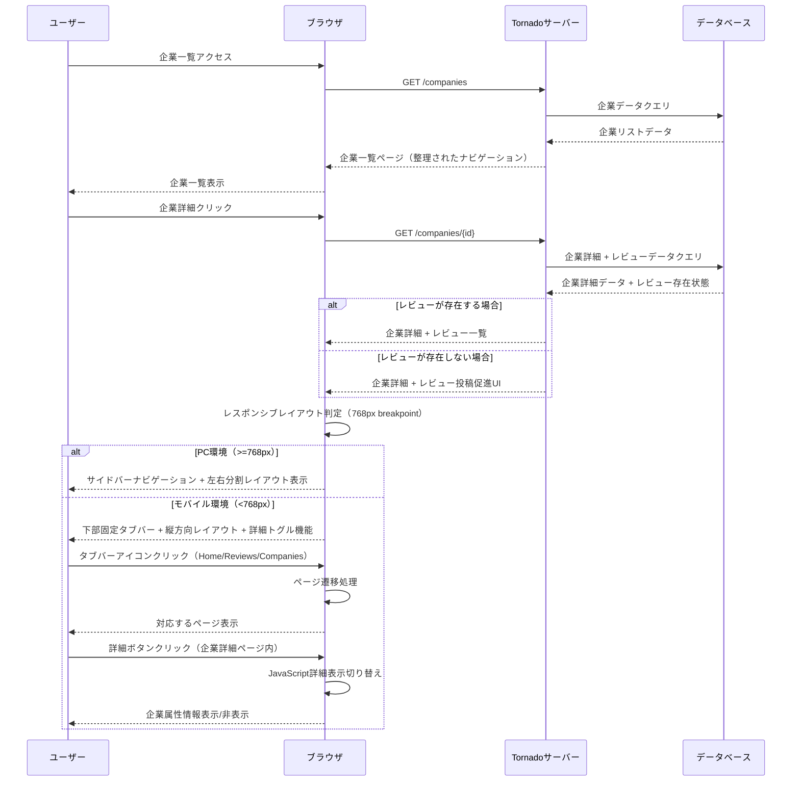
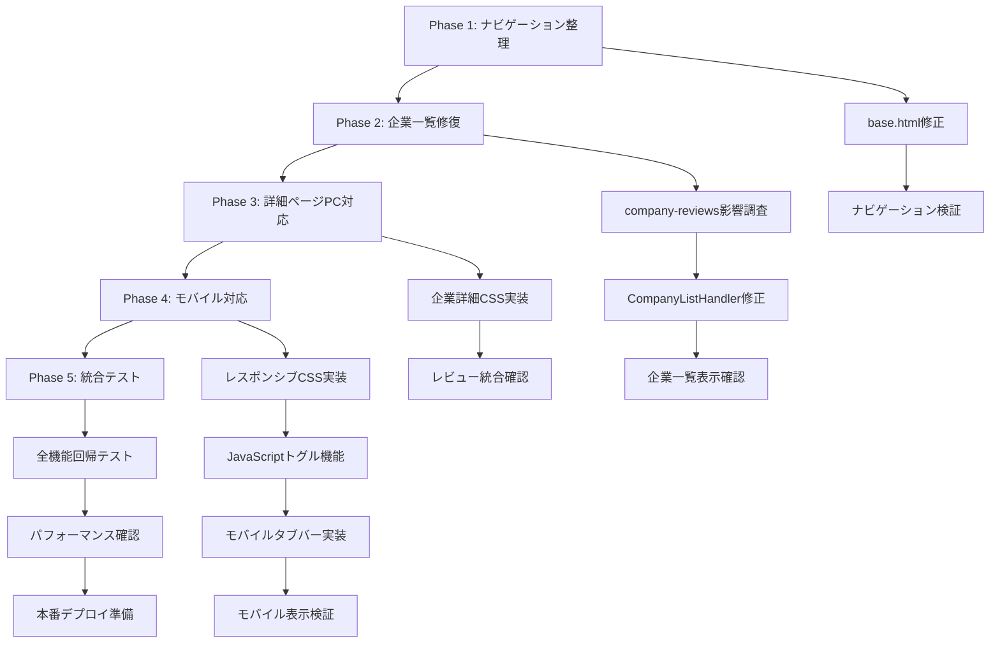

# 技術設計文書

## 概要
このUI Navigation Redesign機能は、既存のStartup Platform: Dxeeアプリケーションのナビゲーション構造を簡素化し、企業詳細ページにレスポンシブなレイアウトを実装します。ユーザーは整理されたメニューから必要な機能にのみアクセスでき、PC・モバイル両環境で最適化された企業情報閲覧体験を得られます。

**目的**: 不要なメニュー項目を削除し、企業詳細ページのレスポンシブレイアウトを改善することで、ユーザビリティと情報閲覧効率を向上させる。
**ユーザー**: 既存のプラットフォーム利用者が、簡素化されたナビゲーションと改良された企業詳細表示を活用する。
**影響**: 現在のサイドバーナビゲーションと企業詳細ページのレイアウトを修正し、company-reviews機能拡張後に生じた企業一覧表示の問題を解決する。

### ゴール
- ナビゲーションメニューから不要な項目（求人情報、ログイン、新規登録、人材情報）を削除
- 企業一覧表示の機能復旧とcompany-reviews機能との統合修正
- PC・モバイル環境に最適化された企業詳細ページのレスポンシブレイアウト実装
- モバイル環境での固定タブバーナビゲーション実装（画面下部固定、3つのアイコン）

### 非ゴール
- 既存のレビュー機能の変更や拡張
- 認証システムの根本的な変更
- 新しいナビゲーション項目の追加

## アーキテクチャ

### 既存アーキテクチャ分析
現在のシステムは以下のパターンで構成されています：
- **Tornadoベースのウェブアプリケーション**: HTMLテンプレート、CSS、JavaScriptによるフロントエンド
- **テンプレート継承パターン**: base.htmlでサイドバーナビゲーションを定義、各ページが継承
- **レスポンシブデザインパターン**: CSS Media Queriesによる768px breakpointの基本実装
- **ハンドラーベースルーティング**: Tornado HTTPハンドラーによるルーティング管理

### 技術スタック整合性
既存の技術スタックとの整合性を維持：
- **フロントエンド**: HTML5, CSS3, Vanilla JavaScript（変更なし）
- **テンプレートエンジン**: Tornado Template（既存パターン継続）
- **レスポンシブフレームワーク**: CSS Grid & Flexbox（既存CSS拡張）
- **アーキテクチャパターン**: テンプレート継承とコンポーネント分離（維持）

### 重要な設計決定

**決定1: ナビゲーション削除方式の選択**
- **判断**: テンプレート条件分岐による動的表示制御ではなく、静的削除を採用
- **コンテキスト**: メニュー項目の完全削除が要件として明確に指定されている
- **代替案**: 条件分岐による非表示、権限ベース表示制御、設定ファイルによる制御
- **選択したアプローチ**: base.htmlテンプレートから該当する`<li class="nav-item">`要素を直接削除
- **根拠**: シンプルで確実、認証状態に関わらず一貫した表示、パフォーマンスオーバーヘッドなし
- **トレードオフ**: 柔軟性を犠牲にして確実性とパフォーマンスを重視

**決定2: 企業詳細ページのレイアウト実装方法**
- **判断**: CSS Grid & Flexboxによるレスポンシブレイアウト、単一テンプレートでPC・モバイル対応
- **コンテキスト**: 768px breakpointでの自動切り替えとインタラクティブな詳細表示が必要
- **代替案**: 独立したPC/モバイル用テンプレート、JavaScript SPAアプローチ、外部CSSフレームワーク導入
- **選択したアプローチ**: CSS Media QueriesとJavaScript toggle機能の組み合わせ
- **根拠**: 既存技術スタック活用、保守性、SEO最適化、単一URLでのレスポンシブ対応
- **トレードオフ**: 複雑なCSS管理と引き換えに既存システム互換性を確保

**決定3: レビュー統合における状態管理**
- **判断**: テンプレートレベルでの条件分岐による表示制御
- **コンテキスト**: レビュー存在有無に基づくUI状態切り替えが必要
- **代替案**: JavaScript動的DOM操作、バックエンドでの事前状態判定、Vue.js等のリアクティブフレームワーク
- **選択したアプローチ**: Tornado templateの``条件分岐とバックエンドでのレビューデータ存在チェック
- **根拠**: サーバーサイドレンダリング維持、SEO最適化、既存テンプレートパターン継続
- **トレードオフ**: リアルタイム更新機能を犠牲にしてサーバーサイド一貫性を確保

**決定4: モバイル専用タブバーナビゲーション実装**
- **判断**: 画面下部固定タブバー形式の採用、既存サイドバーの無効化
- **コンテキスト**: モバイルユーザビリティ向上のため、タッチ操作に最適化されたナビゲーションが必要
- **代替案**: ハンバーガーメニュー維持、ドロップダウンナビゲーション、スワイプベースナビゲーション
- **選択したアプローチ**: CSS `position: fixed; bottom: 0`による下部固定 + 3つのアイコンタブ（Home, Reviews, Companies）
- **根拠**: モバイルアプリケーションの標準UXパターン、親指操作領域での操作性向上、視覚的分離の明確化
- **トレードオフ**: 追加のCSS実装コストと引き換えにユーザビリティを大幅改善

## システムフロー



## 要件トレーサビリティ

| 要件 | 要件概要 | コンポーネント | インターフェース | フロー |
|------|----------|----------------|------------------|--------|
| 1.1-1.5 | ナビゲーションメニュー整理 | NavigationComponent | base.html nav-menu | 静的削除 |
| 2.1-2.3 | 企業一覧表示修復 | CompanyListHandler | /companies endpoint | 企業一覧クエリフロー |
| 3.1-3.4 | PC詳細ページレイアウト | CompanyDetailTemplate | CSS Grid Layout | PC表示フロー |
| 4.1-4.5 | モバイル詳細ページレイアウト | ResponsiveLayout + ToggleComponent | JavaScript toggle API | モバイル表示フロー |
| 5.1-5.3 | レビュー投稿促進表示 | ReviewPromptComponent | 条件分岐テンプレート | レビュー状態判定フロー |
| 6.1-6.4 | レスポンシブデザイン | ResponsiveLayoutSystem | CSS Media Queries | デバイス検知フロー |

## コンポーネントとインターフェース

### Navigation System

#### NavigationComponent

**責任と境界**
- **主要責任**: サイドバーナビゲーションメニューの表示制御と項目管理
- **ドメイン境界**: UI表示層のナビゲーション領域
- **データ所有権**: ナビゲーション項目の表示状態とルーティング情報
- **トランザクション境界**: ステートレス表示コンポーネント

**依存関係**
- **インバウンド**: base.htmlテンプレートから呼び出される共通コンポーネント
- **アウトバウンド**: Tornadoルーティングシステム（URL生成）
- **外部**: なし

**契約定義**

**テンプレートインターフェース**:
```html
<!-- 削除対象項目 -->
<!-- 求人情報、ログイン、新規登録、人材情報のnav-item要素 -->

<!-- 保持項目 -->
<li class="nav-item">
    <a href="/" class="nav-link" title="ホーム">
        <span class="nav-icon">🏠</span>
        <span class="nav-text">ホーム</span>
    </a>
</li>
<li class="nav-item">
    <a href="/reviews" class="nav-link" title="レビュー">
        <span class="nav-icon">⭐</span>
        <span class="nav-text">レビュー</span>
    </a>
</li>
<li class="nav-item">
    <a href="/companies" class="nav-link" title="企業一覧">
        <span class="nav-icon">🏢</span>
        <span class="nav-text">企業一覧</span>
    </a>
</li>
```

**統合戦略**:
- **修正アプローチ**: 既存base.htmlテンプレートの直接編集によるnav-item削除
- **後方互換性**: ルーティング自体は保持、ナビゲーションUIからのみ削除
- **移行パス**: 段階的削除なし、一括適用

### Company System

#### CompanyListHandler

**責任と境界**
- **主要責任**: 企業一覧データの取得と表示、フィルタリング機能提供
- **ドメイン境界**: 企業情報ドメインの表示制御層
- **データ所有権**: 企業一覧表示用のデータ変換と集約
- **トランザクション境界**: 読み取り専用オペレーション

**依存関係**
- **インバウンド**: /companies エンドポイントへのGETリクエスト
- **アウトバウンド**: CompanyService、データベースアクセス層
- **外部**: 企業情報データベース、フィルタリングパラメータ

**契約定義**

**APIコントラクト**:
| Method | Endpoint | Request | Response | Errors |
|--------|----------|---------|----------|--------|
| GET | /companies | FilterQuery | CompanyListPage | 500 |

```typescript
interface FilterQuery {
  industry?: string;
  size?: string;
  location?: string;
  page?: number;
}

interface CompanyListPage {
  companies: Company[];
  total_companies: number;
  current_page: number;
  filters: FilterQuery;
  filter_options: FilterOptions;
}
```

**統合戦略**:
- **修正アプローチ**: company-reviews機能拡張による影響の調査と修正
- **後方互換性**: 既存フィルタリングとページネーション機能の維持
- **移行パス**: 既存データ構造を保持しながらレビュー統合部分のみ修正

#### CompanyDetailHandler

**責任と境界**
- **主要責任**: 企業詳細情報とレビューデータの統合表示
- **ドメイン境界**: 企業情報とレビュー情報の表示統合層
- **データ所有権**: 企業詳細とレビュー状態の表示用データ管理
- **トランザクション境界**: 読み取り専用、複数ドメインデータの結合

**依存関係**
- **インバウンド**: /companies/{id} エンドポイントへのGETリクエスト
- **アウトバウンド**: CompanyService、ReviewService
- **外部**: 企業情報データベース、レビューデータベース

**契約定義**

**APIコントラクト**:
| Method | Endpoint | Request | Response | Errors |
|--------|----------|---------|----------|--------|
| GET | /companies/{id} | CompanyId | CompanyDetailPage | 404, 500 |

```typescript
interface CompanyDetailPage {
  company: CompanyDetail;
  reviews: Review[];
  has_reviews: boolean;
  review_stats?: ReviewStats;
}

interface CompanyDetail {
  id: string;
  name: string;
  industry_label: string;
  size_label: string;
  location?: string;
  description?: string;
  website?: string;
  // ... その他企業属性
}
```

### Mobile Tab Navigation System

#### MobileTabBarComponent

**責任と境界**
- **主要責任**: モバイル環境での下部固定タブバーナビゲーション制御
- **ドメイン境界**: モバイルUI専用ナビゲーション層
- **データ所有権**: タブ選択状態とアクティブページ管理
- **トランザクション境界**: フロントエンド状態管理のみ

**依存関係**
- **インバウンド**: base.htmlテンプレートから条件分岐により呼び出し（モバイル時のみ）
- **アウトバウンド**: Tornadoルーティングシステム、CSS Media Queries
- **外部**: ブラウザのViewport API、タッチイベント

**契約定義**

**HTMLコントラクト**:
```html
<!-- モバイル専用下部固定タブバー -->
<nav class="mobile-tab-bar" style="display: none;">
    <a href="/" class="tab-item" data-page="home">
        <span class="tab-icon">🏠</span>
        <span class="tab-label">Home</span>
    </a>
    <a href="/review" class="tab-item" data-page="reviews">
        <span class="tab-icon">⭐</span>
        <span class="tab-label">Reviews</span>
    </a>
    <a href="/companies" class="tab-item" data-page="companies">
        <span class="tab-icon">🏢</span>
        <span class="tab-label">Companies</span>
    </a>
</nav>
```

**CSSコントラクト**:
```css
/* モバイル専用タブバー */
@media (max-width: 767px) {
    .mobile-tab-bar {
        display: flex !important;
        position: fixed;
        bottom: 0;
        left: 0;
        right: 0;
        background: white;
        border-top: 1px solid #e9ecef;
        box-shadow: 0 -2px 10px rgba(0, 0, 0, 0.1);
        z-index: 1000;
        height: 60px;
    }

    .sidebar {
        display: none; /* サイドバー非表示 */
    }

    .main-content {
        margin-left: 0; /* サイドバー分のマージン削除 */
        padding-bottom: 60px; /* タブバー分のパディング追加 */
    }
}

/* PC環境では従来のサイドバー表示 */
@media (min-width: 768px) {
    .mobile-tab-bar {
        display: none !important;
    }
}
```

**統合戦略**:
- **表示制御**: CSS Media Queriesによるレスポンシブ切り替え
- **状態管理**: 現在のページに基づくアクティブタブ表示
- **アクセシビリティ**: タッチ操作最適化（44px以上のタッチターゲット）

### Responsive Layout System

#### ResponsiveLayoutComponent

**責任と境界**
- **主要責任**: デバイス画面サイズに基づくレイアウト切り替え制御
- **ドメイン境界**: UI表示層のレスポンシブ動作制御
- **データ所有権**: レイアウト状態と表示モード管理
- **トランザクション境界**: フロントエンド状態管理のみ

**依存関係**
- **インバウンド**: 企業詳細ページテンプレートから利用
- **アウトバウンド**: CSS Media Queries、JavaScript DOM API
- **外部**: ブラウザのViewport API

**契約定義**

**CSSコントラクト**:
```css
/* PC レイアウト (>=768px) */
@media (min-width: 768px) {
  .company-detail-layout {
    display: grid;
    grid-template-columns: 1fr 1fr;
    gap: 2rem;
  }

  .company-info-section {
    /* 左側企業情報 */
  }

  .reviews-section {
    /* 右側レビュー */
  }
}

/* モバイル レイアウト (<768px) */
@media (max-width: 767px) {
  .company-detail-layout {
    display: flex;
    flex-direction: column;
  }

  .company-attributes {
    display: none; /* デフォルト非表示 */
  }

  .company-attributes.expanded {
    display: block;
  }
}
```

**JavaScriptコントラクト**:
```typescript
interface ToggleDetailButton {
  onClick: () => void;
  isExpanded: boolean;
}

class ResponsiveToggle {
  private isExpanded: boolean = false;

  toggle(): void;
  expand(): void;
  collapse(): void;
}
```

#### ReviewPromptComponent

**責任と境界**
- **主要責任**: レビュー未存在時の投稿促進UI表示制御
- **ドメイン境界**: レビュー機能のUI誘導層
- **データ所有権**: レビュー投稿促進メッセージとボタン状態
- **トランザクション境界**: 表示制御のみ、レビュー投稿は別システム

**依存関係**
- **インバウンド**: CompanyDetailTemplate内で条件分岐により呼び出し
- **アウトバウンド**: レビュー作成画面への遷移
- **外部**: レビュー投稿システム

**契約定義**

**テンプレートコントラクト**:
```html

<div class="review-prompt-section">
    <div class="prompt-message">
        この企業に勤めていますか？勤めたことがありますか？
    </div>
    <a href="/reviews/create?company_id={{ company.id }}"
       class="btn btn-primary review-submit-btn">
        Reviewを投稿する
    </a>
</div>

```

**状態管理**:
- **表示条件**: `has_reviews = false` の場合のみ表示
- **遷移先**: `/reviews/create?company_id={id}` への遷移
- **スタイリング**: PC・モバイル共通のプロンプト表示

## データモデル

### レスポンシブレイアウト状態管理

**UI状態モデル**:
```typescript
interface ResponsiveState {
  deviceType: 'desktop' | 'mobile';
  breakpoint: number; // 768
  isDetailsExpanded: boolean; // モバイルのみ
}

interface LayoutConfig {
  desktop: {
    layout: 'grid';
    columns: 2;
    sections: ['company-info', 'reviews'];
  };
  mobile: {
    layout: 'vertical';
    sections: ['company-name', 'toggle-button', 'attributes?', 'reviews'];
  };
}
```

### ナビゲーション構成データ

**ナビゲーション定義**:
```typescript
interface NavigationItem {
  name: string;
  url: string;
  icon: string;
  title: string;
  visible: boolean;
}

const NavigationConfig: NavigationItem[] = [
  { name: 'ホーム', url: '/', icon: '🏠', title: 'ホーム', visible: true },
  { name: 'レビュー', url: '/reviews', icon: '⭐', title: 'レビュー', visible: true },
  { name: '企業一覧', url: '/companies', icon: '🏢', title: '企業一覧', visible: true },
  // 削除項目は設定から除外
];
```

## エラー処理

### エラー戦略
レスポンシブレイアウトとナビゲーション変更における堅牢なエラーハンドリング実装。

### エラーカテゴリーと対応

**ユーザーエラー (4xx)**:
- **404 企業が見つからない** → 「企業情報が見つかりません」メッセージと企業一覧への誘導リンク
- **Invalid URL parameters** → デフォルトパラメータでの再試行と適切なページへのリダイレクト

**システムエラー (5xx)**:
- **データベース接続失敗** → キャッシュからの代替データ表示、または簡易的なエラーページ表示
- **テンプレートレンダリング失敗** → 最小限のHTMLによるフォールバック表示
- **レスポンシブレイアウト表示失敗** → デスクトップレイアウトへのフォールバック

**フロントエンドエラー**:
- **JavaScriptエラー** → 詳細トグル機能無効化、静的表示へのフォールバック
- **CSS読み込み失敗** → インラインCSSによる最小限のスタイリング提供

### モニタリング
- レスポンシブブレークポイント切り替え失敗の検知
- テンプレートレンダリングエラーのログ記録
- ナビゲーション項目アクセス失敗の追跡

## テスト戦略

### 単体テスト
- **NavigationComponent**: メニュー項目の正確な表示・非表示制御
- **ResponsiveToggle**: モバイル詳細表示の開閉動作
- **CompanyDetailHandler**: レビュー有無による条件分岐処理
- **ReviewPromptComponent**: レビュー未存在時の適切なUI表示

### 統合テスト
- **ナビゲーション → 企業一覧 → 企業詳細**: 完全なユーザーフロー
- **レスポンシブレイアウト切り替え**: デバイスサイズ変更時の動的切り替え
- **レビューデータ統合**: 企業詳細ページでのレビュー表示と投稿促進UI
- **company-reviews機能との互換性**: 既存レビュー機能の正常動作確認

### UIテスト
- **レスポンシブデザイン**: 768px breakpointでの正確なレイアウト切り替え
- **モバイル詳細トグル**: タッチ操作による属性情報の表示・非表示
- **PC左右分割表示**: 企業情報とレビューの適切な配置
- **ナビゲーションメニュー**: PC環境でのサイドバー表示確認
- **モバイルタブバー**: 下部固定タブバーの表示・操作・アクティブ状態表示確認
- **ナビゲーション切り替え**: PC・モバイル間でのナビゲーション表示切り替え確認

### パフォーマンステスト
- **レスポンシブ切り替え速度**: Media Query適用の応答性能
- **企業詳細ページ読み込み**: レビューデータ統合後の表示速度
- **大量レビューデータ**: 多数のレビューが存在する企業での表示パフォーマンス

## Security Considerations

### フロントエンド セキュリティ
- **XSS対策**: Tornadoテンプレートの自動エスケープ機能活用、ユーザー入力データの適切なサニタイゼーション
- **CSRF対策**: レビュー投稿フォームでのCSRFトークン実装
- **情報漏洩防止**: 企業詳細情報の権限チェック（公開情報のみ表示）

### データ保護
- **アクセス制御**: 企業データへの読み取り専用アクセス、不正な企業ID指定に対する404応答
- **ログ管理**: 個人識別情報を含まないアクセスログの記録、エラー情報の適切なサニタイズ

## Migration Strategy



**プロセス**:
- **Phase 1-2**: 基本機能復旧（ナビゲーション整理と企業一覧表示修復）
- **Phase 3-4**: レスポンシブレイアウト実装（PC・モバイル対応）
- **Phase 5**: 統合検証とデプロイ準備

**ロールバック基準**: 各フェーズで既存機能への影響が発生した場合、前のフェーズ状態に戻す

**検証チェックポイント**:
- ナビゲーション削除後の3項目表示確認
- 企業一覧の正常表示と検索・フィルタリング機能
- PC環境での左右分割レイアウト
- モバイル環境での縦方向レイアウトとトグル機能
- レビュー有無による適切なUI表示