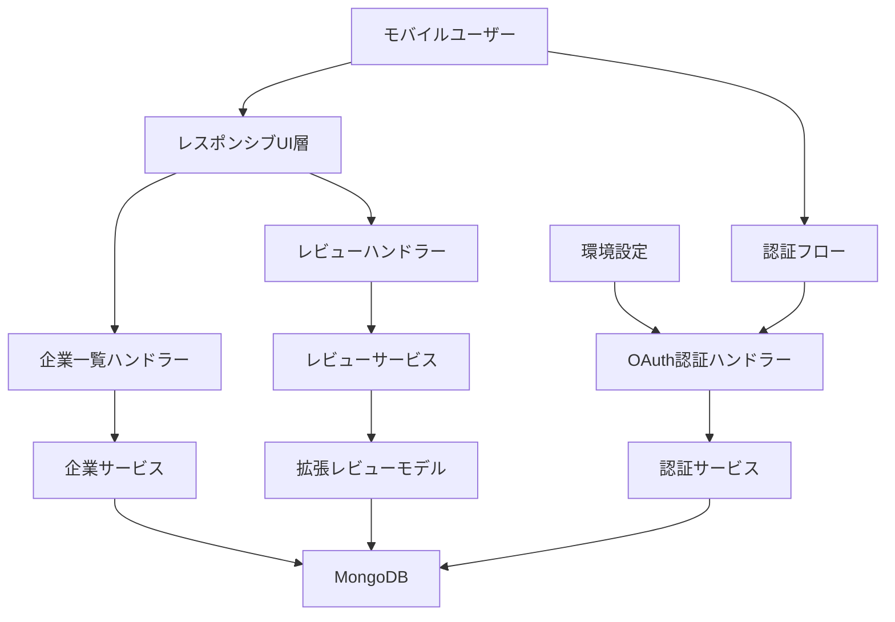

# 技術設計文書

## 概要

この機能は、DXEEWorldプラットフォームにおけるユーザー体験の改善を目的とし、モバイル端末での表示最適化、レビュー投稿フォームの機能強化、認証フローの改善を実現する。既存のTornadoベースのMVCアーキテクチャを拡張し、レスポンシブデザインの強化、勤務期間ドロップダウンの実装、OAuth認証設定の文書化を行う。

**目的**: 全デバイスでの一貫したユーザー体験提供とレビュー投稿の利便性向上
**ユーザー**: モバイル端末ユーザー、レビュー投稿者、未認証ユーザー、開発者
**影響**: 既存のUI表示とレビューデータモデルを拡張し、認証フローを改善

### 目標
- モバイル端末での企業一覧フォーム表示問題を解決
- レビュー投稿画面の表示品質と入力利便性を向上
- 認証フローの導線を強化し、新規ユーザー登録を促進
- 環境設定文書化によりOAuth認証の構築を簡素化

### 非目標
- 新しい認証プロバイダーの追加
- 企業データモデルの変更
- レビュー評価アルゴリズムの変更
- 大規模なアーキテクチャ変更

## アーキテクチャ

### 既存アーキテクチャ分析

**現在のアーキテクチャパターンと制約**:
- Tornado 6.5.2 + Motor 3.6.0によるMVCアーキテクチャ
- Jinja2テンプレートによるサーバーサイドレンダリング
- 非同期ハンドラーパターン（async/await）
- MongoDB文書ベースのデータ永続化
- CSS GridとFlexboxによるレスポンシブレイアウト
- サイドバー/モバイルタブバーによるナビゲーション

**尊重すべき既存ドメイン境界**:
- ハンドラー層：HTTPリクエスト/レスポンス処理
- サービス層：ビジネスロジック実装
- モデル層：データ構造定義とバリデーション
- テンプレート層：UI表示とクライアントサイド処理

**維持すべき統合ポイント**:
- `/companies`エンドポイントのフィルタリング機能
- `/reviews/create`エンドポイントのフォーム処理
- OAuth認証フローの既存パス（`/auth/google`, `/auth/facebook`）
- セッション管理とクッキーベース認証

### 高レベルアーキテクチャ



**アーキテクチャ統合**:
- 既存パターンの保持：MVC分離、非同期処理、テンプレート継承
- 新規コンポーネント根拠：勤務期間モデル拡張（データ整合性）、レスポンシブCSS改善（UX品質）
- 技術アライメント：Tornado/Jinja2/MongoDB技術スタックの維持
- ステアリング準拠：構造化された3層アーキテクチャ、非同期ファーストデザイン、セキュリティ設計の維持

### 技術アライメント

**既存技術スタックとの整合性**:
- **フロントエンド**: 既存のCSS Grid/Flexboxパターンを拡張してモバイル対応を強化
- **バックエンド**: Tornado RequestHandlerパターンを維持し、既存の非同期サービス層を活用
- **データ層**: MongoDB文書構造を保持し、レビューモデルのフィールド追加のみ実施
- **認証**: 既存のOAuth2Mixinベース実装を維持し、設定文書化のみ追加

**新規依存関係の導入**:
- なし（既存技術スタックの範囲内で実装）

**既存パターンからの逸脱**:
- なし（現在の設計パターンを完全に踏襲）

**重要な設計決定**:

**決定1: レスポンシブ改善のCSS拡張アプローチ**
- **コンテキスト**: モバイル端末でのフォーム表示問題を解決する必要性
- **代替案**:
  - 新規CSSフレームワーク導入（Bootstrap, Tailwind）
  - JavaScript動的レイアウト調整
  - 完全新規CSS書き直し
- **選択アプローチ**: 既存CSS拡張による段階的改善
- **根拠**:
  - 既存のグリッドレイアウトパターンとの一貫性維持
  - 追加依存関係なしでの改善実現
  - 既存コンポーネントへの影響最小化
- **トレードオフ**:
  - 得られる価値：迅速な改善、一貫性維持、リスク最小化
  - 犠牲にする価値：最新CSSフレームワークの利便性、完全にモダンなアプローチ

**決定2: レビューモデルの段階的拡張**
- **コンテキスト**: 勤務期間入力機能追加とデータ整合性確保の必要性
- **代替案**:
  - 別テーブル/コレクションでの勤務期間管理
  - 既存モデル完全リファクタリング
  - フロントエンドのみでの処理
- **選択アプローチ**: 既存Reviewモデルへのフィールド追加
- **根拠**:
  - データ整合性確保（単一ソース原則）
  - 既存レビュー機能への影響最小化
  - バックワード互換性維持
- **トレードオフ**:
  - 得られる価値：シンプルなデータ構造、高いデータ整合性
  - 犠牲にする価値：将来的な柔軟性、独立したライフサイクル管理

## 要件トレーサビリティ

| 要件 | 要件概要 | コンポーネント | インターフェース |
|------|----------|---------------|------------------|
| 1.1-1.5 | モバイル端末での企業一覧表示最適化 | CompanyListTemplate, ResponsiveCSS | `/companies` GET, CSSメディアクエリ |
| 2.1-2.5 | レビュー投稿画面の表示改善 | ReviewCreateTemplate, CompanyDataHandler | `/reviews/create` GET, 企業データAPI |
| 3.1-3.6 | 勤務期間入力の改善 | EmploymentPeriodComponent, ReviewModel | フォーム送信API, データバリデーション |
| 4.1-4.6 | 認証フローの強化 | AuthenticationFlowUI, OAuthHandlers | 認証リダイレクト, OAuth設定チェック |
| 5.1-5.5 | レビューデータモデルの更新 | ExtendedReviewModel, DataMigration | データ保存API, バリデーション |
| 6.1-6.5 | 環境設定の文書化 | EnvironmentDocumentation | `.env.sample`ファイル, 設定例 |

## コンポーネントと仕様

### UI・テンプレート層

#### CompanyListResponsiveTemplate

**責任と境界**
- **主要責任**: モバイル端末での企業一覧フォーム表示の最適化
- **ドメイン境界**: UIテンプレート層、企業検索インターフェース
- **データ所有権**: 表示状態とフォームレイアウト管理
- **トランザクション境界**: 単一リクエスト内でのレンダリング処理

**依存関係**
- **受信依存**: CompanyHandlerから企業データとフィルター状態を受信
- **送信依存**: 既存のcompany_service経由でフィルタリング処理
- **外部依存**: ブラウザのViewport API、CSSメディアクエリサポート

**サービス契約**
```typescript
interface CompanyListTemplate {
  renderMobileOptimized(companies: Company[], filters: FilterOptions): Promise<HTMLResponse>;
  renderFilterForm(options: FilterOptions, currentFilters: object): HTMLFormElement;
}
```
- **事前条件**: 有効な企業データとフィルター状態が渡される
- **事後条件**: モバイル端末で表示可能なHTMLを生成
- **不変条件**: フィルター状態の一貫性を維持

**統合戦略**:
- **変更アプローチ**: 既存テンプレートのCSS拡張とHTML構造微調整
- **後方互換性**: 既存のデスクトップ表示を完全維持
- **移行パス**: 段階的CSS適用により既存レイアウトから改善版への移行

#### ReviewFormEnhancementTemplate

**責任と境界**
- **主要責任**: レビュー投稿フォームの表示品質向上と勤務期間入力UI提供
- **ドメイン境界**: レビュー投稿UI、企業情報表示
- **データ所有権**: フォーム入力状態と表示ロジック管理
- **トランザクション境界**: フォーム操作から送信までの単一セッション

**依存関係**
- **受信依存**: ReviewHandlerから企業情報とフォーム初期値を受信
- **送信依存**: ReviewServiceへのフォームデータ送信
- **外部依存**: ブラウザの日付選択UI、JavaScript動的要素更新

**サービス契約**
```typescript
interface ReviewFormTemplate {
  renderCompanyInfo(company: Company): HTMLElement;
  renderEmploymentPeriodDropdowns(currentYear: number): HTMLFormElement;
  validateEmploymentPeriod(startYear: number, endYear: number | 'current'): ValidationResult;
}
```
- **事前条件**: 有効な企業データが存在する
- **事後条件**: ユーザーが操作可能なレビューフォームを表示
- **不変条件**: 開始年 ≤ 終了年の制約を維持

**統合戦略**:
- **変更アプローチ**: 既存フォーム構造に勤務期間セクション追加
- **後方互換性**: 既存レビュー項目の表示・機能を完全保持
- **移行パス**: 新規フィールド追加による段階的機能拡張

### データ・モデル層

#### ExtendedReviewModel

**責任と境界**
- **主要責任**: レビューデータに勤務期間情報を追加し、既存データ構造を拡張
- **ドメイン境界**: レビューエンティティ、勤務歴情報
- **データ所有権**: レビュー内容、評価、勤務期間データ
- **トランザクション境界**: 単一レビューエンティティの一貫性

**依存関係**
- **受信依存**: ReviewServiceからのCRUD操作要求
- **送信依存**: MongoDB永続化層
- **外部依存**: Python datetime、データクラスバリデーション

**サービス契約**
```typescript
interface ExtendedReviewModel {
  // 既存機能の維持
  calculateIndividualAverage(ratings: Dict<string, number>): [number, number];

  // 新規機能
  setEmploymentPeriod(startYear: number, endYear: number | null): void;
  validateEmploymentPeriod(): ValidationResult;
  getDisplayEmploymentPeriod(): string;
}
```
- **事前条件**: 有効な年数値または'current'指定
- **事後条件**: 勤務期間データが適切に保存される
- **不変条件**: startYear ≤ endYear（endYearがnullでない場合）

**状態管理**:
- **状態モデル**: 通常状態 ↔ 勤務期間設定状態
- **永続化**: MongoDB文書の新フィールドとして追加
- **並行性**: 楽観的同時性制御（updated_atフィールド）

### 認証・セキュリティ層

#### AuthenticationFlowEnhancement

**責任と境界**
- **主要責任**: 未認証ユーザーの認証画面への適切な誘導とOAuth設定管理
- **ドメイン境界**: ユーザー認証、セッション管理
- **データ所有権**: 認証状態、OAuth設定情報
- **トランザクション境界**: 認証フロー全体の一貫性

**依存関係**
- **受信依存**: 未認証ユーザーからのアクセス試行
- **送信依存**: 既存のOAuthHandlers、SessionService
- **外部依存**: Google OAuth API、Facebook OAuth API、SMTP設定

**API契約**:

| メソッド | エンドポイント | リクエスト | レスポンス | エラー |
|----------|---------------|------------|-------------|--------|
| GET | `/auth/login` | - | LoginOptionsHTML | 401, 500 |
| GET | `/auth/google` | - | OAuthRedirect | 400, 500 |
| GET | `/auth/facebook` | - | OAuthRedirect | 400, 500 |

**統合戦略**:
- **変更アプローチ**: 既存OAuth認証ハンドラーのUIと設定文書化を強化
- **後方互換性**: 既存のOAuth認証フローを完全維持
- **移行パス**: 設定例追加による環境構築の簡素化

## データモデル

### 物理データモデル

**レビューコレクション拡張**:

```typescript
interface ExtendedReview {
  // 既存フィールド（保持）
  _id: ObjectId;
  company_id: string;
  user_id: string;
  employment_status: 'current' | 'former';
  ratings: {
    recommendation?: number;
    foreign_support?: number;
    company_culture?: number;
    employee_relations?: number;
    evaluation_system?: number;
    promotion_treatment?: number;
  };
  comments: {
    [category: string]: string;
  };
  individual_average: number;
  answered_count: number;
  created_at: Date;
  updated_at: Date;
  is_active: boolean;

  // 新規追加フィールド
  employment_period?: {
    start_year: number;
    end_year: number | null; // null = 現在勤務中
  };
}
```

**インデックス定義**:
- 既存インデックス維持: `{company_id: 1, created_at: -1}`, `{user_id: 1}`
- 新規インデックス: `{employment_period.start_year: 1}` (期間別検索用)

**制約とバリデーション**:
- `employment_period.start_year`: 1970 ≤ value ≤ 現在年
- `employment_period.end_year`: start_year ≤ value ≤ 現在年 (nullの場合は制約なし)
- データ移行: 既存レビューに`employment_period`フィールドなし（Optional扱い）

### データ契約と統合

**API データ転送**:
```typescript
interface ReviewCreateRequest {
  // 既存フィールド
  employment_status: 'current' | 'former';
  ratings: Record<string, number>;
  comments: Record<string, string>;

  // 新規フィールド
  employment_period?: {
    start_year: number;
    end_year: number | null;
  };
}
```

**バリデーション規則**:
- 勤務期間必須性: レビュー投稿時は任意、指定時は妥当性検証必須
- 年数範囲: 1970年〜現在年の範囲内
- 論理整合性: 開始年 ≤ 終了年（終了年指定時）

## エラーハンドリング

### エラー戦略
既存のTornadoエラーハンドリングパターンを拡張し、新機能に対する適切なエラー応答とログ記録を実装

### エラーカテゴリと対応
**ユーザーエラー (4xx)**:
- 不正な勤務期間 → フィールドレベルバリデーション、エラーメッセージ表示
- OAuth設定不備 → 該当ボタン無効化、環境設定ガイダンス表示
- 未認証アクセス → ログイン画面リダイレクト、元URLの保持

**システムエラー (5xx)**:
- データベース接続失敗 → 既存の復旧機構利用、ユーザーには一般エラー表示
- OAuth API失敗 → 代替認証方法の提示、管理者通知

**ビジネスロジックエラー (422)**:
- 重複レビュー投稿 → 編集画面への誘導、既存レビュー表示
- 勤務期間論理エラー → 具体的な修正指示、推奨値の提示

### 監視
既存のTornadoログシステムを活用し、新機能の操作ログとエラートラッキングを実装

## テスト戦略

### ユニットテスト
- **ExtendedReviewModel**: 勤務期間バリデーション、データ変換ロジック
- **EmploymentPeriodValidator**: 年数範囲検証、論理整合性チェック
- **ResponsiveLayoutHelper**: CSS適用ロジック、レイアウト判定
- **OAuthConfigurationChecker**: 環境変数検証、設定完全性確認
- **ReviewFormProcessor**: フォームデータ処理、新フィールド統合

### 統合テスト
- **モバイルフォーム送信フロー**: 企業一覧フィルター → 企業詳細 → レビュー投稿
- **勤務期間データパイプライン**: フォーム入力 → バリデーション → データベース保存
- **OAuth認証フロー**: リダイレクト → プロバイダー認証 → コールバック処理
- **レスポンシブ表示切り替え**: デスクトップ ↔ モバイル表示の一貫性
- **エラーハンドリング統合**: 各種エラー状況での適切な画面遷移

### E2E/UIテスト
- **モバイル企業検索シナリオ**: 768px以下画面での企業一覧操作
- **レビュー投稿完全フロー**: 未認証 → 認証 → 企業選択 → レビュー作成
- **認証プロバイダー選択**: Google/Facebook/メール認証の選択と実行
- **勤務期間入力バリエーション**: 過去勤務、現在勤務、期間エラーケース
- **マルチデバイス表示確認**: スマートフォン、タブレット、デスクトップでの表示

### パフォーマンステスト
- **レスポンシブレンダリング**: CSS適用時間とレイアウト安定性
- **フォーム送信処理**: 新フィールド追加によるレスポンス時間影響
- **認証フロー処理**: OAuth認証の完了時間とタイムアウト処理
- **データベースクエリ**: 新インデックス効果と既存クエリへの影響

## セキュリティ考慮事項

### 認証とアクセス制御
- **OAuth状態パラメータ**: CSRFトークンによる認証フロー保護を継続
- **セッション管理**: 既存の暗号化クッキーベース認証を維持
- **認証プロバイダー検証**: OAuth設定の妥当性チェックとエラーハンドリング

### データ保護とプライバシー
- **勤務期間データ**: 個人特定可能性を考慮した匿名化対応（必要に応じて）
- **企業情報表示**: 既存のデータ表示ポリシーを維持
- **エラーログ**: 個人情報を含まないログ記録の継続

### 入力検証とバリデーション
- **勤務期間入力**: サーバーサイド検証による不正値受付防止
- **フォームトークン**: 既存のXSRF保護を新フィールドにも適用
- **SQLインジェクション対策**: MongoDBクエリビルダー利用による継続的保護