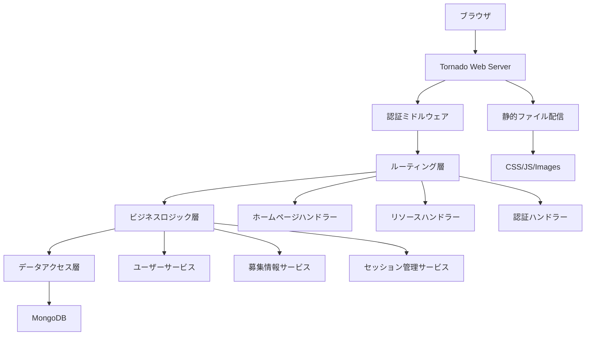
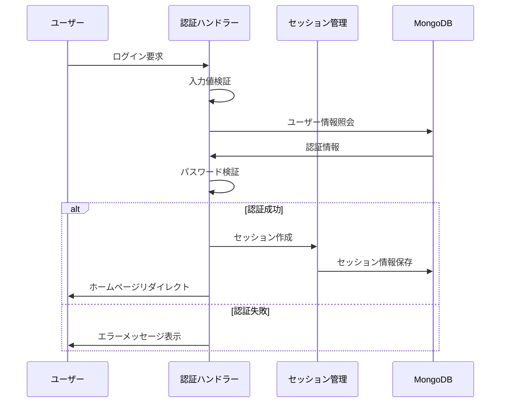
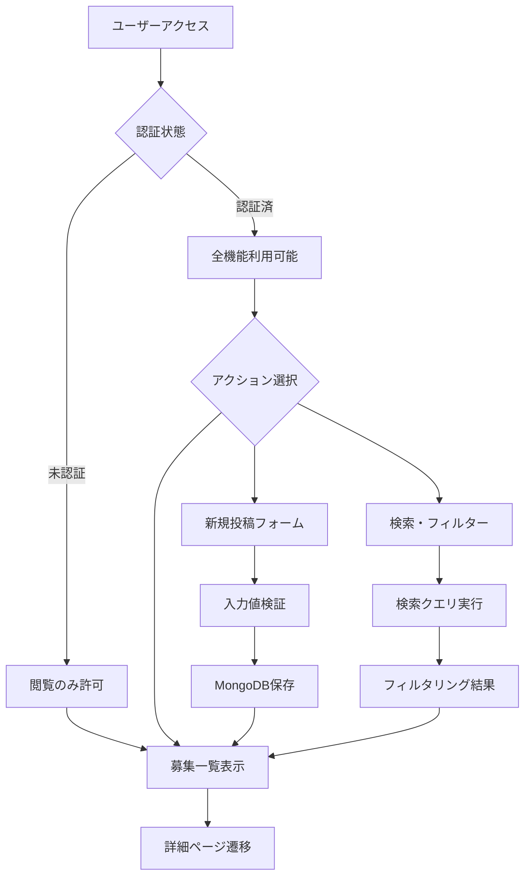
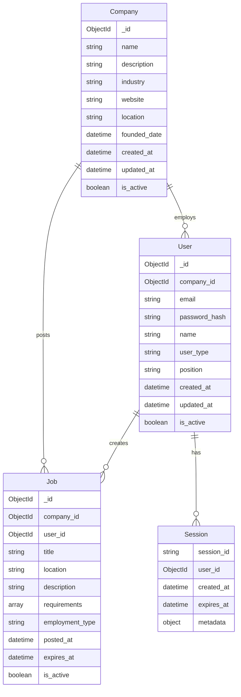
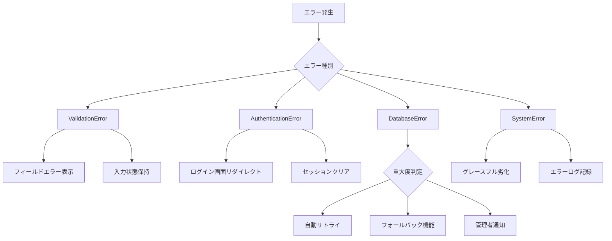

# スタートアッププラットフォーム技術設計書

## Overview

**目的**: このプラットフォームは、Kaggle のような直感的な UI/UX を通じて、スタートアップエコシステム参加者（投資家、起業家、求職者、メンター）に包括的なネットワーキング・情報共有環境を提供する。

**ユーザー**: 求職者は人材募集情報の検索・応募を行い、採用担当者は募集情報の投稿・管理を実施し、一般訪問者はスタートアップエコシステム情報にアクセスする。

**影響**: 現在分散している人材募集・企業情報・投資機会を統合プラットフォームとして集約し、エコシステム全体の効率性を向上させる。

### Goals
- Kaggle ライクな視覚的魅力と使いやすさを持つスタートアッププラットフォーム構築
- 折りたたみ可能なサイドナビゲーションによる効率的な画面領域利用
- 人材募集機能による求職者・採用担当者間のマッチング促進
- MongoDB による高速データ検索・フィルタリング機能の実現
- Tornado の非同期処理による高同時接続数対応

### Non-Goals
- リアルタイムチャット機能（将来の拡張として考慮）
- 決済システム統合（初期リリース対象外）
- explore、company、products、funding、news セクション（Phase 2 で実装）
- モバイルアプリケーション開発（Web レスポンシブ対応のみ）

## Architecture

### High-Level Architecture



### Technology Stack and Design Decisions

**Frontend 技術選択**:
- **選択**: HTML5 + CSS3 + Vanilla JavaScript
- **コンテキスト**: プロトタイプとしてシンプルな技術スタックで迅速な開発とメンテナンス容易性を重視
- **代替案**: React.js、Vue.js、Angular - 複雑な SPA 機能が不要なため除外
- **選択理由**: 軽量性、学習コストの低さ、Tornado との直接統合の容易さ
- **トレードオフ**: 複雑な UI コンポーネント管理の手動実装が必要、一方でシンプルな保守性を確保

**Backend フレームワーク**:
- **選択**: Tornado 6.5.2
- **コンテキスト**: 非同期処理による高同時接続対応と WebSocket 対応の将来拡張性
- **代替案**: Django（同期的）、FastAPI（API 重視）、Flask（軽量だが非同期サポート限定的）
- **選択理由**: 非ブロッキング I/O による高並行性、長期接続サポート、リアルタイム機能への拡張容易性
- **トレードオフ**: Django に比べ ORM やアドミン機能が制限的、一方で高性能とスケーラビリティを実現

**データベース選択**:
- **選択**: MongoDB 7.0+
- **コンテキスト**: 非構造化データ（募集情報）の柔軟な管理と高速検索要件
- **代替案**: PostgreSQL（JSONB）、MySQL（構造化データ向け）
- **選択理由**: ドキュメント指向による柔軟なスキーマ、優れた検索性能、水平スケーリング対応
- **トレードオフ**: ACID 制約の緩さ、一方でスキーマレスによる開発速度向上

### Key Design Decisions

**決定 1: MVC パターンアーキテクチャ**
- **コンテキスト**: コードの可読性と保守性確保のため明確なレイヤー分離が必要
- **代替案**: MVS（Model-View-Service）、レイヤードアーキテクチャ、クリーンアーキテクチャ
- **選択アプローチ**: Tornado RequestHandler をコントローラー、Jinja2 テンプレートをビュー、独立サービスクラスをモデルとして活用
- **根拠**: Tornado の構造に最も自然に適合し、チーム開発での役割分担が明確
- **トレードオフ**: 厳密な DDD に比べ複雑度は低い、一方で将来の大規模化時にリファクタリングが必要

**決定 2: セッションベース認証**
- **コンテキスト**: ユーザー認証状態の管理と投稿権限制御が必要
- **代替案**: JWT トークン、OAuth2、Basic 認証
- **選択アプローチ**: Redis を使用したサーバーサイドセッション管理
- **根拠**: サーバーサイドでの権限制御の確実性、セッション無効化の即座実行可能性
- **トレードオフ**: スケーラビリティで JWT に劣る、一方でセキュリティ制御の確実性を確保

**決定 3: 非同期データベースアクセス**
- **コンテキスト**: Tornado の非同期特性を活かしたデータベース操作の実装
- **代替案**: 同期的 PyMongo、Threading による並列処理
- **選択アプローチ**: Motor（MongoDB の非同期ドライバー）による完全非同期実装
- **根拠**: Tornado の IOLoop と完全統合、ブロッキング I/O によるパフォーマンス劣化回避
- **トレードオフ**: 同期ドライバーより実装複雑度が高い、一方で高並行性を実現

## System Flows

### ユーザー認証フロー



### 募集情報投稿・検索フロー



## Requirements Traceability

| 要件 | 要件概要 | コンポーネント | インターフェース | フロー |
|------|----------|----------------|------------------|--------|
| 1.1-1.5 | ホームページ表示・ナビゲーション | HomeHandler, TemplateEngine | /（GET）, render_template() | - |
| 2.1-2.6 | サイドバーナビゲーション | NavigationComponent, StaticFileHandler | /static/js/navigation.js | - |
| 3.1-3.7 | 人材募集機能 | ResourcesHandler, JobService | /resources（GET/POST） | 募集情報投稿・検索フロー |
| 4.1-4.6 | 基本認証システム | AuthHandler, SessionService | /login, /register | ユーザー認証フロー |
| 5.1-5.6 | データ管理・パフォーマンス | DatabaseService, ErrorHandler | MongoDB接続, 例外処理 | - |

## Components and Interfaces

### プレゼンテーション層

#### HomeHandler (コントローラー)

**責任と境界**
- **主要責任**: ホームページの HTTP リクエスト処理とレスポンス生成
- **ドメイン境界**: UI プレゼンテーション層、ユーザーインタラクションの入口
- **データ所有権**: リクエスト・レスポンスデータの一時的な管理
- **トランザクション境界**: HTTP リクエストスコープ内での処理完結

**依存関係**
- **インバウンド**: Tornado アプリケーション、ルーティング設定
- **アウトバウンド**: TemplateEngine、SessionService
- **外部**: なし

**Contract Definition**

```typescript
interface HomeHandler {
  get(): Promise<void>;  // ホームページ表示
  post(): Promise<void>; // フォーム送信処理（将来用）
}
```

#### NavigationHandler (コントローラー)

**責任と境界**
- **主要責任**: サイドバーナビゲーションの状態管理とルーティング
- **ドメイン境界**: UI ナビゲーション層
- **データ所有権**: ナビゲーション状態（展開・折りたたみ）
- **トランザクション境界**: 単一の状態変更操作

**Contract Definition**

```typescript
interface NavigationHandler {
  toggleSidebar(state: boolean): void;        // サイドバー表示切り替え
  navigateToSection(section: string): void;  // セクション遷移
  getCurrentSection(): string;               // 現在セクション取得
}
```

### ビジネスロジック層

#### CompanyService (ビジネスロジック)

**責任と境界**
- **主要責任**: 企業情報の CRUD 操作と企業関連ビジネスルール適用
- **ドメイン境界**: 企業管理ドメイン
- **データ所有権**: 企業エンティティと関連情報の完全管理
- **トランザクション境界**: 単一企業の一貫性保証

**依存関係**
- **インバウンド**: CompanyHandler, JobService, UserService
- **アウトバウンド**: DatabaseService, ValidationService
- **外部**: なし

**Contract Definition**

```typescript
interface CompanyService {
  createCompany(companyData: CompanyCreateRequest): Result<Company, ValidationError>;
  getCompanyById(id: string): Result<Company, NotFoundError>;
  getCompaniesByIndustry(industry: string): Result<Company[], DatabaseError>;
  updateCompany(id: string, data: CompanyUpdateRequest): Result<Company, ValidationError>;
  searchCompanies(criteria: CompanySearchCriteria): Result<Company[], DatabaseError>;
}

interface CompanyCreateRequest {
  name: string;
  description: string;
  industry: string;
  website?: string;
  location: string;
  foundedDate?: Date;
}

interface CompanySearchCriteria {
  keywords?: string;
  industry?: string;
  location?: string;
  limit?: number;
  offset?: number;
}
```

- **事前条件**: 企業名の一意性確認、基本情報の検証完了
- **事後条件**: 作成された企業は検索可能状態、関連ユーザー・求人との関連付け可能
- **不変条件**: 企業名は一意、削除時は関連データの整合性維持

#### JobService (ビジネスロジック)

**責任と境界**
- **主要責任**: 募集情報の CRUD 操作とビジネスルール適用
- **ドメイン境界**: 人材募集ドメイン
- **データ所有権**: 募集情報エンティティの完全管理
- **トランザクション境界**: 単一募集情報の一貫性保証

**依存関係**
- **インバウンド**: ResourcesHandler
- **アウトバウンド**: DatabaseService, ValidationService
- **外部**: なし

**Contract Definition**

```typescript
interface JobService {
  createJob(jobData: JobCreateRequest): Result<Job, ValidationError>;
  searchJobs(criteria: SearchCriteria): Result<Job[], DatabaseError>;
  getJobById(id: string): Result<Job, NotFoundError>;
  updateJob(id: string, data: JobUpdateRequest): Result<Job, ValidationError>;
  deleteJob(id: string): Result<boolean, AuthorizationError>;
}

interface JobCreateRequest {
  title: string;
  companyId: string;
  location: string;
  description: string;
  requirements: string[];
  employmentType: EmploymentType;
}

interface SearchCriteria {
  keywords?: string;
  location?: string;
  companyId?: string;
  companyName?: string;
  jobType?: EmploymentType;
  limit?: number;
  offset?: number;
}
```

- **事前条件**: 投稿にはユーザー認証が必要、入力データの基本検証完了
- **事後条件**: 作成された募集情報は検索可能状態、適切な権限設定が適用
- **不変条件**: 作成者のみが編集・削除権限を持つ、公開状態の募集情報は検索対象

#### UserService (ビジネスロジック)

**責任と境界**
- **主要責任**: ユーザー認証・認可・プロファイル管理
- **ドメイン境界**: ユーザー管理ドメイン
- **データ所有権**: ユーザーエンティティとプロファイル情報
- **トランザクション境界**: ユーザー単位の操作一貫性

**依存関係**
- **インバウンド**: AuthHandler, SessionService
- **アウトバウンド**: DatabaseService, PasswordService
- **外部**: なし

**Contract Definition**

```typescript
interface UserService {
  registerUser(userData: UserRegistration): Result<User, ValidationError>;
  authenticateUser(credentials: LoginCredentials): Result<AuthToken, AuthenticationError>;
  getUserById(id: string): Result<User, NotFoundError>;
  updateProfile(id: string, data: ProfileUpdate): Result<User, ValidationError>;
}

interface UserRegistration {
  email: string;
  password: string;
  name: string;
  userType: UserType; // RECRUITER | JOB_SEEKER
  companyId?: string; // optional company association
  position?: string; // job title within company
}

interface LoginCredentials {
  email: string;
  password: string;
}
```

### データアクセス層

#### DatabaseService (データアクセス)

**責任と境界**
- **主要責任**: MongoDB との非同期通信と低レベルデータ操作
- **ドメイン境界**: データ永続化層
- **データ所有権**: データベース接続とクエリ結果の管理
- **トランザクション境界**: データベーストランザクションの管理

**依存関係**
- **インバウンド**: JobService, UserService, CompanyService
- **アウトバウンド**: MongoDB Motor Driver
- **外部**: MongoDB Atlas/Server

**外部依存関係調査**: MongoDB Motor ドライバーは Tornado の非同期 I/O ループと完全統合され、PyMongo の非同期版として設計されている。最新バージョンは MongoDB 4.0+ をサポートし、Connection Pooling、自動フェイルオーバー、レプリカセット対応を提供。

**Contract Definition**

```typescript
interface DatabaseService {
  // 汎用 CRUD 操作
  create(collection: string, document: Document): Promise<Result<ObjectId, DatabaseError>>;
  findOne(collection: string, filter: Filter): Promise<Result<Document, NotFoundError>>;
  findMany(collection: string, filter: Filter, options?: FindOptions): Promise<Result<Document[], DatabaseError>>;
  updateOne(collection: string, filter: Filter, update: Update): Promise<Result<UpdateResult, DatabaseError>>;
  deleteOne(collection: string, filter: Filter): Promise<Result<DeleteResult, DatabaseError>>;
  
  // 検索特化操作
  textSearch(collection: string, searchText: string, filter?: Filter): Promise<Result<Document[], DatabaseError>>;
  aggregateSearch(collection: string, pipeline: AggregationPipeline): Promise<Result<Document[], DatabaseError>>;
}

interface FindOptions {
  limit?: number;
  skip?: number;
  sort?: SortSpecification;
  projection?: ProjectionSpecification;
}
```

- **事前条件**: MongoDB 接続が確立済み、有効なコレクション名とフィルター条件
- **事後条件**: 操作結果の適切な型でのラップ、エラー情報の詳細提供
- **不変条件**: 接続プールの適切な管理、メモリリークの防止

## Data Models

### Domain Model

**Core Concepts**:
- **Company Aggregate**: 企業情報と所属ユーザーを管理する組織エンティティ
- **User Aggregate**: ユーザー認証情報とプロファイル、企業との関連を含む一貫したエンティティ
- **Job Aggregate**: 募集情報と企業・投稿者との関連データを管理
- **Session Entity**: ユーザーセッションの状態管理

**Business Rules & Invariants**:
- ユーザーは一意の email アドレスを持つ
- 企業は一意の name を持つ
- ユーザーは企業に所属する場合と個人の場合がある
- 募集情報は必ず企業と関連付けられる
- 募集情報の投稿には認証が必須
- 削除された募集情報は物理削除ではなく論理削除
- セッションの有効期限は 24 時間



### Physical Data Model

**MongoDB Collections**:

**companies コレクション**:
```javascript
{
  _id: ObjectId,
  name: String, // unique index
  description: String,
  industry: String,
  website: String,
  location: String,
  founded_date: ISODate,
  created_at: ISODate,
  updated_at: ISODate,
  is_active: Boolean
}
```

**users コレクション**:
```javascript
{
  _id: ObjectId,
  company_id: ObjectId, // optional, null for independent users
  email: String, // unique index
  password_hash: String,
  name: String,
  user_type: String, // RECRUITER | JOB_SEEKER
  position: String, // optional, job title within company
  created_at: ISODate,
  updated_at: ISODate,
  is_active: Boolean
}
```

**jobs コレクション**:
```javascript
{
  _id: ObjectId,
  company_id: ObjectId, // required, index
  user_id: ObjectId, // posting user, index
  title: String, // text index
  location: String, // index
  description: String, // text index
  requirements: [String],
  employment_type: String, // index
  posted_at: ISODate,
  expires_at: ISODate, // TTL index
  is_active: Boolean // index
}
```

**sessions コレクション**:
```javascript
{
  _id: String, // session_id
  user_id: ObjectId,
  created_at: ISODate,
  expires_at: ISODate, // TTL index
  metadata: {
    ip_address: String,
    user_agent: String
  }
}
```

**Index 定義**:
- companies: name (unique), industry, location
- users: email (unique), company_id, created_at
- jobs: company_id, user_id, location, employment_type, is_active, (title, description) text index
- sessions: expires_at (TTL), user_id

## Error Handling

### Error Strategy

**分類別エラー処理パターン**:
- **バリデーションエラー**: フィールド単位の詳細エラーメッセージ、フォーム状態保持
- **認証エラー**: セキュリティを考慮した汎用メッセージ、ログイン画面リダイレクト
- **データベースエラー**: ユーザーフレンドリーメッセージ、詳細ログ記録、自動リトライ
- **システムエラー**: グレースフル劣化、フォールバック機能提供

### Error Categories and Responses

**User Errors (4xx)**:
- **400 Bad Request**: 入力値検証失敗 → フィールド別エラー表示、入力例提供
- **401 Unauthorized**: 認証失敗 → ログイン画面誘導、パスワードリセット案内
- **403 Forbidden**: 権限不足 → 権限要求説明、適切なアクション提案
- **404 Not Found**: リソース未発見 → 関連リソース提案、検索機能案内

**System Errors (5xx)**:
- **500 Internal Server Error**: サーバー内部エラー → 汎用エラーページ、サポート連絡先
- **503 Service Unavailable**: サービス利用不可 → メンテナンス情報、復旧予定時刻
- **504 Gateway Timeout**: タイムアウト → 自動リトライ、処理軽減提案

**Business Logic Errors (422)**:
- **Duplicate Job Posting**: 重複投稿 → 既存投稿編集提案
- **Expired Session**: セッション期限切れ → 自動ログイン画面遷移、状態復元



### Monitoring

**エラー追跡**: Tornado の ログ設定による詳細エラーログ、syslog 統合、ログローテーション設定
**ヘルスモニタリング**: /health エンドポイントでのシステム状態確認、MongoDB 接続状態監視
**メトリクス収集**: レスポンス時間、エラー率、同時接続数の監視とアラート設定

## Testing Strategy

### Unit Tests
- **UserService.authenticateUser()**: 正常認証、無効なパスワード、存在しないユーザーのケース
- **JobService.searchJobs()**: キーワード検索、フィルター組み合わせ、ページネーション
- **DatabaseService.create()**: 正常作成、重複エラー、接続エラー処理
- **ValidationService.validateJobData()**: 必須フィールド、データ形式、文字数制限
- **PasswordService.hashPassword()**: ハッシュ生成、検証、ソルト処理

### Integration Tests
- **認証フロー全体**: 登録→ログイン→セッション確認→ログアウト
- **募集情報投稿フロー**: 認証→投稿→保存→検索結果反映
- **データベース統合**: MongoDB接続→CRUD操作→インデックス利用確認
- **セッション管理**: セッション作成→有効性検証→期限切れ処理
- **エラーハンドリング**: データベース切断→適切なエラー応答→復旧処理

### E2E/UI Tests
- **ホームページアクセス**: ページ読み込み→ナビゲーション表示→レスポンシブ確認
- **ユーザー登録・ログイン**: フォーム送信→バリデーション→成功時リダイレクト
- **募集情報投稿**: ログイン→投稿フォーム→送信→一覧表示確認
- **検索・フィルター**: 検索語入力→フィルター選択→結果表示→詳細遷移
- **サイドバー操作**: 展開・折りたたみ→アイコン表示→ツールチップ確認

### Performance/Load Tests
- **同時接続性能**: 100 並行ユーザーでの応答時間 < 2 秒維持
- **データベースクエリ**: 1000 件の募集情報での検索応答 < 500ms
- **セッション管理**: 1000 同時セッションでのメモリ使用量監視
- **静的ファイル配信**: CSS/JS ファイルの gzip 圧縮配信性能確認

## Security Considerations

### 認証・認可
- **パスワードハッシュ**: bcrypt による適切なソルト付きハッシュ化
- **セッション管理**: セキュアクッキー、HTTPOnly、SameSite 設定
- **CSRF 保護**: フォーム送信時の CSRF トークン検証実装

### データ保護
- **入力値検証**: XSS 防止のための HTML エスケープ、SQL インジェクション対策
- **機密情報**: パスワード、セッション情報の適切な暗号化
- **HTTPS 強制**: 本番環境での TLS 1.3 必須設定

### プライバシー
- **個人情報管理**: ユーザー同意に基づく情報収集、削除権の実装
- **ログ管理**: 個人識別情報を含まないログ設計
- **データ最小化**: 必要最小限の情報のみ収集・保存

## Performance & Scalability

### Target Metrics
- **応答時間**: ページ読み込み 2 秒以内、API 応答 500ms 以内
- **同時接続**: 1000 並行ユーザー対応、99% アップタイム維持
- **スループット**: 1000 req/min の募集情報検索処理

### Scaling Approaches
- **水平スケーリング**: Tornado アプリケーション複数インスタンスでのロードバランシング
- **データベーススケーリング**: MongoDB レプリカセット、読み取り専用ノードでの負荷分散
- **CDN 活用**: 静的ファイルの地理的分散配信

### Caching Strategies
- **アプリケーションキャッシュ**: Redis による検索結果、セッション情報のキャッシング
- **データベースキャッシュ**: MongoDB の内部キャッシュ最適化、適切なインデックス設計
- **ブラウザキャッシュ**: 静的リソースの Expires ヘッダー設定